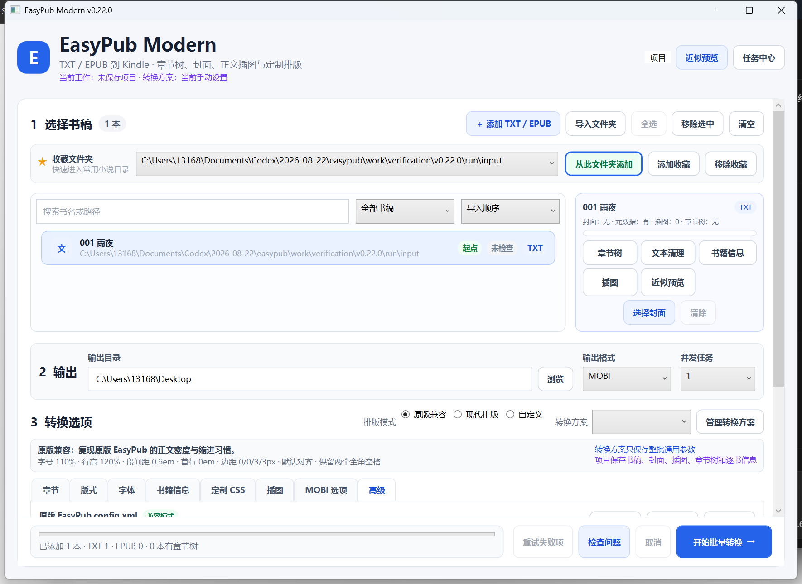
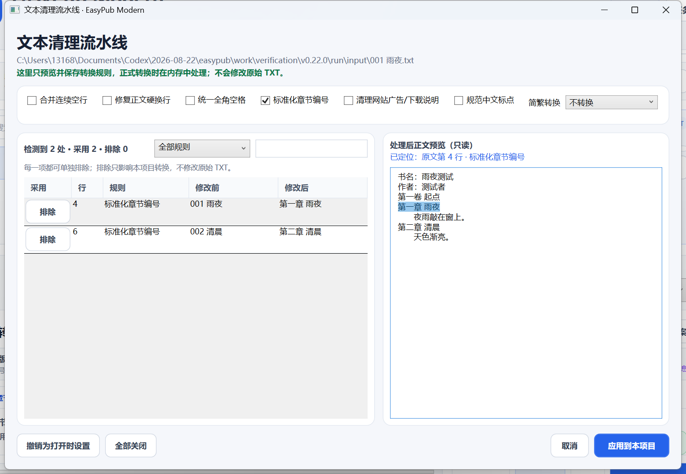

<div align="center">

# EasyPub Modern

面向中文小说与 Kindle 用户的现代化 Windows 批量电子书转换器。

保留 EasyPub v1.50 的经典转换效果，同时加入批量任务、逐书封面与元数据、章节树、正文插图、文本清理、项目恢复和成品验收。

[](https://github.com/uiu8/EasyPub-Modern/releases/tag/v0.22.0)


**[下载最新版](https://github.com/uiu8/EasyPub-Modern/releases/download/v0.22.0/EasyPubModern-v0.22.0-win-x64.zip)** · [查看 Release](https://github.com/uiu8/EasyPub-Modern/releases/tag/v0.22.0)

</div>



## 适合谁

- 希望批量把中文 TXT 小说转换为 EPUB 或 Kindle MOBI 的用户。
- 希望尽量延续原版 EasyPub 排版和 MOBI 兼容行为的用户。
- 需要为每本书分别设置封面、作者、出版社、插图和章节目录的用户。
- 希望转换前发现问题、转换后保留检查报告，同时不改写原始书稿的用户。

## 支持的转换

| 输入 | 输出 | 说明 |
|---|---|---|
| TXT | EPUB | 使用 EasyPub 兼容解析与排版流程 |
| TXT | MOBI | 生成 KindleGen 联合 MOBI，并执行兼容后处理 |
| EPUB | MOBI | 可保留原 EPUB 版式，或使用 EasyPub 兼容重排 |

> MOBI 转换需要 KindleGen 2.9。程序会优先使用当前版本配置的路径，也能手动重新选择。带 DRM 的 EPUB 不支持转换。

## 快速开始

1. 从 [最新版 Release](https://github.com/uiu8/EasyPub-Modern/releases/tag/v0.22.0) 下载并解压 Windows x64 压缩包。
2. 运行 `EasyPub.Desktop.exe`。
3. 添加或拖入一个或多个 TXT / EPUB，也可以从收藏文件夹批量选书。
4. 选择 EPUB 或 MOBI，检查封面、书籍信息和排版模式。
5. 点击“检查问题”，确认无阻断问题后开始批量转换。
6. 在“任务中心”查看每本书的进度、检查问题、成品验收和历史记录。

程序完全在本机处理文件。文本清理、章节树和插图设置都不会改写原始 TXT。

## 核心能力

| 能力 | 当前版本提供的功能 |
|---|---|
| 批量工作流 | 混合添加 TXT / EPUB、递归导入文件夹、搜索筛选、问题优先排序、1–4 个并发任务与失败重试 |
| 逐书设置 | 每本书独立保存封面、标题、作者、译者、ISBN、出版社、分类、语言、简介、插图和章节树 |
| 封面与图片 | 拖放预览 JPG / PNG / WebP；PNG、WebP 解码后转为高质量 JPEG；插图可选择正文位置 |
| 章节与目录 | 卷／章／节层级目录、数字标题一键规范化、顺序与父子关系调整、目录包含开关 |
| 排版与样式 | 字号、行高、段距、缩进、对齐、四边页边距、嵌入 TTF 字体与定制 CSS |
| 文本清理 | 空行、硬换行、全角空格、章节编号、网站说明、简繁转换与中文标点逐项预览、定位及单项排除 |
| 项目与恢复 | `.easypubproj` 保存与打开、转换方案、异常退出恢复快照、收藏文件夹和来源目录元数据映射 |
| 检查与验收 | 统一任务中心集中显示转换前问题、逐书进度、可选 EPUB/MOBI 结构验收、报告和转换历史 |
| 兼容旧工作流 | 可导入原版 EasyPub `config.xml`，并保留原版兼容排版与 MOBI 后处理逻辑 |

## v0.22.0 重点调整

- 书稿列表加入搜索、状态/格式筛选和问题优先排序；每本书旁可直接进入章节树、文本清理、书籍信息、插图和近似预览。
- “转换前检查”“当前任务与验收”“转换历史”合并到统一任务中心，检查结果会回写书稿状态并用于筛选。
- 文本清理的每一条修改都可以单独排除或恢复，还能按规则筛选并搜索修改前后的文字。
- 文件夹元数据映射增加当前项目实际命中预览；多条规则重叠时明确显示最终采用的子文件夹规则和值。
- 明确区分项目与转换方案：项目保存书稿和逐书内容，转换方案只保存整批通用转换参数。
- 预览统一标为“近似版式预览”，明确它不是 Kindle 真机显示确认。
- Release 剔除全部 `.pdb` 调试符号，在不影响转换和运行的前提下降低下载与解压体积。

### 文本清理定位

文本清理不再只是列出变化。点击左侧任意修改记录，右侧会立即定位并高亮处理后的正文：

- 普通替换直接高亮修改后的文字。
- 被删除的广告、下载说明或多余空行会定位到相邻正文，并明确说明原行已删除。
- 超长小说会按选中位置加载附近正文，后半本书不再受预览长度限制。
- 修改记录不再限制为前 500 条，可以检查全部变化。
- 任意一条修改都能单独“排除/恢复”，只改变当前项目的转换规则，不改写原 TXT。



## 三种排版模式

三种模式只控制正文排版基线，不会覆盖封面、元数据、插图、章节树、字体、定制 CSS、KindleGen 或验收设置。

| 模式 | 字号 | 行高 | 段间距 | 首行缩进 | 上/下/左/右边距 | 对齐 | 全角空格 |
|---|---:|---:|---:|---:|---|---|---|
| 原版兼容 | 110% | 120% | 0.6em | 0em | 0/0/3/3px | 默认 | 保留 |
| 现代排版 | 105% | 165% | 0.35em | 2em | 12/12/18/18px | 两端对齐 | 不额外添加 |
| 自定义 | 使用当前值 | 使用当前值 | 使用当前值 | 使用当前值 | 使用当前值 | 使用当前值 | 使用当前值 |

- **原版兼容**：适合希望延续 EasyPub v1.50 正文密度与缩进习惯的书稿。
- **现代排版**：增加行距和留白，更适合高分辨率 Kindle。
- **自定义**：保留当前参数，适合在任一方案基础上继续微调。

手动修改版式后，程序会自动切换到“自定义”，避免模式名称与实际参数不一致。

## 常用高级功能

### 为来源文件夹自动填写元数据

在“书籍信息 → 文件夹元数据映射”中指定来源目录和出版社、分类、语言等标准信息。右侧会按当前书稿显示命中的规则、最终写入值和重叠规则的处理结果；导入后仍可逐书覆盖。

### 在正文中插入图片

在“插图”分页选择图片，再从正文预览中指定插入位置。每本小说的插图相互独立，图片缺失或损坏会在转换前检查中提示。

### 使用原版 config.xml

在“高级”分页选择原版 EasyPub 的 `config.xml`。程序会显示已应用项目和暂未实现项目；随时可以“取消选择”恢复新版设置。

### 保存项目和转换方案

- **项目**保存书稿列表、逐书数据、输出位置和当前工作状态，适合稍后继续处理。
- **转换方案**只保存整批通用参数，适合重复使用同一套排版和 MOBI 设置；不会包含书稿、逐书封面、插图、章节树或逐书元数据。

## 检查边界

- 结构验收默认关闭，需要排查成品问题时再开启，报告保存在输出目录下的 `EasyPub-验收报告` 文件夹。
- “结构通过”表示 EPUB/MOBI 内部目录、链接、图片、字体和关键 Kindle 字段符合当前检查规则，不等同于所有 Kindle 型号的真机确认。
- “近似版式预览”来自临时 EPUB，可检查内容结构与大体排版，但不等同于 Kindle 渲染器或真机显示。
- 固定版式、复杂 SVG、脚本交互 EPUB、TTC/CFF 字体、AZW3、单独 MOBI7/KF8 仍不在当前完整支持范围内。

## 从源码构建

需要 Windows x64 与 .NET SDK 10：

```powershell
dotnet build EasyPub.Modern.slnx -c Release
dotnet test EasyPub.Modern.slnx -c Release
```

项目结构：

- `src/EasyPub.Core`：TXT、EPUB、MOBI 与兼容处理核心。
- `src/EasyPub.Cli`：可脚本化的批量转换入口。
- `src/EasyPub.Desktop`：WPF 桌面应用。
- `tests`：核心转换、兼容性和真实 WPF 交互回归测试。

## 当前版本

当前唯一发布版本为 **v0.22.0**。后续 GitHub Release 只保留最新版，首页也只描述当前可下载版本。
