# EasyPub Modern 功能逻辑与流程图全景

> 分析对象：`D:\software\DeepSeek-Harness\workspace\easypub-branch`（main @ `825ea0b`，v1.57.4）
> 方法：全部结论来自实际读到的代码，关键位置标成 `文件:行`，可直接核对。
> 规模：Core 76 文件 / 11,648 行；Desktop 86 文件 / 23,216 行；测试 82 文件 / 10,966 行。
>
> 全文流程图用 Mermaid，已用官方解析器逐个校验。想直接看图：
> 浏览器打开 `docs/flow-charts/流程图.html`。
> 第 4 章（目录对齐修复）与第 5 章（编辑与撤销）是重点。

---

## 0. 一句话说清这个软件

把一个 TXT（或 EPUB）**原文**读进来，只改一棵**内存里的章节树**，再把树与原文一起渲染成 EPUB / MOBI。

理解这个软件的全部难点，都在"只改树、不改原文"这一句话上：原文行号是唯一的坐标系，
章节树、插图、清理规则、变更记录全都挂在它上面，所以任何一次增删行的动作都可能让五个引用面失配。
代码里的绝大多数复杂度，是在为这件事兜底。

### 三条不可退让的约束

| 约束 | 代码落点 |
|---|---|
| **原始 TXT 永不被修改** | 章节识别、树编辑、修复全部只改内存树；唯一能碰文件的是 `EditSource_Click` 写**副本**（`ChapterEditorActions.cs:140-157`） |
| **用户主权**：手改过的条目重新修复不能翻案 | `RecognitionSource = "manual"`，`ReferencePlanner.Apply:126`、`:164`、`:258` 三处显式跳过 |
| **正文行守恒**：修复前后能被章节树解释的原文行必须一模一样 | `RepairIntegrity.Verify`，在每次重建后立刻调用 |

---

## 1. 系统全貌

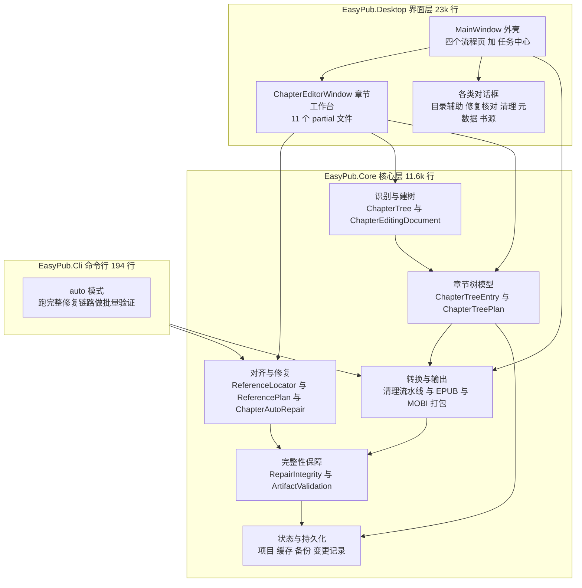

按数据流看，一条主线是：

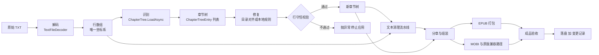

---

## 2. 数据模型：所有流程的共同地基

### 2.1 三个核心类型（`ChapterTree.cs:6-31`）

```csharp
public sealed record ChapterSourceRange(int StartLine, int EndLine);          // 闭区间，行号从 1 起

public sealed record ChapterTreeEntry(
    string Id,                          // 唯一标识；重建时会换新 Guid —— 这是很多 bug 的源头
    string Title,
    int Level,                          // 目录层级 1..4，经 NormalizeHierarchyLevels 规范化
    bool IncludeInToc,
    int? TitleLineNumber,               // 标题所在原文行；null 表示没有实体标题行
    IReadOnlyList<ChapterSourceRange> ContentRanges)
{
    public bool IsFrontMatter { get; init; }   // 前置项「序」，不参与层级，Level 恒为 2
    public int HeadingLevel { get; init; }     // 成品里的标题样式级别，与 Level 是两回事
    public string? RecognitionSource { get; init; }  // 识别来源，见下表
}

public sealed record ChapterTreePlan(        // 可持久化的树
    string SourceSha256,                     // 指纹：与原文不匹配就拒绝复用
    IReadOnlyList<ChapterTreeEntry> Entries);
```

### 2.2 四个字段容易误读的关系

| 字段 | 含义 | 常见误解 |
|---|---|---|
| `Level` | **目录层级**（树里排第几层） | 与 `HeadingLevel` 混为一谈 |
| `HeadingLevel` | **正文标题样式级别**（成品 HTML 里用 h1..h4 的哪一个） | 以为它决定树的层级 |
| `TitleLineNumber` | 标题所在**原文行**；`null` = 该条目没有实体标题行 | 以为它相当于 `Level` |
| `ContentRanges` | 该条目**独占**的正文行区间，**不含标题行本身** | 以为标题行也在正文范围内 |

`ContentRanges` 由"下一个标题行之前的所有行"切出（`ChapterTree.cs:148-155`），
并且 `ValidatePlan` 强制**任意两个条目的正文行不得重叠**（`ChapterTree.cs:230-234`）——
这条不变量是后面一切修复的安全网。

### 2.3 `RecognitionSource` 的取值与含义

| 取值 | 谁写的 | 意味着什么 |
|---|---|---|
| `pattern` | `ChapterTree.cs:160` | 由一/二/三级正则或自定义表达式识别 |
| `numeric` | `ChapterTree.cs:160` | 由数字章节识别（`NumericHeadingRule`）识别 |
| `reference` | `ReferencePlan.cs:259`、`:289` | 由参考目录对齐后收录 |
| `reference-volume` | `ReferencePlan.cs:253` | 对齐时建立的卷层级条目 |
| `inferred-volume` | `ChapterAutoRepair.WithInferredVolumes` | 由"章号重新计数"推断出来的卷 |
| **`manual`** | 桌面端手工编辑 | **用户改过 —— 任何对齐都不许动它** |

> `manual` 是三条约束里"用户主权"的实现方式。它不是给别人看的标签，而是一个**开关**：
> `ReferencePlanner.Apply:164` 一旦在树里发现 `manual`，整棵树就切换到
> `ApplyPreservingEdits`（保守分支），从"按原文物理位置重建"退化为"在现有树上做局部改动"。

---

## 3. 章节树的识别与构建

### 3.1 主流程

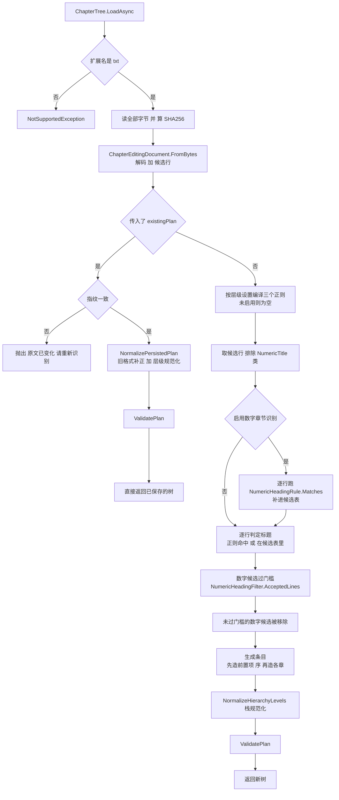

### 3.2 三种识别来源的优先级

代码里的优先级是**顺序覆盖**，不是加权（`ChapterTree.cs:101-130`）：

1. `ChapterEditingDocument` 给出的候选行（普通表达式识别，`ChapterCandidateKind` 若干种）；
2. 若 `RecognizeNumericHeadings` 打开，补上**不在候选表里**的数字标题候选（`:104-110`）；
3. 逐行判定时，正则 `MatchLevel` 命中 → 用它给层级；否则查候选表 → 用候选，层级默认 2（`:112-120`）。

**"最少有效正文行数"门槛**（`NumericHeadingFilter.AcceptedLines`）是一条独立的过滤器：
它统计"从当前候选标题到下一个候选标题之间的非空、未被清理移除的正文行"，
不足门槛的数字候选会被 `headings.RemoveAll` 剔除（`ChapterTree.cs:126-129`）。
所以它的作用是**压掉把数字列表、金额、日期误认成章节标题**的情况。

### 3.3 一行原文最终归给谁

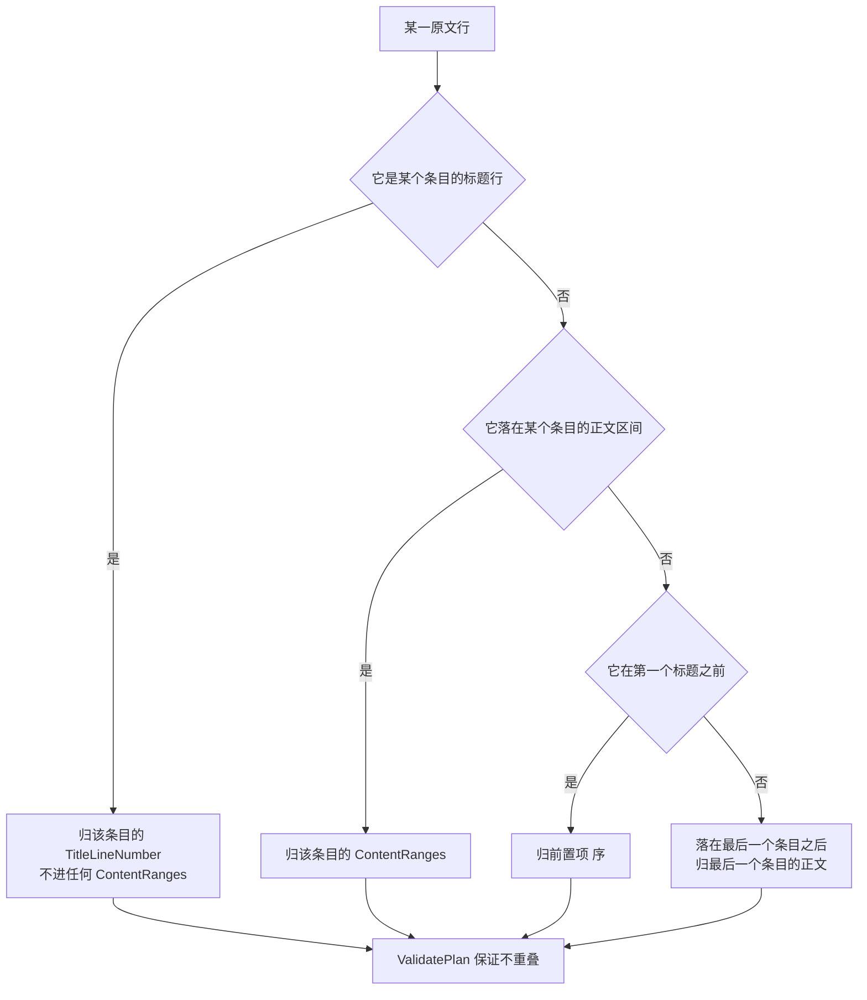

### 3.4 `ValidatePlan`：每次建树与每次修复后都要过

`ChapterTree.cs:189-237`，逐条列出（每条都会抛 `InvalidDataException`）：

| 校验 | 出处 |
|---|---|
| 指纹非空 | `:192` |
| 至少一个条目 | `:194` |
| Id 非空且不重复 | `:202` |
| 标题非空、不含换行 | `:204` |
| `Level` 在 1..4 | `:206` |
| 前置项 `Level` 必须是 2 | `:208` |
| `HeadingLevel` 在 0..4 | `:210` |
| 根章节必须是 L1 | `:218` |
| 不得跳过中间层级 | `:220` |
| `TitleLineNumber` 在文件范围内 | `:224` |
| 正文区间合法且在范围内 | `:228` |
| **同一行不得分配给两个条目** | `:232` |

> 最后一条是整个模型的地基。它把"正文会不会丢"变成了一件**可以在内存里证明**的事，
> 而不是靠跑一遍看看。

---

## 4. 目录对齐修复（重点）

这是软件里最复杂的一条链路，也是"把章节树修对"的主力。它分四个阶段：


### 4.1 阶段一：参考目录从哪来

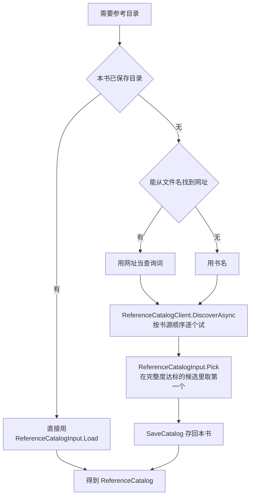

两个值得注意的取舍：

- **`Pick` 不是取"章节最多的"，而是取"完整度 ≥ 最全者 90% 的候选里，书源顺序最靠前的那个"**。
  这条规则来自 `docs/2026-09-14_对齐修复-v1.43.1.md` §4.1：某本书的三个源里，
  最全的那个反而少了正文，于是宁可要一个"够全且更靠前"的。
- 落选的候选现在会在界面上列出来（`BookSourcePanel.cs`），因为"静默只留一份"曾经让用户困惑。

### 4.2 阶段二：`ReferenceLocator.Locate` 的三遍定位

这是全项目最核心的算法。**三遍**，每遍解决上一遍解决不了的情况，且每遍都被单独计时
（`ReferenceLocator.cs:271-276`），因为"哪一遍最慢"决定了该优化什么。

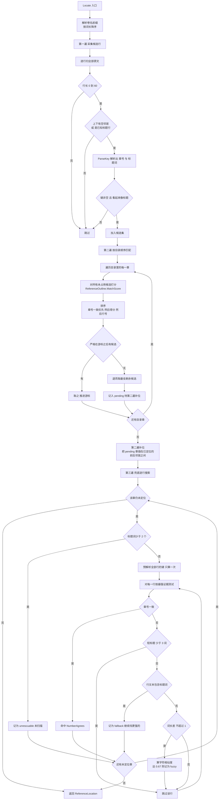

**三遍各自解决什么**（注释写得很明确）：

| 遍 | 解决 | 关键设计 |
|---|---|---|
| 一 | 采集"像标题的行" | 要求**上下至少一个空邻居**（`isolated`，`:140-142`）——中文正文段落之间没有空行，这条能把正文滤掉大半 |
| 二 | 按目录顺序单调匹配 | 先精确、再章号一致、最后才是相似（`:178-181`）；**优先取游标之后的**，取不到才回头取最佳剩余（`:181`） |
| 三 | 前两遍都失败的章 | 扫描**每一行**（不限候选集），因为"埋在长章里、没有任何空邻居的标题"正是漏章的样子（`:243-245`） |

三处容易踩的细节，都是历史上真出过问题的：

1. **章号一致必须优先于标题词得分**（`NumberAgrees`，`:339-346`）。
   否则目录写"第十六章 预谋"时，正文里"第二百五十七章 预谋"词面得分更高，
   会把这一章拖到几千行之外——重建出来的树看起来就是"乱序"，见
   `docs/2026-09-14_对齐修复-v1.43.1.md` §4.3。
2. **两字标题（"赌徒""神陨"）在第三遍里需要章号一致才接受**（`shortTitle`，`:238`、`:302`）。
   裸子串匹配太容易误中，但完全跳过又会漏掉真章。
3. **词长差超过 1 就直接放弃相似度**（`:310`）。标题多一个字少一个字还是同一章，
   差得更多就是另一章，宁可保持"未找到"也不猜。

### 4.3 阶段三：`ReferencePlanner.Build` 生成动作清单

先把树的行覆盖情况喂给定位器（**只喂章节树覆盖到的行**，其余位置给空串，
这样已删除的正文不会被重新找到并"复活"，`ReferencePlan.cs:73-74`），
然后逐条目录章生成动作：

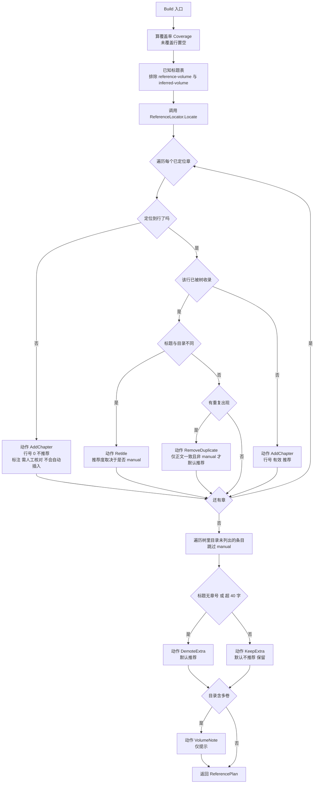

六种动作与它们的默认勾选（`ReferencePlan.cs:52-53` 的 `DefaultSelection`）：

| 动作 | 含义 | 默认勾选 |
|---|---|---|
| `AddChapter` | 目录有、原文中找到了标题行，树未收录 | ✅（前提是 `Recommended`，行号 0 的那个不推荐） |
| `Retitle` | 章已在树里，标题改用目录写法 | ✅（`manual` 条目不推荐） |
| `RemoveDuplicate` | 同一章原文出现多次、目录只列一次 | ✅（仅在正文一致、非 `manual`、无子章节时推荐） |
| `DemoteExtra` | 目录未列出、标题无章号或过长 → 并回正文 | ✅ |
| `KeepExtra` | 目录未列出但看起来像正经章节 → 保留 | ❌ **永不自动** |
| `VolumeNote` | 目录的卷结构在原文里落不了地 | ❌ 纯提示 |

> `DefaultSelection` 覆盖的四种恰好是"三条红线之外"的全部。这不是巧合：
> 手工编辑过的章不预选、正文不一致的重复不预选、目录外章节不预选，
> 其余都可以放心默认执行。

### 4.4 阶段四：`ReferencePlanner.Apply` 重建章节树

`Apply` 有两个**完全不同的分支**，走哪条由树里有没有手工痕迹决定：

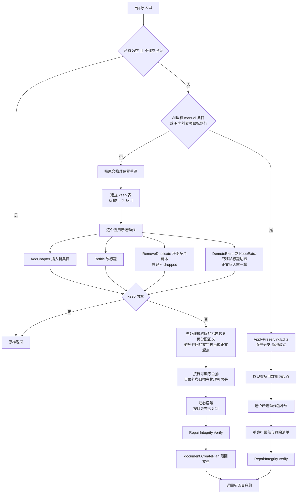

**两条分支为什么要分开**：重建分支假设"树是原文的忠实映射"，于是可以放心地按行号重新排布；
一旦用户手工调过顺序、层级或正文范围，这个假设就不成立，重建会把用户的编辑抹掉。
`ApplyPreservingEdits` 因此只在现有数组上做局部增删（`ReferencePlan.cs:267-317`）。

**`DemoteExtra` / `KeepExtra` 的语义**（`:194-202`）值得单独说：
勾选它不是"删掉这一章"，而是**移除这个标题边界**——标题行不再进 `TitleLineNumber`，
它下面的文字全部落进前一章的 `ContentRanges`。正文一行都不少，这也是行守恒能继续通过的原因。

### 4.5 一键修复的完整闭环

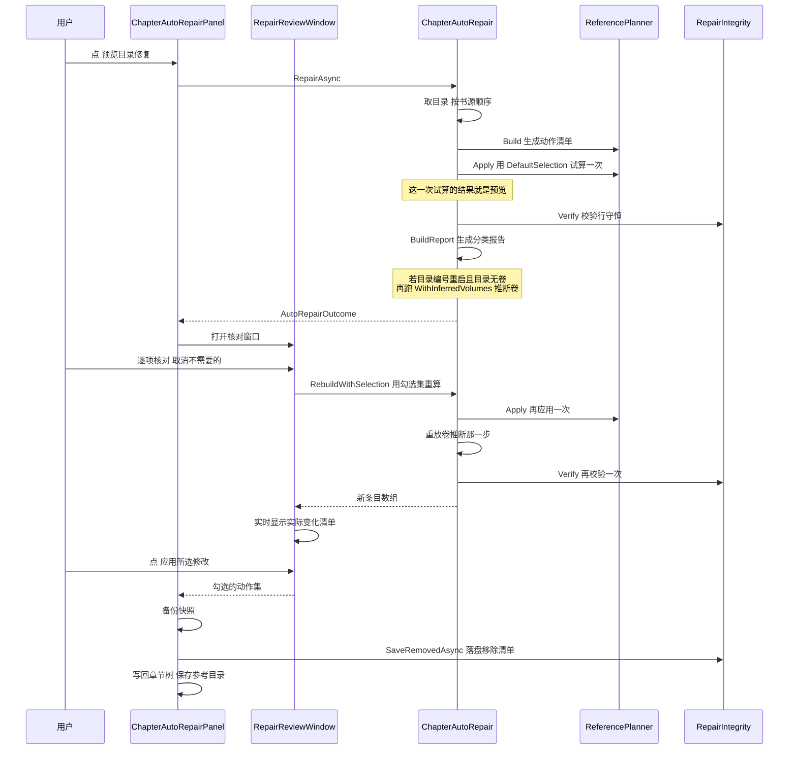

**为什么预览要应用一次**：报告里的数字（"收录 N 章""并回 N 处"）必须是**试算的结果**，
而不是计划里的条数——两者会不一致（例如某条 `AddChapter` 实际插不进去）。
所以 `Prepare` 真的用 `DefaultSelection` 跑了一次 `Apply`（`ChapterAutoRepair.cs:239`），
窗口里的每一行数字都来自那棵树。

这也解释了一个容易被当成 bug 的现象：**左栏"补齐"显示 0，而目录里明明有缺章**。
那些缺章的动作是 `AddChapter@0`（行号 0，定位不到原文行），`Apply` 会跳过它们
（`ReferencePlan.cs:177` 要求 `action.Line > 0`），所以树上没有变化、也就没有可勾选的行。
它们只体现在头部的「章需你核对」和「参考目录未匹配」里。

### 4.6 手工编辑保护的三处铁闸

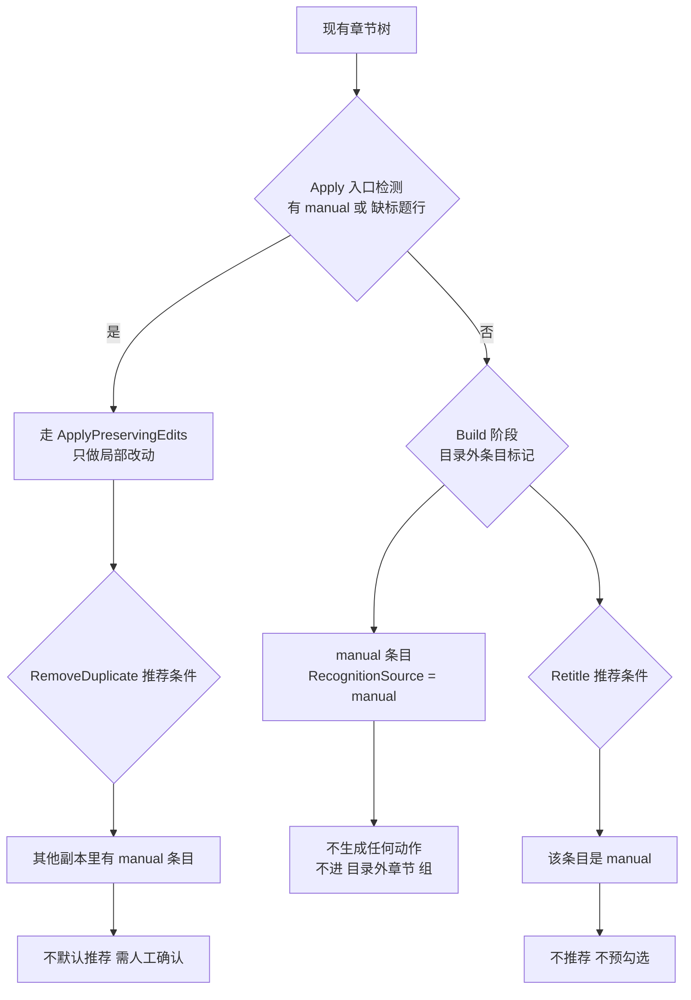

三处分别是：`ReferencePlan.cs:126`（目录外条目生成动作时跳过 manual）、
`:164`（分支选择）、`:258`（重建时保留 manual 标记），
外加 `:101`、`:113` 两处影响 `Recommended`。

---

## 5. 章节树的编辑与撤销

### 5.1 唯一的修改入口

桌面端所有对树的修改都必须经过 `Mutate`（`ChapterEditorWindow.xaml.cs:520-554`）。
它不是"建议"，而是撤销/重做能成立的前提：

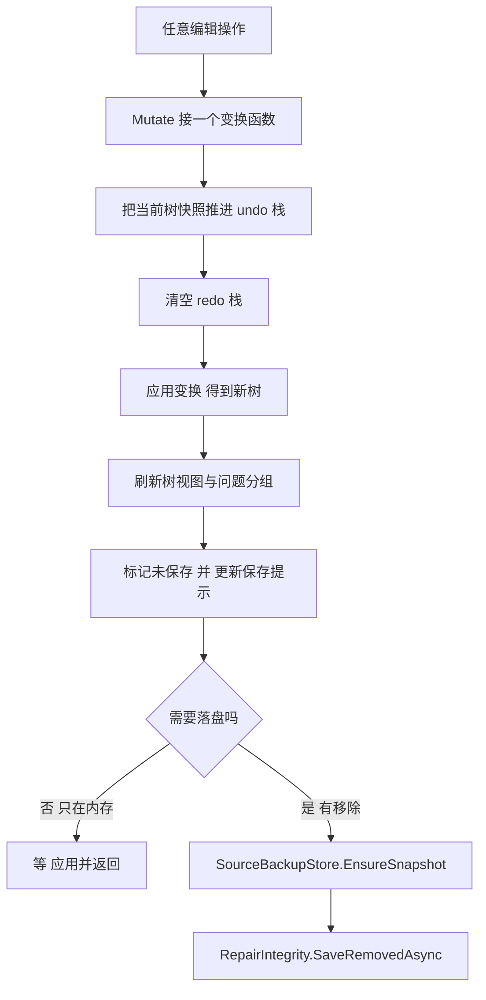

**为什么必须唯一**：撤销栈存的是**整棵树**的快照。如果某个操作绕开 `Mutate` 直接改数组，
那么下一次撤销会把它的改动一起回滚，或者更糟——撤销到一个从未存在过的状态。
所以代码里能看到的元操作只有两个：`Mutate` 与"直接替换整棵树"（重新识别）。

### 5.2 会改树的操作（按依据分族）

| 族 | 操作 | 依据 | 可能删正文 |
|---|---|---|---|
| **A 目录驱动** | 一键目录修复、手动核对目录、获取参考目录 | 公开目录 | 是（落盘移除清单） |
| **B 本地规则** | 补建无编号标题、结构整理、清理重复标题、规范化数字标题、修复跳章漏标题、识别数字章节、重新识别、对比正文去重 | 原文与正则 | 仅"对比正文去重"逐对确认 |
| **C 纯编辑** | 上移/下移/设子章节/移出父章节/还原为正文/拖放、目录全选 | 用户判断 | 否 |

### 5.3 撤销/重做的边界

- 快照是整棵树，所以撤销的粒度 = 一次 `Mutate`（批量操作算一次）。
- 任何新的 `Mutate` 都会**清空 redo 栈**——这是标准语义，但在这里尤其重要：
  因为"重做"如果跨过一次手工编辑，重做出来的树会与用户刚做的编辑冲突。
- 逐次操作 vs 整批操作：A 族是整批一次 `Mutate`（修复是一件事），
  B/C 族是逐次（每个动作一件事）。

---

## 6. 完整性保障：行守恒

### 6.1 保证什么

`RepairIntegrity.Verify(before, after, removed)`（`RepairIntegrity.cs:284-292`）只做一件事，
但把这件事做到了可证明：

```
Coverage(before) − removed  ==  Coverage(after)
```

`Coverage` 收集所有条目的**标题行 + 全部正文行**（`RepairIntegrity.cs:260-270`）。
等式成立意味着：**成品能解释的原文行，与修复前完全一致，既不丢也不重**。

### 6.2 不保证什么

这一点必须说清楚，否则会误以为有了它就万事大吉：

- 不保证**顺序**正确——行还在，但可能归给了另一章；
- 不保证**内容**没被清理规则改写（那是另一条链路的事）；
- 不保证**成品**没丢字（成品是渲染出来的，需要 `ArtifactValidation` 另行验收）；
- 不保证**插图与清理后的坐标**还对得上（见第 7 章）。

### 6.3 三条防线各拦什么

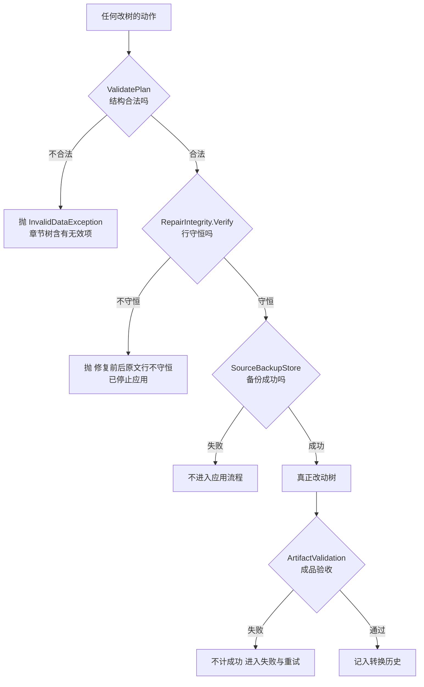

### 6.4 一处正文行被谁同时引用（这是全项目最大的风险面）

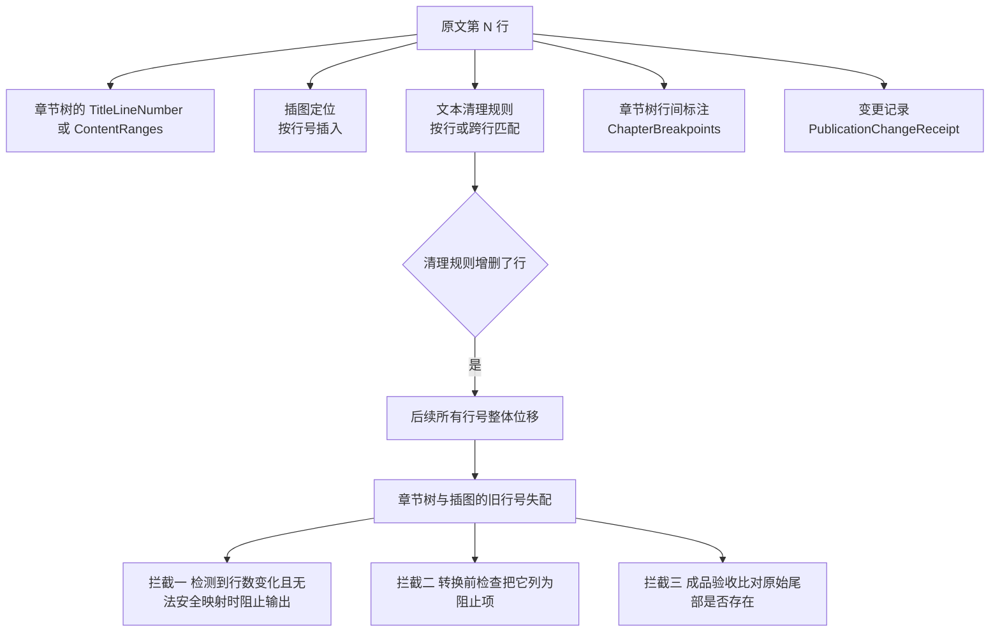

这条链路的历史教训写在 `docs/2026-09-07_product-quality-EasyPub-Modern-report.md` 的 F01：
**"保存章节树 → 再用跨行清理规则"这个组合曾经能让转换"成功"而正文缺失**。
现在的处置是三道拦截，而不是静默生成错位内容。

---

## 7. 状态在窗口之间怎么流动

### 7.1 唯一真相与它的下游

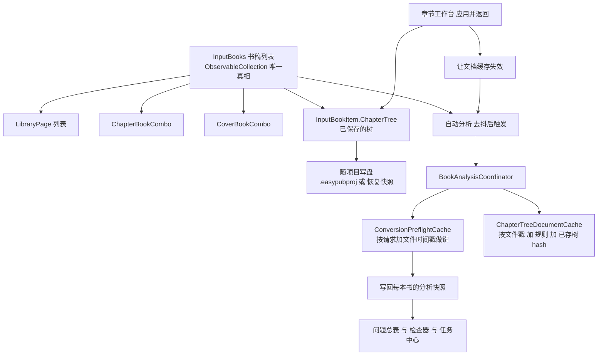

### 7.2 什么会让什么失效（容易搞错的地方）

| 触发 | 章节文档缓存 | 预检缓存 | 为什么 |
|---|---|---|---|
| 工作台「应用并返回」 | 该书失效 | 该书键变化 | 树变了，检查结论不再成立 |
| 外置编辑器改了 TXT | 该书失效 | **整表清空** | 行号坐标系整体变了，所有书都可能受影响 |
| 改自动检查设置 | 不动 | **整表清空** | 检查口径变了 |
| 改任一转换选项 | 不动 | 该书重新排期 | 选项进入了预检请求 |
| 打开「检查与修复」页 | 复用 | 复用 | 只看结果，不改输入 |
| 转换前检查 | 复用 | 复用 | 与自动分析共用同一个协调器 |

两条全局熔断值得单独记：`ScheduleAutomaticAnalysis` 一发现输入变化就
**立刻递增代数并取消在跑的分析**（`MainWindow.xaml.cs:1430-1432`），
分析结果回来时代数不符就丢弃。注释写明理由：**在去抖窗口期内也要让旧结果作废**。
工作台的断点标注用同一套办法（`ChapterReviewPanel.cs:282-294`）。

---

## 8. 从章节树到成品

### 8.1 清理流水线与分章的关系

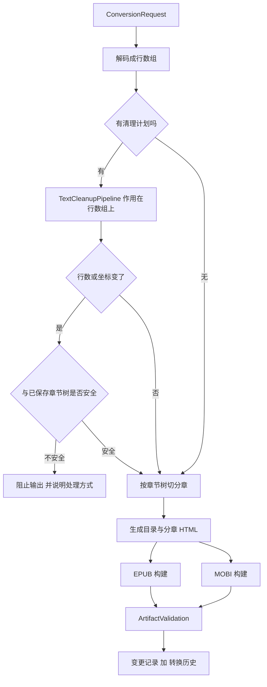

### 8.2 两条输出路径的分叉

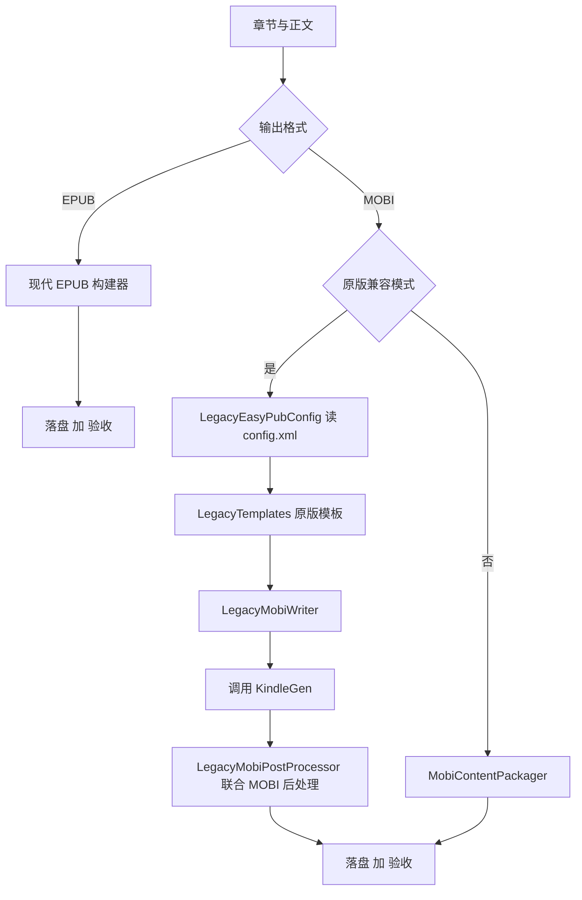

> 原版兼容路径是这个项目独有的资产：它复刻原版 EasyPub 的 `config.xml` 与模板，
> 让老用户的历史配置能继续用。代价是这条路径与主路径并行维护，
> 任何"章节怎么变成 HTML"的改动都要在两边各做一次。

---

## 9. 全项目风险清单（基于代码，不是猜测）

| # | 风险 | 位置 | 现状 |
|---|---|---|---|
| 1 | 清理规则增删行后，章节树与插图的旧行号失配 | `LegacyTextParser.cs:24,85,99-101`、`TextCleanupPipeline.cs:240-253` | 三道拦截，但**没有**行号重映射 |
| 2 | 重建时条目换新 `Guid`，按 Id 比对会误报 | `ReferencePlan.cs:253`、`:207` | 已用"稳定身份"（卷按标题、其余按行）兜住 |
| 3 | `Describe(after, before)` 与 `DescribeChanges(before, after)` 参数顺序相反 | `RepairIntegrity.cs:75`、`:241` | 已在 XML 注释里显式写明，但仍是同名类型的高危调用点 |
| 4 | `ReferencePlanner.Apply` 的两条分支（重建 / 保守）语义差很大 | `ReferencePlan.cs:164` | 靠"树里有没有 manual"隐式选择；分支不同但外部看不出走了哪条，建议加一条日志 |
| 5 | `AddChapter@0`（定位不到的缺章）不产生树变化 | `ReferencePlan.cs:177` | 用户只能从头部数字看到，改动清单里没有 |
| 6 | 两千次以上的 `Mutate` 快照会占用可观内存 | `ChapterEditorWindow.xaml.cs:520-554` | 快照存整棵树；长篇小说（数万行 + 上千章）需要留意 |
| 7 | `InkChaptersPage` 是不可达 UI，但控件仍被同步 | `MainWindow.xaml.cs:241`、`:255`、`:1961` | 死代码与活引用并存 |
| 8 | 主题切换靠替换画刷实例 | `ThemeManager.cs:73-74` | 任何用 `StaticResource` 读取主题键的新代码都会**静默**不跟随主题 |

---

## 10. 附：图与详细分析

### 10.1 可直接打开的流程图

`docs/flow-charts/流程图.html` —— 双击用浏览器打开即可，四张核心图已经排好版：

| 文件 | 内容 |
|---|---|
| `docs/flow-charts/流程图.html` | 四张核心图的交互页面（联网时自动加载 Mermaid；离线可把 `mermaid.min.js` 放到同目录） |
| `docs/flow-charts/fig-1-主链路.png` | 原始 TXT 到成品 |
| `docs/flow-charts/fig-2-三遍定位.png` | 目录对齐修复的三遍逐章定位 |
| `docs/flow-charts/fig-3-重建两条分支.png` | 重建章节树的两条分支 |
| `docs/flow-charts/fig-4-行号引用面.png` | 一处正文行被谁同时引用 |

本文档里的 17 张 Mermaid 图已用官方解析器逐个校验（`mermaid.parse` 全部通过），
所以粘到任何支持 Mermaid 的编辑器里都能直接渲染。

### 10.2 详细分析片段

每个子系统的完整分析（含更多逐条代码索引）分别在：

| 片段 | 内容 |
|---|---|
| `work/flow-analysis/章节识别与章节树构建.md` | 识别优先级、候选种类、字段口径、一行归谁、序的构造、栈规范化、ValidatePlan 逐条、指纹复用 |
| `work/flow-analysis/chapter-tree-editing-undo-redo.md` | 逐操作字段清单、Mutate 与快照栈语义、原文保护边界、外部改动处理、manual 保护范围、多选批量规则 |
| `work/flow-analysis/界面结构与状态流转.md` | 主窗口页面、工作台信息架构、**14 个修复入口与调用链**、状态载体与失效矩阵、主题机制 |
| `work/flow-analysis/chapter-tree-to-artifact.md` | 转换请求组装、清理流水线、分章、EPUB 与 MOBI、验收、落盘、危险组合的三道拦截 |
| `work/flow-analysis/repair-integrity-and-artifact-validation.md` | 行守恒的三步检查、五个引用面、备份策略、变更记录、验收项、预检缓存 |

> 这五份是分析过程的原始产物（`work/` 被 git 忽略，只在本地留档），本篇是它们的整合与重新组织。
> 若两者冲突，以代码为准，并应修正片段。
