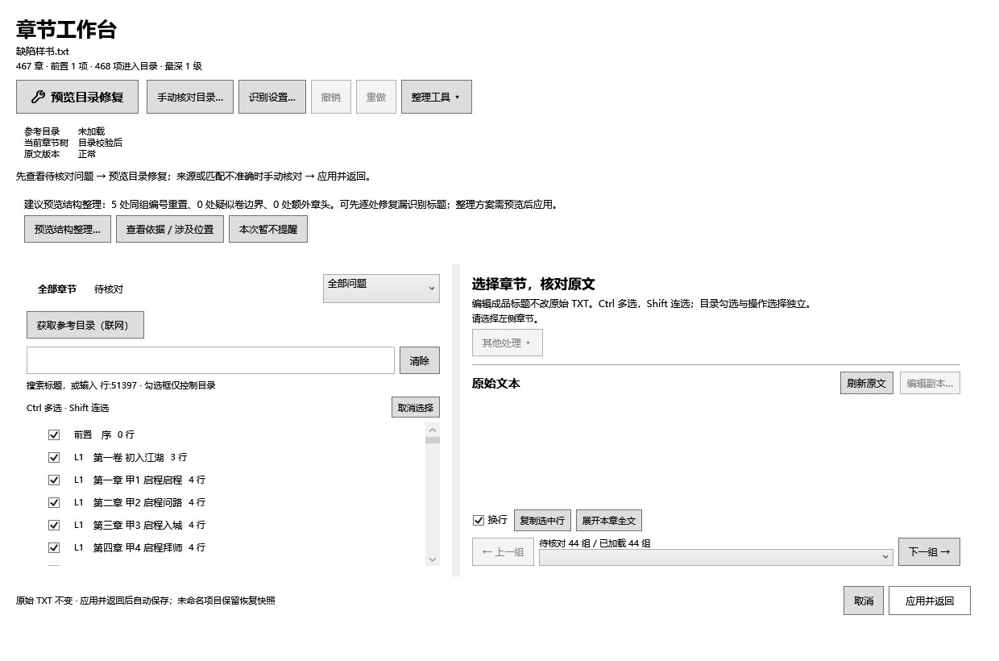

# EasyPub Modern 交互设计与情境决策映射

日期：2026-09-18
状态：设计文档（未实施）
验证案例：`samples/六卷缺陷样书/`

---

## 0. 这份文档回答什么

你的三个原话问题，加上一个我替你做的决定：

| # | 问题 | 本文位置 |
|---|---|---|
| Q1 | 有了「依照目录修复」，什么情况应该提示用户用它？是错误提示太多，还是章节结构混乱？ | §2.3 |
| Q2 | 进入编辑界面后，用户怎么知道他该点哪个按钮？按钮对应什么功能、解决什么问题？ | §5、§6 |
| Q3 | 软件有四种修复组合，我怎么知道"获取目录后转而自主修复"时的功能逻辑到底是什么？ | §1.3、§3 |
| Q4 | 要不要根据有没有目录，分成两个界面？ | §4 |

**结论先放这里**（每一条的论证在对应章节）：

1. **Q1 的两个候选都不是判据。** 真正的判据是**问题的性质**：需要"这本书之外的知识"才能回答的问题（缺了哪几章），只有目录能解；只需要"书自身知识"的问题（同一标题出现两次），不必先联网。
   **但"问题码"只是输入之一，不是结论**——它决定*可以考虑哪些策略*，不直接决定推荐哪个动作（见 §2.3 与 §9）。
2. **Q2 的答案是：按钮必须自己说清三件事**——解决什么现象、需要什么前提、改动落在哪里。现在有 5 个按钮不满足，见 §5.2。
3. **Q3 的现状是：用户不可能知道，这不是他的错。** 「预览目录修复」这一个按钮有四种结果，由软件内部静默决定（§1.1）。本文把状态拆成**三个可见事实**，其中"本次依据"由用户决定（§3）。
4. **Q4 的决定：不分两个界面。** 理由见 §4——"有没有目录"不是一个开关，而是一个会来回变化的过程状态，分界面会让"获取目录后转而自主修复"这个场景**更**混乱，而不是更清楚。

---

## 1. 现状诊断：用户为什么会迷路

这一节全部基于代码实测，每一处都给出 `文件:行`。

### 1.1 头号问题：「预览目录修复」是一个结果不可预测的按钮

工作台左上第一个按钮是「预览目录修复」（`ChapterEditorWindow.xaml:115`，`HeroRepairButton` 样式，是全窗口视觉权重最高的一个）。点它走 `AutoRepair_Click`（`ChapterAutoRepairPanel.cs:42`）→ `RunRepairReviewAsync()`。

它内部发生了什么（`ChapterAutoRepair.cs:187-256`）：

```
点下「预览目录修复」
  │
  ├─ ① 读「本书已保存的目录」        ReferenceCatalogInput.Load(SourceSha256)   :191
  │      └─ 命中 → 用它，标注"本书已保存目录"                                  :193
  │
  ├─ ② 没命中 → 从文件名猜书籍网址     FindLocalBookUrl(path)                    :197
  │      └─ 命中 → 拿它当搜索词；否则用书名当搜索词                             :198
  │
  ├─ ③ 联网抓取参考目录               ReferenceCatalogClient.DiscoverAsync       :203
  │      预算：搜索 6s / 单源 15s / 并发 4
  │      ├─ 成功 → Pick 选最大候选                                             :205
  │      └─ 失败 → error = 消息，reference 仍为 null                           :208
  │
  └─ ④ 按 reference 是否为 null 分岔   Build(document, catalog, ...)            :236
         ├─ 有目录 → ReferencePlanner.Build（目录对齐）                          :257
         └─ 无目录 → SelfRepairPlanner.Build（自修复）                           :245
```

然后回到窗口层（`ChapterAutoRepairPanel.cs:155-163`）：

```csharp
if (!outcome.CatalogFound && (outcome.Plan?.Actions.Count ?? 0) == 0)
{
    SetReviewResult(outcome.Verdict);
    CatalogAssist_Click(this, new RoutedEventArgs());   // ← 自动打开「手动核对目录」对话框
    return;
}
```

**把这两段合起来，用户点一次「预览目录修复」，会得到四种结果之一：**

| 结果 | 触发条件 | 用户看到 |
|---|---|---|
| A | 有保存目录或联网成功，且有方案 | 修复确认窗，方案来自**参考目录** |
| B | 无目录，但自修复有方案 | 修复确认窗，方案来自**书自身** |
| C | 无目录，且自修复也没方案 | **「手动核对目录」对话框**（不含修复方案） |
| D | 联网失败，但自修复有方案 | 修复确认窗，方案来自**书自身**，判词里带失败原因 |

**A 和 B 长得一模一样**——同一个窗口，同一句「本次将做 N 类修改」，同一排统计卡片。用户从界面上分不出这次的方案是"目录说的"还是"软件自己猜的"。而这两者的可信度完全不同（§2.2）。

**C 更严重**：用户想要的是"修章节"，得到的是一个要求粘贴目录的对话框。

### 1.2 提示条数是不稳定的

这一条比 §1.1 更隐蔽，也是你问"是错误提示太多还是结构混乱"时真正该看的现象。

诊断层按模式抑制（`ChapterReviewAnalyzer.cs:44-58`）：

```csharp
var referenceIds = entries.Where(e => e.RecognitionSource == "reference").Select(e => e.Id).ToHashSet();
bool Unverified(string id) => !referenceIds.Contains(id);
var referenceAligned = entries.Any(e => e.RecognitionSource == "reference")
    && entries.Where(e => !e.IsFrontMatter && e.RecognitionSource is not ("reference-volume" or "inferred-volume"))
        .All(e => !Unverified(e.Id));
```

**`referenceAligned` 的判定比"有没有目录"严格得多**——它要求**所有**非前置、非卷条目都带 `reference` 标记。任何一条由本地规则识别出来、或用户手工添加的章节，都会让整个抑制失效。

被抑制的问题码共 6 个（`ChapterReviewAnalyzer.cs:55-57`）：

| 问题码 | 全对齐时 | 否则 |
|---|---|---|
| `chapter_unrecognized` | 抑制 | 出现 |
| `chapter_number_order` | 抑制 | 出现 |
| `chapter_heading_typo` | 抑制 | 出现 |
| `chapter_content_duplicate` | 抑制 | 出现 |
| `chapter_duplicate` | 抑制 | 出现 |
| `chapter_repeated_sequence` | 抑制 | 出现 |
| `chapter_number_gap` | **保留**——`:52-54` 有明确注释说明为什么故意不抑制 | **保留** |

另有五处独立开关，作用于不经过 `ChapterDiagnostics` 的检查：

| 检查 | 位置 | 抑制条件 |
|---|---|---|
| `chapter_unnumbered`（无编号标题） | `:69-71` | `referenceAligned` |
| `chapter_heading_typo`（跳章区间漏识别候选） | `:80` | `referenceAligned` |
| `chapter_content_duplicate` | `:98` | `referenceAligned` |
| `chapter_repeated_sequence` | `:100` | `referenceAligned` |
| `chapter_cross_title_duplicate`（标题不同、正文相同） | `:118` | `referenceAligned` |

**两个后果：**

1. **同一本书的提醒条数会变。** 用户视角里发生的事情是：昨天报 12 条，今天报 3 条，中间他只点过一次「应用所选修改」。没有任何界面元素解释这个变化。

2. **"全对齐"很难达到，所以抑制常常是失效的。** 用户手工改过一个标题、或补建过一章，`referenceAligned` 就变回 `false`，6 类提醒**全部回来**。用户看到的现象是"我明明按目录对齐过了，怎么又冒出这么多问题"。

> **一处必须澄清的语义分裂**：`chapter_number_gap` 在两种模式下都保留，但**含义完全不同**。`:52-54` 的注释写明理由：
>
> > 章号之间的间隔在对齐后**故意不抑制**。目录知道哪些章存在，所以此时的间隔意味着原文确实缺少官方版本有的章——这是最该告诉用户的一件事。
>
> **但这段注释本身说得太强了**（独立复评 §10）。同一个文件的 `reference_chapter_absent` 文案（`:231-233`）写的是：
>
> > 这些章**要么原文里确实没有**（软件不会补造正文），**要么没被识别到**；请对照原文核对。
>
> 而且 `ReferencePlanner` 会区分「找不到标题，但这段内容已被其他章节占用」与「标题和对应正文都找不到」两种情形。
>
> 所以「目录中存在 ＋ 当前 locator 没定位到」**只能推出**：
>
> > **当前系统尚未建立这一章在原文中的可靠位置。**
>
> **不能推出**"原文真的缺了这一章"——locator 失败、识别失败、标题变体都会产生同样的观测结果。
>
> 因此 §2.3 给用户的承诺措辞必须相应收紧。

你截图里的《福尔摩斯小姐》显示「参考目录里有 464 章在章节树中没有」——这条来自 `reference_chapter_absent`（`:230`），它只在**诊断时传入了目录**才会产生（`:218`）。所以这本书的诊断确实带着目录；但那 6 类是否被抑制，还要看它是否满足上面那个严格的全对齐条件。

### 1.3 四种组合分散在三处，没有一处告诉你现在是哪种

设计方案里的原始表述（`docs/2026-09-16_修复流程重构设计方案.md:95`）：

> **分叉点只有两个且互不相干**：A 决定"计划里有什么"，B 决定"计划怎么落地"。组合数 2×2，代码分支 2+2。

| 维度 | 取值 | 现在在哪里决定 | 用户看得见吗 |
|---|---|---|---|
| **A 计划里有什么** | `ReferenceCatalog` / `SelfRepair` | **自动**：`catalog is null`（`ChapterAutoRepair.cs:236`） | ❌ 完全不可见 |
| **B 计划怎么落地** | `TreeOnly` / `EditSource` | 修复确认窗里的单选（`RepairDecision.cs:80-86`） | ⚠️ 只在最后一个窗口可见 |

> **一处判据不一致，值得单独指出**：决定"方案用哪个依据"的条件是 `catalog is null`（有没有拿到目录），而决定"诊断抑制哪些提醒"的条件是 `referenceAligned`（树是否**全部**被目录验证过）。**这是两个不同的条件。**
>
> 后果：用户可能看到 6 类提醒全都在（因为树没全对齐，`referenceAligned == false`），但点下修复按钮后，方案却是按目录生成的。用户的预期是"既然报了这些问题，修复就该处理它们"，而修复走的是另一套逻辑。**问题列表与修复方案不是同一个判据产出的。**

> **顺带一处设计漂移**：设计稿里 `RepairPlanBasis` 有三个值——`ReferenceCatalog` / `LocalHeuristic` / **`Mixed`**（`docs/2026-09-16_修复流程重构设计方案-v3.md:202`），实现里只剩两个（Phase 7 记 `SelfRepair`），**`Mixed` 没有落地**。而样书恰好就是需要 `Mixed` 的书（§7）。

**这就是 Q3 的完整答案**：用户不可能知道。判定依据在代码里、模式状态在界面上没有表示、而且按钮名（「预览**目录**修复」）在走自修复路径时是**错的**。

### 1.4 同一个问题码，三个窗口三套按钮文案

问题码 → 按钮文案，现在有三份互不相干的映射实现：

| 实现 | 位置 | 方式 | `chapter_number_gap` 得到 |
|---|---|---|---|
| 转换前检查窗 | `PreflightWindow.xaml.cs:125-137` | `switch` on `Code` | 「核对跳章区间」 |
| 工作台问题卡 | `ChapterIssueAction.cs:20-29` | 规则式（类别 + 能否拆分） | 「到原文定位并核对…」 |
| 兜底 | `BookAnalysisCoordinator.cs:40-52` | `switch` on `Target` | 「处理章节」 |

同一个「章节编号从 3 跳到 393」：

- 在转换前检查窗里叫 **「核对跳章区间」**
- 在工作台问题卡里叫 **「到原文定位并核对…」**
- 若某个 `switch` 没覆盖到该码，退化成 **「处理章节」**

**三个名字，三种心理预期，而且点下去到达的地方也不同。** 用户在两处看到同一件事的两个名字，会合理地怀疑这是两件事。

`ChapterIssueAction` 的注释自己写明了这条原则（`ChapterIssueAction.cs:8-9`）：

> 规则是：按钮必须指向一个**确实能解决当前问题**的动作；没有这种动作的提醒，不得退化成一个看起来合理、实际什么也不做的动作。
> ——"在缺章下面放『编辑成品标题…』，就是用户为什么最后会去改标题来修缺章。"

原则是对的，但**只在工作台生效**，另两处没跟上。

### 1.5 按钮名用的是实现词汇，不是问题词汇

| 现在的名字 | 位置 | 用户以为 | 实际 |
|---|---|---|---|
| 「预览目录修复」 | `ChapterEditorWindow.xaml:115` | 会用到目录 | 可能完全不用目录（§1.1 B/D） |
| 「手动核对目录…」 | `:121` | 手工输入目录 | 逐条核对**匹配结果**，也可粘贴网址 |
| 「整理工具 ▾」 | `:126` | 杂项工具 | 底下有 **4 个自主修复功能**（§5.2） |
| 「刷新原文」 | `:222` | 重新读取文件 | **双重身份**：原文已变化时 = **版本迁移**（保住手工编排）；原文未变化时 = **重新识别**（丢弃手工编排）。ToolTip 只描述了后者 |

「整理工具 ▾」的实际内容（`ChapterWorkbench.cs:417-446`）：

```
全书整理
  ├─ 重建编号分组与结构（预览）…          → RecoverStructure_Click
  ├─ 清理全书重复标题…                    → CleanDuplicateTitles_Click
  ├─ 规范化全书数字标题…                  → NormalizeAll_Click
  └─ 批量修复跳章区间漏识别标题…          → RepairMissingHeadings(null)
目录（全书）
  ├─ 全部加入目录 / 全部不加入目录（保留正文）
视图
  ├─ 展开全部 / 折叠全部
  ├─ 查看 / 恢复本书已确认的提醒…
  └─ 恢复本书已确认的提醒
其他
  ├─ 复制原始文件路径 / 文本编辑器设置…
```

**「全书整理」这 4 项全部是无目录路径的自主修复**，它们和「预览目录修复」是**同一个维度的两种取值**，却一个摆在工具栏 C 位，一个藏在下拉菜单第二组。

### 1.6 两处「名字对不上」

**一、菜单项同名但行为不同**（`ChapterWorkbench.cs:439-440`）：

- 「查看 / 恢复本书已确认的提醒…」→ 打开窗口
- 「恢复本书已确认的提醒」→ 直接执行恢复

两行相邻、名字几乎相同、行为完全不同。这是 §1.4 同一类问题的菜单版。

**二、文案指向了一个不存在的按钮。**

`reference_chapter_absent` 的提示语（`ChapterReviewAnalyzer.cs:233`）写着：

> 需要补建的入口在**「目录辅助修复」**。

但工作台上**没有任何按钮叫这个名字**。最接近的是「预览目录修复」（`:115`）和「手动核对目录…」（`:121`）。用户照提示去找，找不到。

这是 §1.5 的镜像问题：不只是按钮名字起得不好，**代码里的文案还指向了界面上不存在的名字**。两条路必须统一到同一个词汇表。

### 1.7 两处错误的安全承诺（比按钮改名严重）

`ChapterCatalogPanel`（「手动核对目录…」打开的那个窗口）里有两句话：

| 位置 | 原文 |
|---|---|
| `ChapterCatalogPanel.cs:40` | 「原始 TXT 不会被修改，所有调整都可撤销。」 |
| `:74` | 「与顶部「一键目录修复」打开同一个修复确认窗，原始 TXT 不变，可撤销」 |

**这两句现在是假的。** 这个窗口里的「预览章节调整…」进入的正是统一确认窗 `RepairReviewWindow`，而它**支持「同时改原文」**（`RepairDecision.cs:80-86`；默认值取自 `AppSettingsStore.DefaultRepairLandingMode`，Phase 6 记录第 3 节写明默认为 `EditSource`）。

于是用户在**被明确告知"不会改文件"的窗口里**，可以一步步走到"文件被改写"的结局。

这比按钮名字起得不好严重得多——**它是关于"我的文件会不会被动"的错误承诺**，而这个软件的可信度恰恰建立在"正文守恒、每次删除都有可核对清单"之上。

> **行动**：全仓库排查 `原始 TXT 不变` / `不会修改源文件` / `原始 TXT 不会被修改` 这类文案，逐条核对它所在路径是否真的不可能写 TXT。**§5.2 的改名应当排在这些承诺修正之后**——先保证不说假话，再谈说得清不清楚。

### 1.8 目录候选未经确认就被保存

`ChapterCatalogPanel.cs`：

```csharp
:160    if (found.Count > 0) sources.SelectedIndex = 0;   // 自动选中第一候选
:169    sources.SelectionChanged += (_, _) => { ... };
:186        try { Save(); } catch ...                      // 选中即保存
```

**实际行为链**：点「获取目录」→ 抓到多个候选 → **自动选中第一个** → 触发 `SelectionChanged` → **第一份目录立即落盘**。

用户从未确认过"这就是我要用的版本"。而这份被静默保存的目录，会在下一次点修复按钮时被 `ChapterAutoRepair.cs:191` 的 `ReferenceCatalogInput.Load(SourceSha256)` 读出来直接使用。

**这与 §3 的主张直接冲突**：§3 要设计一个"由用户决定依据"的界面，但"依据"这件事本身就在用户背后被决定了。

> **行动**：改为「只展示，不保存」→ 用户核对来源 / 章数 / 匹配度 → 点「使用这份目录」→ 才写 `ReferenceCatalogInput`。

---

## 2. 设计的第一原理：问题的性质决定手段

### 2.1 判据

> **回答这个问题，需不需要"这本书之外的知识"？**

这条判据不是我发明的，它已经作为铁律写在代码里。`SelfRepairPlanner` 的取舍（Phase 7 记录 §2）：

> **只发不依赖外部目录就能判定的动作。**
> 要靠目录才能判定的，一律不发：某章是不是*缺失*、某段正文该不该*立成标题*、某一章是不是真的*多余*。从书自身猜这些，就是让修复凭空造章节。

对应的代码形态（`ChapterAutoRepair.cs:236-256`）：

- 有目录 → `ReferencePlanner.Build`——它能回答"应该有哪些章"
- 无目录 → `SelfRepairPlanner.Build`——它只回答"已有的章有什么毛病"

**所以两种依据不是"高级版/低级版"，而是回答两类不同的问题。**

**⚠️ 但"需要外部知识"必须拆成三个不同的问题**（复审 v3 §6）

我原来的表 1 写"只有目录能解"，而表 2 又写这些问题的解决器是「从选中行建立章节」「`UnnumberedHeadings.Apply` / 人工确认」——**两张表自相矛盾**。

正确的拆法：

| # | 问题 |
|---|---|
| **A** | 软件仅靠**本地证据**能不能**自动下结论**？ |
| **B** | 用户看原文后能不能**人工决定**？ |
| **C** | 参考目录能不能提供**更强的外部证据**？ |

以 `chapter_unrecognized` 为例：

```
A = 不能安全自动决定
B = 用户可以人工决定（「从选中行建立章节」）
C = 目录可以显著提高确定性
```

**这与"只有目录能解"不是一回事。**

所以顶层原则应改成：

> **软件能否仅凭当前证据自动下结论；若不能，用户可人工核对，参考目录则提供额外证据。**

这直接决定 UI：用户看到「疑似未识别标题」时，合理的 CTA 可以**同时**是

```
[到原文核对]   [选择参考目录…]
```

而不是暗示"你必须获取目录，否则没法处理"。

### 2.2 十六类问题的完整归类

问题码全集来自 `IssueCategory.cs:9-21`、`ChapterReviewAnalyzer.cs:126`（`chapter_cross_title_duplicate`）、`:208`（`chapter_numbering_variants`）、`:230`（`reference_chapter_absent`）；归类轴来自 `ReviewCategories.cs`（5 类：漏识别 / 误识别 / 重复 / 编号与层级 / 其他提醒）。

**表 1：判据——回答这个问题需不需要"书外知识"**

| 问题码 | 类别 | 需要外部知识吗 | 只有目录能解？ |
|---|---|---|---|
| `chapter_number_gap` | 漏识别 | **需要**——"缺的是哪几章" | ✅ 最终判断必须靠目录（但见 §2.3 的处理顺序） |
| `chapter_unrecognized` | 漏识别 | **需要**——"这段该不该立成章" | ✅ 是 |
| `chapter_unnumbered` | 漏识别 | **需要**——目录能给出标题原文 | ✅ 是 |
| `chapter_heading_typo` | 漏识别 | 部分——规范形式可由标题自身推出 | ⚠️ 更好 |
| `numeric_chapters_suspected` | 漏识别 | 不需要——是识别器设置问题 | ❌ 否 |
| `numeric_body_group` | 误识别 | 不需要——纯本地形态判断 | ❌ 否 |
| `chapter_duplicate` | 重复 | **不能压成一格**（见下） | ❌ 发现不需要；**定案可能需要** |
| `chapter_content_duplicate` | 重复 | 不需要——正文相似度 | ❌ 否 |
| `chapter_cross_title_duplicate` | 重复 | 不需要——标题不同但正文相似 | ❌ 否 |
| `chapter_repeated_sequence` | 重复 | 不需要——重复拼接区段 | ❌ 否 |
| `chapter_number_order` | 编号与层级 | **建议**——目录能定位正确顺序 | ⚠️ 更好 |
| `volume_number_duplicate` | 编号与层级 | 建议 | ⚠️ 更好 |
| `chapter_level_gap` | 编号与层级 | 建议 | ⚠️ 更好 |
| `chapter_structure_suggested` | 编号与层级 | **需要人** | ❌ 否 |
| `chapter_numbering_variants` | 编号与层级 | 不需要——同一章多种写法（合成码） | ❌ 否 |
| `reference_chapter_absent` | 漏识别 | **需要**——"目录里有、树里没有" | ✅ 是（有目录模式专属，无目录时不产生） |

> ⚠️ **`chapter_duplicate` 这一格被 §2.2.1 推翻了**（终审 v2 §9）。我原本写"由**位置**判定"，但 §2.2.1 已明确「`FirstWins` 只是旧假设，不是证据」。**三件事必须分开写**：
>
> | 问题 | 需要外部知识吗 |
> |---|---|
> | **发现同名候选** | ❌ 不需要 |
> | **认定它们是错误副本** | 需要正文 / 上下文证据 |
> | **决定保留哪一份** | 可能需要额外位置证据或参考目录 |
>
> **这三件事不能继续压成一格。**

**表 2：解决能力——每一类问题实际由谁解决**

> 评审指出原稿的"自修复能做"一列把**四种互不相同的能力**混在了一起：`SelfRepairPlanner` 自动动作、`ChapterReviewAnalyzer` 诊断、专项修复工具、重新识别/人工核对。确实如此。**"自修复能做 ✅"会被读成"点主按钮就会解决"，而绝大多数情况并非如此。** 下表把它拆开：

| 问题码 | 检测器 | 解决器（现状） | 自动化程度 | 会写 TXT？ | 风险 |
|---|---|---|---|---|---|
| `chapter_number_gap` | `ChapterDiagnostics` | 本地候选 `MissingChapterHeadings.Repair` / 目录 `AddChapter` | 人工确认 | 目录路径可 RequiredInEditSource | 补建需目录；本地只找"写法错"的候选 |
| `chapter_unrecognized` | `ChapterDiagnostics` | 工作台「从选中行建立章节」/ 目录 `AdoptHeading` | 人工 | 可选 | 无目录时由人挑行 |
| `chapter_unnumbered` | `UnnumberedHeadings` | `UnnumberedHeadings.Apply` / 目录 | 人工确认 | 否 | 行数阈值敏感 |
| `chapter_heading_typo` | `MissingChapterHeadings` | `MissingChapterHeadings.Repair` / 目录 `AddChapter` | 人工确认 | 是（目录路径） | 只在跳章区间内找 |
| `numeric_chapters_suspected` | `FindNumericChapters` | 重新识别（改识别选项） | 一键 | 否 | 改的是识别设置，非章节树 |
| `numeric_body_group` | `ChapterDiagnostics` | **无自动解决器** | 人工 | 否 | 只诊断 |
| `chapter_duplicate` | `ChapterDiagnostics` | `SelfRepairPlanner`（无目录）/ `ReferencePlanner`（有目录） | **自动、默认勾选** | 视 opt-in | ⚠️ **见 §2.2.1** |
| `chapter_content_duplicate` | `ChapterContentDuplicates` | 正文对比工具 / 目录 `RemoveDuplicate` | 人工确认 | 视 opt-in | 相似度阈值 |
| `chapter_cross_title_duplicate` | `ChapterContentDuplicates.FindCrossTitle` | **只报告** | 人工 | 否 | 软件明确不自动处理 |
| `chapter_repeated_sequence` | `ChapterRepeatedSequences` | 只报告 + 导航 | 人工 | 否 | — |
| `chapter_number_order` | `ChapterDiagnostics` | 目录 `Retitle` / 层级动作菜单 | 人工确认 | 是 | 无目录时能力有限 |
| `volume_number_duplicate` | `ChapterDiagnostics` | 层级动作菜单 | 人工 | 否 | — |
| `chapter_level_gap` | `ChapterDiagnostics` | 层级动作菜单 | 人工 | 否 | — |
| `chapter_structure_suggested` | `ChapterStructureSuggestion` | `ChapterStructureRecovery`（专项工具） | 人工预览 | 否 | 须人判断 |
| `chapter_numbering_variants` | 合成码 | `Retitle` | 自动 | 是 | — |
| `reference_chapter_absent` | `ChapterReviewAnalyzer` | **只报告** | 人工 | 否 | 有目录模式专属 |

**这张表应当升级成真正的类型**——但**不能是"问题码 → 一个静态答案"**（评审第二版 §3）。

理由是**我自己在 §3.4 给出的**：同一个问题码在不同上下文下含义不同。`chapter_number_gap` 就是直接反例：

| 上下文 | 它的含义 | 该推荐什么 |
|---|---|---|
| 无目录 | "可能只是漏识别标题" | **先**本地找候选（`MissingChapterHeadings.Find`） |
| 有目录且已验证 | "目录里有这些章，原文里没定位到" | 参考目录的意义**更强** |

所以不能静态写死 `NeedsCatalog = true/false`，也不能绑死某个 `Resolver`。`chapter_duplicate` 同理——它的风险取决于是否跨卷、是否同父、正文是否相同、是否连续、是否有目录佐证、是否位于重复序列（§2.2.1）。

**建议拆成静态层 + 动态层：**

```csharp
// 静态层：只回答"这是什么问题、谁发现的"
public sealed record IssueDefinition(
    string IssueCode,
    string Category,
    string Detector);

public enum ResolutionExecutionKind
{
    Navigation,              // 定位到某行 / 打开正文对比窗
    AcquireCatalog,          // 获取参考目录（不存在 TreeOnly/EditSource）
    ReRecognizeTree,         // 重新识别（替换章节树，不改 TXT）
    OpenSpecializedTool,     // 打开专项处理
    GenerateRepairProposal   // 生成方案 —— 只有这一类才有 landing mode
}

// 每个动作各自带自己的需求与风险 —— 它们不属于整条 advice
public sealed record ResolutionAction(
    ResolutionIntent Intent,
    ResolutionExecutionKind Execution,   // ← 怎么执行
    CatalogRole CatalogRole,
    AutomationLevel Automation,
    RiskLevel Risk,
    string Explanation);
// 注意：这里**没有** CanEditSource —— 理由见下

public sealed record ResolutionAdvice(
    IReadOnlyList<ResolutionAction> AvailableActions,
    string? RecommendedActionId,   // 稳定 ID，不用 index
    string Summary);

// 由上下文动态求值
IssueResolutionPolicy.Evaluate(ChapterReviewGroup finding, ChapterRepairContextSnapshot context);
```

**为什么 `CatalogRole` / `Automation` / `Risk` 必须挂在 `ResolutionAction` 上，而不是 `ResolutionAdvice` 上**（终轮评审 §5）：**一条 finding 可以同时有多个解决动作，而每个动作的这三项属性常常完全不同。**

以 `chapter_number_gap` 为例：

| 动作 | CatalogRole | Automation | Risk |
|---|---|---|---|
| A. 扫描本地漏识别候选 | `None` | 人工确认 | Low |
| B. 按参考目录判断真正缺章 | `RequiredForConclusion` | 人工确认 | Medium |

把这三项挂在整条 advice 上，就只能强行取一个值——**那等于把"多动作"这个事实压扁**，而多动作恰恰是问题的本质。`chapter_duplicate` 同样：

| 动作 | CatalogRole | Risk |
|---|---|---|
| 查看两个同名章节 | `None` | Low |
| 本地强证据移除重复节点 | `None` | Medium |
| 按目录确认并处理 | `Helpful` / `RequiredForAutomaticAction` | Medium |

> **`CatalogRole` 的语义边界**（终轮评审 §6、终审 v2 §8）：它只表示"**这个具体动作若要执行，是否必须有目录**"。
>
> ⚠️ **上一版这里有一句事实矛盾**：我写"强证据（正文完全相同、**目录定位**、重复序列）都不依赖目录"——**"目录定位"显然依赖目录**。正确说法是：**正文证据与重复序列证据不依赖目录**；"目录定位"只在**具体某个 catalog-dependent action** 上才是必需的。
>
> ⚠️ 而且**不能把 `RequiredForAutomaticAction` 挂在泛化的问题码上**（终审 v2 §8）。"需要额外证据"与"需要参考目录"**不是一回事**——本地的 exact content evidence ＋ 结构安全 ＋ 可靠 keep-target，理论上也可能足够。
>
> 所以 `RequiredForAutomaticAction` 只能用于某个**具体的、依赖目录的动作**，例如"按目录定位确认 keep target 后自动生成移除建议"，而**不能**写成"`chapter_duplicate` 的安全自动删除需要目录"。

> **为什么需要 `ExecutionKind`**（独立复评 §13）：这些 action **不是同一种东西**——可能是"打开正文对比窗""重新识别章节""获取参考目录""生成 `RepairProposal`""定位到某行""打开专项工具"。
>
> `CanEditSource : bool` 对它们太粗：
>
> | 动作 | 有 TreeOnly/EditSource 吗？ | 改 TXT？ |
> |---|---|---|
> | 获取目录 | **根本不存在** | 否 |
> | 重新识别 | 不存在（它直接替换树） | 否 |
> | `RemoveDuplicate` 方案 | **才有** landing mode | 视决策 |
>
> 没有 `ExecutionKind`，Coordinator / UI 拿到 advice 后**仍需 switch 猜行为**——那只是把原来的三套 switch 从 `IssueCode` 换成了 `Intent`。

> **为什么删掉 `CanEditSource`**（终审 v2 §7）：类型里保留它、正文却说它"太粗"，是**自相矛盾**。
>
> 对 `AcquireCatalog` / `Navigation` / `ReRecognizeTree` / `OpenSpecializedTool`，**根本不存在** TreeOnly/EditSource；而对 `GenerateRepairProposal`，能否真的 EditSource 取决于：
>
> ```
> 本次 proposal 里具体有哪些 action
> 用户勾了哪些 action
> SourceEffectDecision
> SourcePatch 是否可编译
> SourceEditPreflight 是否通过
> 源目录 / journal / backup 是否可写
> source SHA 是否仍匹配
> ```
>
> 所以在 policy 阶段写一个 `CanEditSource = true/false`，**很容易变成一个假的承诺**。
>
> **做法**：删掉这个字段。只有 `Execution == GenerateRepairProposal` 时，UI 说：
>
> > "是否可同时修改原文，将在预览中按所选动作与当前文件状态计算。"
>
> 若确实需要表达能力，用 `LandingModeAvailability { NotApplicable, PreviewDetermined }`，**而不是静态 bool**。

> **`RecommendedActionId` 用稳定 ID，不用 index**（终审 v2 §14）：不同 surface 可能**过滤 / 重排 / 隐藏不可用动作**，`index` 很容易失去语义。用 `ActionId`（或直接传 `ResolutionAction?`）。

**`NeedsCatalog` 不用 `bool`，改用枚举**——因为"需要目录"有四种强度：

```csharp
public enum CatalogRole
{
    None,                        // 完全不需要
    Helpful,                     // 有更好
    RequiredForConclusion,       // 要下结论必须有（判定"真正缺章"）
    RequiredForAutomaticAction   // 要自动执行必须有（安全删除重复）
}
```

这才表达得出：

```
chapter_number_gap → 本地可以先找候选；判断"真正缺章"需要目录（RequiredForConclusion）
chapter_duplicate  → 发现不需要目录（None）；安全自动删除需要的是**额外证据**（属于
                     DuplicateIdentityConfidence / PreferredKeepId / RemovalEligibility，
                     **不是** CatalogRole —— 本地证据也可能足够）
```

> **一句话**：真正需要的不是 `IssueCode → IssueResolution`，而是
> **`IssueCode + ChapterRepairContext → ResolutionAdvice`**。

### 2.2.1 ⚠️ 一处必须先修的缺陷：`SelfRepairPlanner` 跨卷同名误判

**这是本文最严重的遗漏。** 我原稿在表 1 里给了 `chapter_duplicate` 一个"不需要目录"的结论，并在 §2.3 建议告诉用户"本书自身可判定，无需联网"。**在修掉下面这个缺陷之前，这句话是过度承诺。**

`SelfRepairPlanner.cs:54-89` 的实际实现：

```csharp
foreach (var group in entries
             .Where(entry => !entry.IsFrontMatter && entry.TitleLineNumber is not null)
             .GroupBy(entry => entry.Title, StringComparer.Ordinal)   // ← 只按标题分组
             .Where(group => group.Count() > 1) ...)
{
    var ordered = group.OrderBy(entry => entry.TitleLineNumber).ToArray();
    var keep = ordered[0];                                            // ← 保留第一份
    foreach (var copy in ordered.Skip(1))
        actions.Add(new ReferenceAction(ReferenceActionKind.RemoveDuplicate, ...,
            Recommended: true));                                      // ← 默认勾选
}
```

**分组键只有 `Title`**，不含卷、父节点、层级、正文相似度或上下文。因此：

```
第一卷 第一章 缘起
第五卷 第一章 缘起      →  被判为"副本"，默认勾选移除
```

**而且是 `Recommended: true`（默认勾选）**，代码注释还专门解释了为什么默认勾选（`:86-88`）：

> 标题连续印两次不是判断题：书要的是一章，留哪份由位置而非口味决定。不勾选会让"无目录 + 改原文"变成一个无事可做的模式。

理由在**连续重复**的场景下是对的，但它被应用到了**跨卷同名**的场景上，那里理由不成立。

**当前 v1.60.1 的发布说明已经把这个记为已知问题**（不同卷里的合法重名章节可能被判为副本，且默认勾选）。也就是说：这不是我发现的，是**已登记但未修**的缺陷，而我写文档时用了它的乐观面。

**修复方向（已按第二版评审修正）**

我原稿建议"把分组键扩成 `Parent / Volume + Level + Title`"。**这个修法不够，而且恰好在最需要它的场景下失效**（评审第二版 §2.1）：

**六卷缺陷样书本身就是反例——它的原文里没有任何卷标题行。** 没有参考目录时，`Volume` / `Parent` 可能根本不存在，所有章节都处于同一顶层。于是：

```
Parent / Volume + Level + Title   →   退化成   Level + Title
```

**跨卷同名仍会被合并。** 换句话说：把 Volume 加进 key 只能保护"源文件本来就已识别出卷结构"的书——**它保护不了最需要自修复的那一类结构不完整的书稿**。而样书、以及现实中大量缺失卷标题的 TXT，正属于后者。

更根本的问题（评审第二版 §2.2）：**同标题 ≠ 副本。** 即使 `同一 Parent + 同一 Level + 同一 Title`，也不能推出"后出现的那个是副本"。现实小说里合法存在：

```
序章
序章          ← 两个不同的"序章"，正文完全不同

幕间
幕间

第一章 重逢
第一章 重逢
```

所以标题相等最多只能给出一个 **duplicate candidate（重复候选）**，不能直接给出 `RemoveDuplicate` + `Recommended = true`。

**修正后的方案：把「发现重复」和「认定副本」拆成两档**

**⚠️ 证据不是"一个置信度"，而是四个独立维度**（独立复评 §3）

我上一版把 `Candidate / Probable / Confirmed` 三级当作一个置信度，然后写 `Confirmed → Recommended = true`。**这个推理还缺两层。**

真正要回答的是**四个互相独立的问题**：

| # | 问题 | 类型 | 当前是否已有 |
|---|---|---|---|
| 1 | **它们是不是同一个逻辑章节？** | `DuplicateIdentityConfidence` | 部分有（`ChapterContentDuplicates`） |
| 2 | **应该留哪一份？** | `PreferredKeepId` + `KeepReason` | ❌ 现在假设"留第一份" |
| 3 | **删这个树节点结构上安全吗？** | `TreeRemovalEligibility` | ✅ **`ReferencePlanner` 已经有** |
| 4 | **要不要物理删 TXT？** | `SourceEffectDecision` | ✅ 已有（`ExplicitOptIn` / `ApplyRequired`） |

```csharp
public enum DuplicateIdentityConfidence { Candidate, Probable, Confirmed }
public enum TreeRemovalEligibility { Unsafe, NeedsReview, Safe }

public sealed record DuplicateClusterAssessment(
    string AssessmentId,
    string? PreferredKeepId,                     // null = 无法确定该留哪一份
    string? KeepReason,
    IReadOnlyList<DuplicateOccurrenceAssessment> Occurrences);

// 身份强度与「能不能删」都针对**某一个 occurrence 相对 keep target**，
// 不是整个 cluster 一个值
public sealed record DuplicateOccurrenceAssessment(
    string EntryId,
    DuplicateIdentityConfidence IdentityAgainstKeep,
    TreeRemovalEligibility RemovalEligibility,
    IReadOnlyList<DuplicateEvidence> EvidenceAgainstKeep);

// PreferredKeepId == null 时，至少保存 pair 关系
public sealed record DuplicateRelation(
    string FirstId,
    string SecondId,
    DuplicateIdentityConfidence Identity,
    IReadOnlyList<DuplicateEvidence> Evidence);
```

**⚠️ `Identity` 也必须下沉到 occurrence**（复审 v3 §2）

我上一版把 `RemovalEligibility` 下沉了，**却把 `Identity` 留在 cluster 级**——而同一节里我自己已经写了"`Evidence` 也可能是 pair-specific 的"。**这是自相矛盾。**

直接反例：

```
PreferredKeep = A

A ↔ B   正文完全相同          → Identity = Confirmed
A ↔ C   正文只有 91% 相似      → Identity = Probable
B.RemovalEligibility = Safe
C.RemovalEligibility = Safe
```

cluster 级**填什么都错**：

| 填 | 后果 |
|---|---|
| `Confirmed` | **C 被错误地继承为 `Confirmed`** |
| `Probable` | **B 失去了它本来拥有的强证据** |

**既然 Evidence 是 pair-specific 的，Identity 也必须是。**

**判定也必须按 occurrence 算**（不是"cluster 里所有 Safe 节点都可删"）：

```
对每一个待删 occurrence：

PreferredKeepId != null
AND occurrence.IdentityAgainstKeep == Confirmed
AND occurrence.RemovalEligibility == Safe
→ 才可 Recommended = true
```

> **cluster 只是 UI / 组织层产物，不应该凭空产生一个全局 identity。**

**⚠️ 为什么 `RemovalEligibility` 必须挂在 occurrence 上，不能整个 cluster 一个值**（终审 v2 §3.1）

假设 A / B / C 三份正文完全相同，`PreferredKeep = A`，但：

```
B = 普通 leaf，Safe
C = manual 节点，而且带子章节，Unsafe
```

cluster 级一个 `RemovalEligibility`，**两种写法都是错的**：

| 写法 | 后果 |
|---|---|
| `Safe` | 可能**自动删掉 C** |
| `Unsafe` | 连本来可以安全处理的 **B 也无法推荐** |

而且 `Evidence` 也可能是 pair-specific 的（A↔B 是 exact body，A↔C 只有 90.2% 相似）——统一挂在整个 cluster 上会**暗示所有成员之间证据相同**。

**还要防"冲突 cluster"**（终审 v2 §3.3）：

```
A ~ B
B ~ C
但 A 与 C 不相似
```

或者两条证据对 keep target 给出不同答案。此时**不能简单 union 后自动处理**：

> **keep-target 冲突 → 整个 cluster 降级为 `NeedsReview`。**

**修正后的判据：**

```
Recommended = true
  当且仅当  Identity == Confirmed
        AND PreferredKeepId != null
        AND RemovalEligibility == Safe

物理删 TXT 是第四个独立维度（SourceEffectDecision），不得与上面三个混合
```

**第 1 维 · 身份置信度**

| 等级 | 依据 |
|---|---|
| `Candidate` | 仅标题相同 |
| `Probable` | 正文高度相似 + 标题相同 ／ 目录只定位到其中一份 ／ `ChapterRepeatedSequences` 命中 |
| `Confirmed` | 两章正文**完全相同**（**按 `ChapterContentDuplicates` 的既有口径**，见下） |

**第 2 维 · 留哪一份**

`SelfRepairPlanner` 现在假设"留第一份"（`SelfRepairPlanner.cs:62` 的 `var keep = ordered[0];`）。**但重复块完全可能是"错误副本插在前面、正本在后面"。** 参考目录路径可以通过 locator 给出"目录认定的位置"，本地路径没有这个信息。

所以 `PreferredKeepId` 可能是 `null`——此时**不能自动推荐删除**。

> **`FirstWins` 只是旧假设，不是证据。**

**本轮选择：保守方案**（复审 v3 §4）

本文此前只写"可靠 keep target"，**却没有定义什么证据算可靠**——这是一个会把 `FirstWins` 偷偷带回来的缺口：实现者最终必须写 `PreferredKeepId = ...`，而文档不给规则时，很容易出现"最早出现 / 最后出现 / 标题更靠前 / 正文更长"这类**看起来合理**的隐式规则，其中任何一个都可能重新制造误删。

本轮在 `CurrentTreeHeuristicRequest` 下（**不接入** `ReferencePlanner`），本地**没有自然可用的 keep-target 来源**，所以：

| 项 | 本轮取值 |
|---|---|
| 同标题 / 正文完全相同 | 可以确认 **duplicate identity** |
| 可靠 keep target | **`PreferredKeepId = null`** |
| 结果 | **不默认推荐删除**；用户在对比 / 确认界面里自己选择留谁 |

自动化方案（定义 `Manual user choice` / 序列连续性 / 唯一结构锚点等证据，并逐个测试）**留到后续轮次**，不在本轮。

> **D1 夹具正是这个方案的验收**：`Identity == Confirmed` 但 `PreferredKeepId == null` → `Recommended == false`。

**第 3 维 · 删这个树节点是否结构安全**

**当前代码已经承认这一维存在**——`ReferencePlanner` 里的现成先例：

```csharp
safe = other.RecognitionSource != "manual"
    && !HasChildren(...)
    && SameBody(...)
```

也就是说：**"是副本"和"允许默认移除这个树节点"本来就不是同一件事。** 我上一版的三级模型把它们合并了。

至少要考虑：`manual` 节点、是否有子章节、正文 ownership、是否跨层级、是否会留下孤儿节点、能否确定 keep target。

**第 4 维 · 是否物理删 TXT** —— 已有，继续走 `SourceEffectPolicy`。

> ⚠️ **`ChapterRepeatedSequences` 不能作为 `Confirmed` 证据**（独立复评 §4）。
>
> 我上一版把它列为"明确认定为重复拼接块"。但当前代码**并没有"明确认定"**——它的输出文案原文是：
>
> > 疑似源文件重复拼接，**不是**正常分卷的证据。先定位两段前后章节、核对完整性，再逐对选择保留；**不自动**移动、删除或补写内容。
>
> 算法条件是「至少 3 章连续配对，每对正文相似度 ≥ 90%」。这是一条**高价值诊断证据**，但设计上明确定位为**需要人核对**。
>
> 所以它属于 **`Probable`**，不是 `Confirmed`。**不要偷偷把现有 detector 的语义等级往上提**——除非以后额外增加更强条件（例如整个重复区段逐章 exact body match ＋ 前后章节连续性证明其中一段是插入副本）。

> ⚠️ **不要造第五套正文重复算法**（独立复评 §5）。
>
> `DuplicateEvidenceClassifier` 是合理的"汇总器"名字，但它**只能聚合现有证据，不得重新实现一遍 hash / similarity**。当前代码里重复判断已经很分散：`ChapterContentDuplicates` / `ChapterRepeatedSequences` / `DuplicateChapterCleaner` / `ChapterDiagnostics` / `SelfRepairPlanner` / `ReferencePlanner.SameBody`。
>
> `ChapterContentDuplicates` 的门槛不是随便写的（`ChapterContentDuplicates.cs`）：
>
> | 项 | 值 | 位置 |
> |---|---|---|
> | 相似度阈值 | `.90` | `:11` |
> | 相似度算法 | 5-gram overlap | `:28` |
> | 进入比较的最短正文 | **20 字符** | `:39` |
> | 非 exact 的额外要求 | 最短正文 **≥100 字符** | `:43` |
>
> 这些限制专门避免"很短的模板文字 / 空正文"被当成强重复证据。
>
> **所以我上一版写"正文 hash 完全相同 → `Confirmed`"太宽**：两个只有「完」字、或极短模板正文的章节，hash 相同**也不应该自动删一个**。
>
> 正确写法：`Confirmed` 必须**按 `ChapterContentDuplicates` 的既有口径**判定，而不是自己新定义一个 `HashBody()`。
>
> ⚠️ **"高度相似"必须落成可测试的规则**（终轮评审 §7.2）。在写进代码之前它只是自然语言，不是规格——但**它的答案就在 `ChapterContentDuplicates` 里**，直接复用即可。

> **要点：0-A 不是"改 `GroupBy` 的 key"，而是"改自动删除的证据门槛"。**

**⚠️ 先纠正一处层级错误（独立复评 §2）**

我上一版写：

> 对照样书：第六卷"每章标题连续出现两次"命中第 3 条，**仍会被正确判为重复**。

**这是错的。** 第六卷的 100 个重复标题行**根本不在 `SelfRepairPlanner` 的视野里**：

`SampleBookRegressionTests.Repeated_heading_lines_no_longer_leak_into_chapter_bodies`（`:138-170`）已经把这个行为锁死：

- 第六卷存在 **100 行**与上一行完全相同的重复标题行（`:159` 断言 `Assert.Equal(100, repeated.Count)`）
- 这些行在**章节识别阶段就被从「章节条目」里剔除**（该测试的 XML 注释原文）
- 它们**不被任何 `ContentRange` 认领**（`:165` 断言 `Assert.DoesNotContain(line, owned)`）
- 源文件里它们仍在（所以也不在移除清单里）

而 `SelfRepairPlanner.Build(document)` 只遍历 `document.Entries`（`SelfRepairPlanner.cs:43`）——**第二个连续重复的标题行已经不是 `ChapterTreeEntry`，planner 看不到"两个标题节点"。**

同文件 `:117` 的注释也写明：无目录时的方案是「这本书的 **32 组**同名标题」。**32 ≠ 100。**

**所以"重复"这个词下面其实混了三个不同层的对象**（独立复评 §19）：

| 层 | 对象 | 谁负责 | 当前状态 |
|---|---|---|---|
| **① 原始 TXT 的重复行** | 第六卷那 100 行 | 识别阶段的 raw source hygiene | 已被剔除出章节条目；**原文件里仍在** |
| **② 章节树里的重复节点** | 样书的 32 组 | `SelfRepairPlanner` / `DuplicateAssessment` | 本轮 0-A 的处理对象 |
| **③ 语义上同属一章的重复正文** | 正文相同但标题不同 | `ChapterContentDuplicates` | 只报告，不自动处理 |

**它们不在同一层，不能由同一个置信度直接决定同一种动作。**

**必须拆开的两件事**：

- **A. 章节树级重复**：两个或多个 `ChapterTreeEntry` 都存在 → 属于 `SelfRepairPlanner` / `RemoveDuplicate`
- **B. 原始文本级重复标题行**：原文有两行，但识别阶段只保留一个章节节点 → 属于 **raw source hygiene**，不是"重复章节"问题

**B 还有一个未决的产品问题**（独立复评 §2.4）：用户选择 `EditSource` 时，那 100 行**仍在原 TXT 里**。必须明确二选一：

| 选择 | 含义 | 相应的界面约束 |
|---|---|---|
| **只保证章节树/成品不重复** | 这类原始冗余标题行不在自动 Source 修复范围内 | UI **不得**暗示"EditSource 会清掉本次检测到的所有重复" |
| **连这 100 行也清** | 需要一个独立的 source-level finding + patch 入口 | **不能把它假装成两个 `ChapterTreeEntry` 之间的 `RemoveDuplicate`** |

**由此，0-A5 的验收必须改写**（独立复评 §2.5）：

| 子项 | 内容 |
|---|---|
| **0-A5-a** | 六卷样书的 `SelfRepair` 逻辑重复动作**按新证据规则重新统计**，**不得预先写死"第六卷 100 组"** |
| **0-A5-b** | 保留现有回归：第六卷 100 个重复标题原始行不进入 `ContentRanges`，成品无重复标题 |
| **0-A5-c** | 若产品决定 `EditSource` 也应清掉这 100 行，**另建 source-level 验收，不与 `SelfRepairPlanner` 的动作数混算** |

**必须补的四个测试**（评审第二版 §2.4）——只补一个"跨卷同名"夹具不够：

| # | 夹具 | 期望 |
|---|---|---|
| A | 有显式卷节点：`第一卷 第一章 缘起` / `第二卷 第一章 缘起` | **不得**自动判副本 |
| B | 没有卷标题、只发生章号重启：`第一章 缘起` … `第一章 缘起` | **不得**仅凭标题自动判副本 |
| C | 同一层级、同标题、**正文不同** | finding 可以有，但**不得** `Recommended = true` |
| D | 同标题、**正文完全相同** / 重复块 | **可以** `Recommended = true` |

**夹具 B 正是六卷样书的形状，它比 A 更重要**——原稿的修法只能通过 A，通不过 B。

**在修掉它之前**：

- 表 1 中 `chapter_duplicate` 的"不需要目录"只能理解为"**发现**不需要目录"，不能理解为"**可以安全自动处理**"
- §3.4 的措辞必须是："检测到**疑似**重复，可先用本地证据核对；跨卷或上下文不明确的重复不会被自动删除"
- `RemoveDuplicate.Recommended = true` 在缺少强证据时不应成立

### 2.2.2 必须新增一个共享分析层：`DuplicateAssessmentService`

**为什么需要它**（独立复评 §6）：

`SelfRepairPlanner.Build(...)` 返回的是 `ReferencePlan`，而 `ReferencePlan` 的载体是 **`Actions`**——**它不是一个通用的 Finding 容器**。

所以 0-A2 说的「`SameTitleFinding` → 只报告」，**在当前 API 里根本没有地方返回**：既然不生成 `RemoveDuplicate` action，这条 finding 放在哪里？我上一版没有定义。

这暴露出一个更根本的问题：**重复逻辑现在至少有两套消费者。**

| 消费者 | 回答的问题 |
|---|---|
| 诊断层（`ChapterReviewAnalyzer`） | "这里值得用户看一眼吗？" |
| Planner 层（`SelfRepairPlanner`） | "这里能否生成可执行动作？" |

它们**应该共享同一份重复分析**，而不是各算一遍——否则本轮重构之后仍会出现原来的问题：

> **问题列表说一套，修复按钮又说另一套。**

**建议形态：**

```csharp
DuplicateAssessmentService.Assess(document, entries)
    -> IReadOnlyList<DuplicateAssessment>
```

每个 assessment 含：成员（pair 或 cluster）、`Evidence`、`Identity`、`PreferredKeep`、`RemovalEligibility`（字段定义见 §2.2.1）。

分流：

```
ChapterReviewAnalyzer  →  把 Candidate / Probable 转成 finding
SelfRepairPlanner      →  只把满足动作门槛的 assessment 转成 RemoveDuplicate action
ReferencePlanner       →  在同一个 assessment 上叠加 catalog evidence（可提高 keep-target 置信度）
```

这样才真正把 **检测 / 证据 / 动作** 统一起来，而不是让 diagnostics 与 planner 各造一套。

**⚠️ 必须指定唯一 owner：`ChapterDiagnostics` 的 duplicate 分支要退场**（复审 v3 §5）

当前 `ChapterDiagnostics` **已经独立生产** `chapter_duplicate`：

```csharp
var parent = ...;
if (!titles.Add((parent, entry.Level, title)))
    Add("chapter_duplicate", ...);
```

如果只把新 service 接进 `ChapterReviewAnalyzer` 而**不动这里**，用户会看到**同一个重复问题两份 finding**，而且两份证据口径不同：

| 来源 | 口径 |
|---|---|
| 旧 `ChapterDiagnostics` | `parent + level + title` |
| 新 `DuplicateAssessmentService` | pair / cluster ＋ 正文证据 ＋ 删除安全性 |

**必须明确：**

```
DuplicateAssessmentService  =  chapter_duplicate 的唯一分析来源
ChapterDiagnostics          不再独立生成 chapter_duplicate
```

（或者：`ChapterDiagnostics` 的 duplicate 分支**内部直接调用** `DuplicateAssessmentService`。）

**但不能两套并存。** 这条 ownership 规则要写进 **0-A3**，不能留给实现者自行决定。

**⚠️ 并且必须按 pair / cluster 判定，不能按整个 title group 给一个 Confidence**（独立复评 §7）

这是 0-A 实现时最容易踩的新坑。假设同标题组里有三章：

```
A：正文 X
B：正文 X
C：正文 Y
```

A/B 是明确副本，**C 是合法的另一个同名章节**。

如果 classifier 对整个 `Title = "序章"` 组给一个 `Confirmed`，然后沿用当前的"保留第一份、其余全部 `RemoveDuplicate`"，**就会错误删除 C**。

所以 Evidence **不能挂在 title group 上**，至少要是 **pair assessment** 或 **duplicate cluster**，并明确 cluster 成员：

```
Cluster 1 = { A, B }
C = independent candidate
```

**这是把旧的 `GroupBy(Title)` 模型真正拆掉的关键。**

**⚠️ 必须二选一：`DuplicateAssessmentService` 本轮是否进入 `ReferencePlanner`**（终审 v2 §5）

本节上面写"`ReferencePlanner` 在同一个 assessment 上叠加 catalog evidence"，而 §8.2.3 写"`ReferencePlanner` 不重构、修复算法链不动"。**两者不能同时成立。**

如果 `ReferencePlanner` 开始读新的 `DuplicateAssessmentService`，并用它改变重复证据 / keep target / `Recommended` / `RemovalEligibility`，那它已经进入 **repair semantics**——正是本轮声明不重开的层。

**本轮选择：方案 A（严格守边界）。**

| | **方案 A（选定）** | 方案 B（不选） |
|---|---|---|
| `DuplicateAssessmentService` 给谁用 | `ChapterReviewAnalyzer` ＋ `SelfRepairPlanner` | 还包括 `ReferencePlanner` |
| `ReferencePlanner` | **继续现状，一行不改** | 需新增 `ReferencePlanner` regression / `SampleBookRegression` / `RepairDefaultSelection` / `RepairPlanCompiler` / canonical equality 等专门验收 |
| Mixed Evidence | 在 **UI 层**展示合并（本地 assessment ＋ `ReferencePlanner` 已有的 action / evidence），**不改它的决策** | 在 planner 内部合并 |

**选 A 的理由**：本轮红线是"不动算法层"，而方案 B 会把它打开。**Mixed Evidence 用展示层合并就能表达，不需要改决策。**

**这张表把"需不需要目录"从一句感觉变成了一个可查的映射。**

### 2.3 Q1 的答案：提示规则

**你的两个候选都不是判据**：

- ❌ "错误提示太多"——条数本身不稳定（§1.2），而且 12 条"重复标题"完全不需要目录
- ❌ "章节结构混乱"——"混乱"没有定义，`chapter_duplicate` 和 `chapter_number_gap` 都算"结构"但一个不需要目录、一个必须要

**触发规则按问题码，但"推荐什么"不能只由问题码决定**（独立复评 §9）。

问题码决定**可以考虑哪些策略**；最终推荐哪个动作，由 `finding + evidence + tree provenance + catalog state + 当前请求上下文` 共同决定——也就是 §2.2 的 `ResolutionAdvice`。**下表是"什么问题该触发什么方向的提示"，不是"问题码 → 固定动作"的映射表。**

| 条件 | 提示 | 措辞要点 |
|---|---|---|
| 出现 `chapter_number_gap` | **提示可以获取目录** | 措辞必须收紧（见下） |
| 出现 `chapter_unrecognized` / `chapter_unnumbered` | **强烈建议**获取目录 | "参考目录能直接给出这些章的标题原文。" |
| 只有 `chapter_duplicate` / `chapter_content_duplicate` / `chapter_heading_typo` / `chapter_numbering_variants` | **告诉用户不必先联网** | "这些问题可以先用**本地证据**处理，不需要先获取参考目录；**是否能自动修复由具体证据决定**。"<br>⚠️ 这四类的证据强度并不相同（§2.2.1），**不得**写成"本书自身就能判定" |
| 出现 `chapter_structure_suggested` | 提示需人工判断 | 不提供"一键修复"按钮（`ChapterIssueAction.IsInformational:14` 已正确实现） |
| 已处于有目录模式但仍有 `chapter_number_gap` | 提示"目录里有、原文里没找到" | 这是**另一种**问题（`ReferenceMissing` 断点），不是"缺章" |

> **一处要澄清**：最后一行和第一行是两件不同的事。`chapter_number_gap` 在两种模式下都保留（§1.2 表），但有目录时它的含义变成"目录列了这一章、定位器在原文里没找到它"（`ChapterBreakpoints` 的 `ReferenceMissing`）。**同一个问题码在两种模式下语义不同**——这是 §1.4 三套文案问题的深层原因，也应当在文案上分开。

---

## 3. 核心设计：两个决定，两个时刻

### 3.1 先修正一个模型错误：三个状态不能压成一个

原稿（本文第一版）设计了一个单一的「修复依据」开关，可以在"书自身规则"和"参考目录"之间切换，并用「清除」按钮回到前者。**这个模型是错的。**

系统里至少存在三个互不相同的状态：

| # | 状态 | 它是什么 |
|---|---|---|
| **A** | **是否存在可用的参考目录** | 磁盘上有没有 `ReferenceCatalogInput` 的记录 |
| **B** | **当前章节树是怎么形成的** | 本地识别 / 目录校验后 / 目录校验后 + 手工修改 / 原文迁移后 |
| **C** | **本次生成方案时用什么依据** | `SelfRepairPlanner` 还是 `ReferencePlanner` |

**它们不能合并，因为取值可以互相矛盾。** 两处反例都由代码证实：

**反例一：`SelfRepairPlanner` 吃的是"当前树"，不是"原始识别出来的树"。**

`SelfRepairPlanner.Build(document)`（`SelfRepairPlanner.cs:39-43`）直接读 `document.Entries`。于是：

```
获取目录 → 应用目录修复 → 当前树已是"目录校验后的树"
                                    ↓
                         用户切到「书自身规则」
                                    ↓
     SelfRepairPlanner 看到的是"被目录改过的树"，而不是原始本地识别结果
```

**这已经不是"书自身"了。** 状态 A 说"目录已加载"、状态 C 说"用书自身"，而状态 B 让 C 名不副实。

**反例二：「清除目录」不会恢复本地树。**

`ReferenceCatalogInput.Delete(hash)` 删掉的只是一条目录记录。它**不会**恢复 `ChapterTreeDocument.Entries`、不会重置 `RecognitionSource`、不会撤销 `reference-volume`、也不动用户手工修过的结构。

所以「清除 → 回到书自身规则」是一个**假状态**：界面说"书自身规则"，树却还是目录修过的样子。

### 3.2 修正后的载体：显示三个事实，而不是一个模式

工作台顶部增加一条**始终可见**的事实状态条（替代 `ChapterWorkbench.cs` 里那句静态说明）。

**已实现**的部分 —— 三行**只读事实**：

```
参考目录      未加载
当前章节树    目录校验后
原文版本      正常
```

| 行 | 取值 | 数据来源 | 状态 |
|---|---|---|---|
| **参考目录** | 未加载 ／ 已保存「书名」· N 章（本次尚未选用） ／ 已选用… | `ReferenceCatalogInput.Load` ＋ 本次选定 | ✅ |
| **当前章节树** | 本地识别 ／ 目录校验后 [＋ 手工修改 N 项] ／ 来源未知（旧项目） | **`PersistedTreeProvenance`**（§8.2.2b） | ✅ |
| **原文版本** | 正常 ／ 已在程序之外变化 | `_sourceChanged` | ✅ |

截图由 `WorkbenchContextBarTests` 生成（设 `EASYPUB_SCREENSHOT_DIR` 即可重跑）：


**下面这张演示的正是单一开关做不到的状态**：参考目录「未加载」而当前章节树「目录校验后」—— 用户清掉了目录记录，但树仍然是按那次修复改过的。**两行同时成立，并不矛盾**；一个开关只能说出其中一件，于是总有一半是假的。



> ### ⚠️ 还没做的部分
>
> 原设计里第一行右侧有「获取 / 选择…」、第三行是「**本次检查依据**」（本地规则 / 按参考目录核对）并带一个「改用参考目录…」。**这些没有实现**，而且原因只有一个：
>
> **那一行是一个用户选择，它需要配套的切换入口，以及一套"点了之后走哪条依据"的策略** —— 也就是 `IssueResolutionPolicy`（§8.2.2 R1）。本轮先落了「原文版本」，因为它是**纯事实**、不需要任何新入口。
>
> 在没有那套策略之前加按钮，只会造出第二个"点了不知道会发生什么"的控件 —— 而那正是本文一开始要消灭的东西。

**三条设计要点：**

1. **显示事实，不显示模式名。** 原稿写的「已对齐 · 437/480」容易被读成"修完了"，而实际还有 43 章未定位。应写成 `定位结果：437 已定位 / 43 未定位`（评审 §12）。

2. **三行可以互相矛盾，这正是要显示三行的原因。** "目录已加载 + 树是本地识别 + 依据是本地规则"是完全合理的状态（拿到了目录但还没用它）。原稿的单开关无法表达这种状态，只能显示一个必然有一半是假的标签。

3. **依据是"本次检查"的，不是"软件模式"。** 每次生成方案时确定一次，**不锁定**。参考目录应当被理解为**额外证据**（评审 §2.3），而不是"软件进入了另一种模式"。

4. **"本地规则"这个名字必须改**（独立复评 §8）。

   本文 §3.1 已经证明：`SelfRepairPlanner` 读的是**当前** `document.Entries`，而它可能已经被 `ReferencePlanner` 改过。文档自己都写了"这已经不是'书自身'了"。

   但当前代码里 `SelfRepairPlanner.SourceName` 仍然是：

   ```csharp
   public const string SourceName = "本书自身（未使用参考目录）";
   ```

   **在一个 reference-derived tree 上，这是一个历史事实错误。**

   `SelfRepairPlanner` 真正保证的只有一件事：**本次 planner 不重新读取 `ReferenceCatalog`**。它**不**保证"当前输入树从未受过 `ReferenceCatalog` 影响"。

   | 位置 | 改为 |
   |---|---|
   | 类型/回执命名 | `Basis = LocalHeuristic` |
   | 状态条第三行 | 「基于当前章节树检查」 |
   | 主按钮文案 | 「基于当前章节树检查并生成建议…」 |
   | Tooltip | "本次**不会重新读取**参考目录；当前章节树**可能包含**之前按目录校验或手工调整的结果。" |
   | 回执 | `Basis = LocalHeuristic` ＋ `TreeProvenance = Reference-derived + Manual(3)` ＋ `CatalogReadThisRun = false` |

   **不推荐"再造一个 local-recognition baseline tree"**（独立复评 §8.2）：那会丢掉用户当前的 manual / reference 调整。**改语义，不重造基线。**

### 3.3 「清除目录」必须拆成两个操作

原稿说「清除 → 回到书自身规则」，**这是错的**（§3.1 反例二）。要拆成两个语义明确的操作：

| 层 | 操作名 | 它做什么 | 它不做什么 |
|---|---|---|---|
| 配置层 | **「忘记这份目录」** | 删除 `ReferenceCatalogInput` 记录；以后不再自动使用 | 不动章节树。tooltip 必须写明"章节树不受影响" |
| 树层 | **「重新按本地规则识别章节…」** | 重建章节树 | 不删目录 |

树层操作的确认文案**已经存在**，直接复用（`ChapterEditorWindow.xaml.cs:441`）：

> 重新识别会替换当前手动章节树。同一原文版本可撤销；原文变化时开启新历史。是否继续？

**不要让一个按钮同时承担"删除配置 + 切换 planner + 回退树状态"三件事**（评审 §7）。

### 3.4 推荐的时机与顺序

状态条是常驻的，但**推荐动作**由问题码触发。这里要修正原稿的一处绝对化表述（评审 §11）：

| 用户看到 | 第一步 | 第二步 |
|---|---|---|
| `chapter_number_gap` | **先**本地扫描是否有高置信度漏识别候选（`MissingChapterHeadings.Find`）。有 → 提示「发现疑似漏识别标题，可先本地核对」（入口：`ChapterWorkbench.cs:427`「批量修复跳章区间漏识别标题…」） | 本地修完**仍有** gap → 才推荐获取目录 |

**gap 的承诺措辞必须收紧**（独立复评 §10.1）。推荐用：

> 参考目录能告诉你**理论上应有哪些章节**，并帮助确认哪些章节**目前没有可靠定位**；
> 是否确实缺正文，仍要根据原文定位结果区分。

**不要写**"书里缺的是哪几章"——那超出了当前 locator 能证明的范围（§1.2）。
| `chapter_unrecognized` / `chapter_unnumbered` | **[ 获取参考目录以取得标题 ]** | — |
| 只有重复 / 写法类 | 措辞必须是："检测到疑似重复，可先本地核对；**跨卷或上下文不明确的重复不会被自动删除**"（§2.2.1） | — |
| `chapter_structure_suggested` | 无推荐按钮，提示需人工判断 | — |

**为什么 gap 不能直接推目录**：`第39章 / 第肆拾章 / 第41章` 这种情形，gap 不是"缺章"而是"没识别出来"，而软件本来就有本地补建工具。

> **目录是判断完整性的必要证据，但不一定是所有 gap 的第一处理步骤。**

### 3.5 决定 B 的现状：**这一半已经做对了**

`RepairLandingMode`（`RepairDecision.cs:80-86`）的选择已经放在修复确认窗里，而且 Phase 6 记录了理由：

> 产品决定：**在核对窗口里选**，而不是两个独立按钮，也不是只靠设置。
> 理由：勾选之后窗口会列出"将改动原文的 69 行"，这个数字来自 `Preview`；用户在看到"哪些章节要改"的同时也看到"其中多少会落到我的文件上"。

**这一设计应当保留，不改。** 本文只改决定 A。

### 3.6 四种组合的完整定义表

把 §3.2 状态条的第三行（**本次检查依据**）与 §3.5 的落地模式组合起来，就是设计方案 §9.1 的 2×2 矩阵。**这张表是给开发看的，不是给用户看的**：

| # | 依据 A | 落地 B | 计划来源 | 写 TXT？ | 典型场景 |
|---|---|---|---|---|---|
| 1 | 书自身 | 只改成品 | `SelfRepairPlanner` | ❌ | 书里只有重复标题，不需要联网 |
| 2 | 书自身 | 改原文 | `SelfRepairPlanner` | ✅ | 同一本，但用户希望 TXT 也干净 |
| 3 | 参考目录 | 只改成品 | `ReferencePlanner` | ❌ | 有官方目录，只想成品正确 |
| 4 | 参考目录 | 改原文 | `ReferencePlanner` | ✅ | 有官方目录，且要修好源文件 |

组合 1/2 与 3/4 的**动作种类完全相同**（Phase 7 记录 §3：`SelfRepairPlanner` 发的是与目录路径相同的 `ReferenceActionKind`，一个都不新增），差别只在"依据回答了哪些问题"。

### 3.7 为什么不让用户理解"四种组合"

因为**用户不需要**。他需要的是两个各自独立、各自有明确后果的选择。把 2×2 摊给用户，等于把软件的架构图当成操作说明书——这正是现在的状态。

界面上**永远不出现"组合""模式 1/2/3/4"这类词**。

---

## 4. Q4 的决定：不分两个界面

### 4.1 三个候选

| 方案 | 说明 |
|---|---|
| **A. 分两个界面** | 「自助修复」窗口 与 「目录修复」窗口，按书的状态进入不同窗口 |
| **B. 一个界面 + 依据状态条** | 同一工作台，顶部显示并允许切换依据（§3.2） |
| **C. 强制先选** | 导入后弹窗要求选择依据，之后锁定 |

### 4.2 我选 B，理由三条

**理由一：「有没有目录」不是一个开关，而是一个会来回变化的过程状态。**

它至少有四个状态：

```
① 无目录          树里没有任何 reference 条目，诊断全开
② 有目录未对齐     抓到了目录、存在磁盘上，但树还没被它校验过
③ 部分对齐        树里有一部分 reference 条目（例如用户对齐后手工补过章节）
                  → referenceAligned == false，6 类诊断仍然全开
④ 全对齐          所有非前置非卷条目都带 reference 标记
                  → 6 类诊断被抑制（§1.2）
```

**状态 ③ 是最容易被误判的一个**：用户以为"我已经对齐过了"，但因为他在对齐之后手工动过一个节点，`referenceAligned` 已经变回 `false`，6 类提醒全部回来——而他不知道这是自己那次编辑造成的。

**并且它不能通过"清除目录"回到状态 ①**：清除目录只删那条配置记录，不动章节树（§3.3）。要真的回到 ①，得走「重新按本地规则识别章节…」并接受"替换当前章节树"的后果。

**分两个界面会掩盖状态 ② 和 ③**——而你的问题（"获取目录后转而进行自主修复"）恰好就发生在这个混合区间里。把它藏进"另一个窗口"，只会让用户更不知道自己现在在哪。

**理由二：用户的工作是渐进的，不是二选一的。**

样书的真实操作顺序（§7）是：

```
看问题 → 先试自修复 → 发现缺章判不了 → 去获取目录 → 核对 → 应用 → 还想手工补几处
```

这个过程中用户在两种依据之间**来回移动**。分界面意味着每次移动都要关窗开窗，并且丢失当前的筛选、选中和滚动位置。

**理由三：分界面无法消除问题的根源。**

根源不是"两种逻辑挤在一个窗口里"，而是 §1.1——**一个按钮的后果不可预测**。分界面之后，那个按钮仍然要决定"用哪个依据"，只是决策点被移到了"进哪个窗口"。问题从"点了会怎样"变成"我该进哪个窗口"，没有变简单。

### 4.3 替代「分界面」的做法

用**状态 + 命名**代替分界面，三件事：

1. **依据状态条**（§3.2）——解决"不知道现在是什么逻辑"
2. **按钮名反映当前依据**（§5.2）——解决"不知道点了会怎样"
3. **推荐而非自动切换**（§3.4）——解决"不知道该不该联网"

---

## 5. 按钮语义字典

### 5.1 每个按钮必须回答三个问题

新按钮（或改名后的按钮）的验收标准：

| 问题 | 反例 | 正例 |
|---|---|---|
| **解决什么现象？** | 「整理工具」 | 「清理全书重复标题」 |
| **需要什么前提？** | （不写） | 「需要已取得参考目录」 |
| **改动落在哪里？** | （不写） | 「只改成品，不动 TXT」 |

### 5.2 需要改的按钮

**先分清两类能力**——原稿在这里犯了一个自相矛盾的错：主按钮叫「用书自身规则检查并修复…」，下拉菜单叫「书自身修复 ▾」，**两个都叫"书自身修复"，用户无法知道区别**（评审 §5）。

正确的分法是按**能力性质**分，不是按"用不用目录"分：

| 类别 | 是什么 | 谁发起 | 载体 |
|---|---|---|---|
| **自动建议** | 软件按当前依据生成一整份方案，列在确认窗里供逐项勾选 | 软件 | 主按钮 |
| **专项处理** | 用户指定做某一件事（重建层级、清理重复标题、规范数字标题、补建跳章漏识别） | 用户 | 「专项处理 ▾」下拉 |

| 现在 | 位置 | 问题 | 改为 |
|---|---|---|---|
| 「预览目录修复」 | `ChapterEditorWindow.xaml:115` | 名不副实：无目录时走自修复（§1.1） | **按依据变名**（依据见状态条第三行）：<br>本地启发式 → 「**基于当前章节树**检查并生成建议…」<br>参考目录 → 「按参考目录检查并生成建议…」<br>Tooltip："先生成方案，勾选后才应用。**本次不会重新读取参考目录**；当前章节树可能包含之前按目录校验或手工调整的结果。"（§3.2 要点 4） |
| 「手动核对目录…」 | `:121` | "手工输入目录"是误解 | 「选择参考目录…」<br>Tooltip："可以粘贴网址、导入目录文字，或从书源抓取" |
| 「整理工具 ▾」 | `:126` | 4 个自主修复功能被降级为杂项，且与主按钮**撞名** | 「**专项处理 ▾**」<br>不再叫"书自身修复"。菜单项名称本身已足够清楚（`ChapterWorkbench.cs:423-427`） |
| 「刷新原文」 | `:222` | 双重身份（§1.5、§6 情况 G） | 名称随状态变：<br>原文未变化 → 「重新识别章节（会替换手工调整）…」<br>原文已变化 → 「原文已变化，迁移章节树…」 |
| 两个「恢复本书已确认的提醒」 | `ChapterWorkbench.cs:439-440` | 同名不同行为 | 「查看已确认的提醒…」/「全部恢复」 |

> **先做 §1.7 再动这里。** 按钮改名的价值，取决于界面不再说假话。`ChapterCatalogPanel.cs:40` 与 `:74` 那两句"原始 TXT 不会被修改 / 不变"必须先修掉。
>
> 按钮名随依据变化这件事，`ChapterWorkbench.cs:98` 已经开了个头（有目录时显示"按参考目录调整章节树"）。**把它从静态说明文字提升为按钮本体的名字。**

### 5.3 保持不变的按钮

| 按钮 | 位置 | 为什么保留 |
|---|---|---|
| 「应用所选修改」 | `RepairReviewWindow.cs:918` | 语义准确，且是唯一的提交点 |
| 「暂不应用」 | 同上 | 同上 |
| 「同时改原文」单选 | `RepairReviewWindow.cs:962` | §3.5，位置正确 |
| 「并从原文删除这一份」 | `RepairReviewWindow.cs:539` | 逐项 opt-in，符合"用户只能让效果变强" |
| 「从选中行建立章节」 | `ChapterIssueAction.cs:27` | 现象清楚、后果明确 |
| 「修改为：xxx」 | `ChapterIssueAction.cs:23` | 直接给出结果，最好的一个 |
| 「核对层级处理…」 | `ChapterIssueAction.cs:25` | 准确（对应动作菜单） |

### 5.4 统一的是「解决意图」，不是按钮字符串

原稿说"把三套映射合并为一套，三处得到同一文案"——**这太机械了**。评审指出（§14）：不同窗口的上下文不同，**允许**不同的 CTA 文案。

同一个意图在两个 surface 上，本来就应该说不同的话：

| Surface | 它能做什么 | 合理的 CTA |
|---|---|---|
| `PreflightWindow`（报告窗口） | 只能跳转 | 「打开章节工作台处理…」 |
| 章节工作台（就在工作台里） | 可以就地执行 | 「定位疑似标题…」 |

**真正该统一的是业务语义。** 现在的问题是三个窗口不只是文案不同，**语义也不同**——有的跳转、有的就地执行、有的退化到「处理章节」兜底（`BookAnalysisCoordinator.cs:40-52`）。

目标形态（**动态**，与 §2.2 的 `IssueResolutionPolicy` 一致）：

```csharp
// 统一层：结合上下文算出建议（唯一来源）
var advice = IssueResolutionPolicy.Evaluate(finding, context);

// 各 surface 把同一个 RecommendedAction 映射成自己的 CTA
PreflightWindow.CtaFor(advice.RecommendedAction)   → "打开章节工作台处理…"
ChapterWorkbench.CtaFor(advice.RecommendedAction)  → "定位疑似标题…"
```

**静态的 `IssueDefinition` 只能回答"这是什么问题、谁发现的"**，不得直接决定 CTA / 目录需求 / 自动化程度 / 风险 / 解决器——那些都依赖当前 finding + context。

**一个 Intent 可以有两个 CTA，但不能有两种语义。** `ChapterIssueAction` 的旧规则（`ChapterIssueAction.cs:20-29`）是现有实现里最正确的一份，它已经成为 `IssueResolutionPolicy` 的**内部判断逻辑来源**，另两处改为委托给它——但委托的是**语义判断**，不是字符串。

### 5.5 落地记录：`IssueResolutionPolicy`（2026-09-18）

§5.4 的目标形态已经实现，**而且它一落地就抓出了四处"说一套做一套"** —— 下面这些不是设计推演出来的，是改完代码后实测到的。

#### 建了什么

| 类型 | 回答什么 |
|---|---|
| `IssueDefinition` | 这是什么问题、谁发现的（静态，16 个码一张表） |
| `ResolutionAction` | 一个动作：意图 + 执行方式 + 目录角色 + 自动化程度 + 风险 + 解释 |
| `ResolutionAdvice` | 可用动作列表 + 推荐哪个 + 一句话总结 |
| `IssueResolutionFacts` | **只跟这一条 finding 有关**的本地证据：有没有本地候选、有没有建议标题、选中的行能不能立成章 |

`ResolutionAction` 上刻意**没有** `CanEditSource`（§2.2 已论证）。`RecommendedIntent` 用**强类型枚举**而非 `string` id —— 原稿写的是 `string? RecommendedActionId`，但枚举天然稳定、拼错会被编译器抓住，而原稿括注里本来就允许"或直接传 `ResolutionAction?`"。

#### 一落地就抓到的四处：工作台按钮说的和点下去做的不是一回事

| 问题码 | 按钮说 | 点下去做 |
|---|---|---|
| `volume_number_duplicate` / `chapter_level_gap`（有建议标题时） | 「修改为：第三百章 归来」 | 打开层级处理菜单 |
| `reference_chapter_absent` | 「到原文定位并核对…」 | 把选中行建立成章节 |
| `chapter_numbering_variants` | 「编辑成品标题…」 | 自动改章节号 |
| `chapter_unrecognized`（未选中行时） | 「到原文定位并核对…」（灰的，点不了） | 被 `needsSelection` 禁用 |

根因是同一张卡片里"文案"与"执行"**分头 switch 问题码**：`UpdateReviewCard` 用类别拼字符串，`ReviewAction_Click` 用 code 分派，两边从来没有被放在一起核对过。

#### 报告窗口：同一件事，两个相反的预期

| 问题码 | 报告窗口（旧） | 工作台（旧） |
|---|---|---|
| `chapter_number_gap` | 「核对跳章区间」（只核对） | 「补建本组 N 个漏识别标题…」（就地改） |
| `chapter_content_duplicate` | 「对比并**删除**重复正文」 | 「对比正文，**选择保留**…」 |
| `numeric_chapters_suspected` | 未覆盖 → 兜底「处理章节」 | 「识别并规范标题」 |
| `chapter_cross_title_duplicate` | 未覆盖 → 兜底 | 「编辑成品标题…」 |
| `chapter_numbering_variants` | 未覆盖 → 兜底 | 「编辑成品标题…」 |

现在报告窗口的每一条都以「在工作台…」起头：**它只能跳转**，这个前缀把这件事说清楚了。该列宽度相应从 112 调到 148。

#### 另外修掉的三处

**一、同一个问题码，两处算出的类别不同。**

`IssueCategory.For`（报告窗口）与 `ChapterReviewAnalyzer`（工作台）各有一份手写映射，**两份各有缺口，而且互补**：

| 问题码 | 报告窗口（旧） | 工作台（旧） | §2.2 表 1 |
|---|---|---|---|
| `chapter_cross_title_duplicate` | 其他提醒 | 重复 | 重复 |
| `chapter_numbering_variants` | 其他提醒 | 编号与层级 | 编号与层级 |
| `reference_chapter_absent` | 其他提醒 | 漏识别 | 漏识别 |
| `chapter_number_gap` | 漏识别 | **编号与层级 / 误识别** | **漏识别** |

现在 `IssueResolutionPolicy.All` 是唯一来源，两处都委托它（经 `IssueCategory`）。

**副作用（两个，都是改善）**：`chapter_number_gap` 在工作台的问题筛选里从「编号与层级」移到「漏识别」；未选中章节时它的按钮从**隐藏**变为**显示** —— 它的两个出口（本地补建、取目录）本来都不需要先选中一行。

**二、一个会让界面静默退化的缺陷。**

跳章那一条的推荐动作原本被写死成"获取目录"。而**已经选用目录**时该动作已换成"按这份目录补建"，于是 `Recommended` 找不到对应动作而返回 null，界面**悄悄退化成「处理章节…」兜底** —— 正是这次重构要消灭的东西。现在 `Recommended` 找不到就抛异常，并有一条测试把 16 个码 × 4 种上下文 × 5 组本地证据全部过一遍。

**三、「没查过」不能当成「查过且没有」。**

跳章这一类的推荐取决于"本地有没有可补建的候选"。报告窗口手里只有一条 `ConversionPreflightIssue`，没有文档，**无从知道**这件事。`IssueResolutionFacts.HasLocalHeadingCandidate` 因此是三态：

| 值 | 含义 | 谁会给 |
|---|---|---|
| `true` | 本地有候选 | 工作台（查过） |
| `false` | 本地查过，没有候选 | 工作台（查过） |
| `null` | **没查过** | 报告窗口、任务中心 |

把 `null` 当成 `false`，报告窗口就会对**每一条**跳章都说"去获取参考目录"——而其中不少其实是本地漏识别，根本不需要目录。这是 §2.2「同一个码在不同上下文下含义不同」的又一个实例，只不过这次的"上下文"是**调用方知道多少**。

现在 `null` 走第三条路：两个出口都不预设，推荐**「到原文核对」**——它对跳章永远成立，也不暗示必须先弄一份目录。工作台拿到真实证据后会自己重算，届时该说「补建本组 3 个…」就说那个。

> **这一条是被测试逼出来的。** `MainWindowLayoutTests.Workflow_preserves_jump_gap_action_and_separates_planned_cleanup` 断言了报告窗口那一行的按钮文字，策略改完后它红了。当时的直觉是"把断言改成新文案"——但把新文案（一律「在工作台获取参考目录」）读一遍就发现，**那句话本身是错的**。测试锁住旧行为不等于旧行为不值得保留，也不等于新行为就一定对；这里两种都不是，真正的问题是那一格缺少一种状态。这与 `SampleBookRegressionTests:15` 写下的原则是同一件事。

#### 现在靠什么保证不再发生

**卡片文案与点击执行读同一个 `AdviceFor(...)` 的结果。** 这是这次重构的全部意义：说得对不对和做得对不对，不再是两件可以各自漂移的事。

```
IssueResolutionPolicy.Evaluate(finding, context, facts)   ← 唯一的语义
  ├─ ChapterIssueAction.CtaFor(action)   → 「核对层级处理…」
  └─ PreflightCta.For(action)            → 「在工作台核对层级」
```

#### 还没做的

`UpdateReviewCard` 里有七张卡片带**专属措辞**（问题卡提前返回，按钮文字比通用说法更贴合，例如重复区段的「定位另一段开头」带上了具体对象）。它们**仍然跟着策略走**，但文案是硬编码的。没有把它们改成模板，是因为那些文字里嵌着算出来的数字（"补建本组 3 个…"），硬套模板反而更糟。取而代之的是一条 `Theory` 测试：策略一旦改了这七个码的推荐动作，测试就红，逼着人去同步那张卡片。

**这条保证的强度要说清楚**：它保证"策略变了会被发现"，**不保证**"`ReviewAction_Click` 的 `case` 里调对了方法" —— 那是编译器管不到的部分（`case CleanDuplicateTitles:` 里写 `Split_Click` 照样能编过）。这一层目前靠枚举名与所调方法同名来维持可读性，没有自动化守卫。

### 5.6 落地记录：按钮与两个操作（2026-09-18）

§5.2 的五个按钮已改。§3.3 的"拆分"实际做成了**新增**，而且比文档写的多做了一步前提。

#### 前提：主按钮不再隐式联网

「按依据变名」的前提是**依据可预测**。而改之前 `AutoRepair_Click` → `RunRepairReviewAsync(reference: null)` → `AcquireCatalogAsync`：依次读本书已保存的目录、联网抓、抓不到再退回自修复。也就是说**点之前没人知道这次会用哪个依据**，按钮再怎么改都是猜。

所以先把 §6 情况 C 那句"不再自行联网"做掉：

| | 改之前 | 改之后 |
|---|---|---|
| 依据从哪来 | `AcquireCatalogAsync`：读磁盘 → 联网 → 退回 | `ReadSavedCatalog`：**只读本书已保存的目录** |
| 联网取目录 | 主按钮自己会做 | 只有「选择参考目录…」会做 |
| 按钮能说什么 | 只能说"目录修复"（而可能完全不用目录） | 说得出真正的依据 |

`AcquireCatalogAsync` 随之**删掉** —— 它只有一个调用点，而那正是被移除的那个。联网那条路本来就有第二份实现（`ChapterCatalogPanel` 与 `FetchCatalog_Click` 各自的 `DiscoverAsync`），留着它是三份。

**"无方案时"一并改了**（§6 情况 C 的后半句）。原来"没有目录 + 没有方案 → 直接弹目录面板"，等于把目录当成唯一出路。现在分两种说法：

- **已有目录**：按目录核对后，树与原文确实没有需要改动的地方。
- **没有目录**：本次只覆盖树自身能看出的问题（例如重复标题）；**缺章与漏识别标题需要参考目录才能判断**。

后者不能含糊 —— 不说清，用户会把"问题没查"读成"没问题"。

**代价要说清**：不再自动联网，意味着没保存过目录的书**不会再自动得到一份**。它换来的是按钮名可信；需要目录时用户按一次「选择参考目录…」。这是把一次隐式动作换成一次显式选择，符合 §2.3 的顶层原则。

#### 五个按钮

| 原来 | 改为 | 为什么 |
|---|---|---|
| 「预览目录修复」（硬编码） | **按依据变名**：「基于当前章节树检查并生成建议…」/「按参考目录检查并生成建议…」 | 名不副实（§1.1）。Tooltip 同时明说"本次不会重新读取参考目录"与"能否同时改原文要到预览才算得出来" |
| 「手动核对目录…」 | 「选择参考目录…」 | "手工输入目录"是误解：它可以粘贴网址、导入目录文字、从书源抓取 |
| 「整理工具 ▾」 | 「专项处理 ▾」 | 主按钮＝软件按依据生成整份方案；专项处理＝用户指定做某一件事。两者不是同一维度的取值，而原名让人以为下拉里是杂项 |
| 「刷新原文」 | 「重新识别章节（会替换手工调整）…」/「原文已变化：迁移章节树…」 | 双重身份，且两个后果**相反**（§6 情况 G）。原名两种都说"刷新"，Tooltip 只描述了会丢编排的那一种 |
| 两个「（查看 / ）恢复本书已确认的提醒」 | 「查看已确认的提醒…」/「全部恢复」 | 相邻两行、名字几乎相同、行为完全不同（§1.6） |

#### 「忘记这份目录」：不是拆分，是新增

§3.3 说「清除目录」要拆成两个操作。**实测发现界面上根本没有这个操作** —— `ReferenceCatalogInput` 只有 `Save`/`Load`，没有任何删除入口。所以这一步是新增：

- `ReferenceCatalogInput.Forget(hash)`：只删那条 JSON 记录，失败与"本来就没有"都返回 false 而不抛。
- 按钮落在**状态条第一行**（参考目录那一行）旁边，且只在真有记录时出现。**位置本身就是说明**：忘掉的是这一行说的事，与第二行（树）无关。

| 操作 | 在哪 | 它做什么 | 它不做什么 |
|---|---|---|---|
| 「忘记这份目录」 | 状态条第一行 | 删配置记录，以后不再自动使用 | **不动章节树** |
| 「重新识别章节（会替换手工调整）…」 | 原文区 | 重建章节树 | 不删目录记录 |

新增测试 `WorkbenchForgetCatalogTests` 把这条独立关系钉住：忘掉之后第一行变「未加载」、按钮消失、**第二行仍是「目录校验后」、树一格没变**。

---

## 6. 情境决策映射表（核心交付）

**读法**：从左到右。用户遇到的情况 → 软件怎么判断 → 推荐什么 → 用户按什么 → 得到什么反馈。

### 情况 A：刚导入一本书，还没做任何事

| 步骤 | 内容 |
|---|---|
| **用户看到** | 工作台打开，状态条显示三行事实：<br>参考目录：未加载（或：已加载，来自上次）<br>当前章节树：本地识别<br>本次检查依据：本地规则 |
| **软件判断** | 跑全量诊断（无目录模式，6 类全开），按 §2.2 归类 |
| **推荐** | 若结果里含 `chapter_number_gap` / `chapter_unrecognized` / `chapter_unnumbered` → 状态条右侧出现 **[ 选择参考目录… ]**；否则不出现 |
| **用户按** | ① 直接点主按钮（本次依据 = 本地规则）② 或先点 [ 选择参考目录… ] |
| **反馈** | 见情况 B / C |

### 情况 B：用户决定获取参考目录

| 步骤 | 内容 |
|---|---|
| **入口** | 状态条第一行 → **[ 选择参考目录… ]**。**不再由修复按钮隐式触发** |
| **软件** | 打开核对面板（`ChapterCatalogPanel.CatalogAssist_Click`，`ChapterCatalogPanel.cs:13`）：可粘贴网址 / 导入目录 TXT / 从书源抓取 |
| **成功** | 候选**先只展示、不落盘**（§1.8）；用户点「使用这份目录」后才写入 `ReferenceCatalogInput`（按 `SourceSha256` 绑定）。<br>状态条第一行变为「已加载 · 480 章 · 已确认使用」，**第二行（当前章节树）仍是"本地识别"**——这个中间态是原稿的单开关无法表达的 |
| **失败** | 说明失败原因 + **仍然可以继续用本地规则**（现在失败后用户会以为无事可做） |
| **注意** | 此时树**还没有**被对齐（状态 ②），诊断仍是无目录模式——状态条要如实显示这一点 |

### 情况 C：生成并应用修复

| 步骤 | 内容 |
|---|---|
| **用户按** | 修复按钮（名字随依据，§5.2） |
| **软件** | `ChapterAutoRepair.RepairAsync` → 按**状态条显示的**依据选 `ReferencePlanner` 或 `SelfRepairPlanner`。<br>**关键改动：不再自行联网**（§1.1 的步骤 ③ 移除），依据已由用户决定 |
| **预览** | 修复确认窗（`RepairReviewWindow`）：左栏改动清单，右栏选中项详述，底部落地模式单选 |
| **无方案时** | 直接在工作台内说明"本次没有可应用的方案"，并说明原因（缺目录？还是书自身也没查出问题？）。**不再自动跳到「手动核对目录」对话框** |
| **用户按** | 「应用所选修改」 |
| **反馈** | TreeOnly：树变化 + 移除清单 + 备份路径 + "可撤销"<br>EditSource：上述 + 事务收据 + 原子替换确认 |

### 情况 D：只有重复/写法类问题

| 步骤 | 内容 |
|---|---|
| **用户看到** | 问题列表里只有 `chapter_duplicate` / `chapter_heading_typo` / `chapter_numbering_variants` |
| **软件** | 依据状态条显示"这些可先用**本地证据**核对，无需先获取目录" |
| **用户按** | 「专项处理 ▾ → 清理全书重复标题…」或直接点主按钮 |
| **反馈** | 同情况 C，走 `SelfRepairPlanner` |
| **措辞要求** | **不得**写"本书自身可判定"——在 0-A 修完之前那是过度承诺（§2.2.1）；修完之后也仍应保留"疑似"二字 |

### 情况 E：缺章但拿不到目录

| 步骤 | 内容 |
|---|---|
| **用户看到** | `chapter_number_gap` 提醒，[ 获取参考目录 ] 已点过但失败 |
| **软件** | 状态条注明失败原因 |
| **用户按** | 「专项处理 ▾ → 批量修复跳章区间漏识别标题…」（`ChapterWorkbench.cs:427`） |
| **反馈** | 明确说明**这次修复的边界**："只在跳章区间内、按编号格式错误找候选；不能判定缺的是哪几章。" |
| **要点** | 这是"退而求其次"的路径，必须如实说明它**不能**替代目录 |

### 情况 F：已经按目录对齐过，还想再改

| 步骤 | 内容 |
|---|---|
| **用户看到** | 状态条三行：<br>参考目录 **已加载** · 480 章 · 已确认使用<br>当前章节树 目录校验后 + 手工修改 N 项<br>本次检查依据 按参考目录核对<br>（**不是**一个"已对齐"标签——理由见 §3.2） |
| **要解释的** | ⚠️ 我上一版写"提醒变少不是问题解决了，是抑制规则生效"——**这过度绝对**（终审 v2 §11）。应用目录修复后，**三件事同时发生**：<br>① 某些问题**真的被修了**（`Retitle` / `AddChapter` / `RemoveDuplicate`）<br>② 某些 finding 被**新的树形状**消除了<br>③ 某些 finding 只是因 reference suppression **不再重复显示**<br><br>所以既不能说"问题没解决、只是被抑制"，也不能说"提醒少了所以都修好了"。正确反馈要**分开报**：<br>`已应用 27 项修复` · `仍有 6 项待核对` · `另有 4 类本地启发式提醒因参考目录验证而不再重复显示`<br><br>这正是 `SuppressionDecision.Reason`（§8.2.2 R3）的用途——**UI 要能解释"为什么这条不再显示"**。 |
| **用户按** | 再次点主按钮（依据仍是目录）→ 可增量修复 |
| **退出路径** | 两个**独立**操作（§3.3）：<br>「忘记这份目录」→ 只删配置记录，**不动树**<br>「重新按本地规则识别章节…」→ 重建树，并提示"会替换当前章节树" |

### 情况 G：原文被外部程序改过

| 步骤 | 内容 |
|---|---|
| **现状** | 「刷新原文」按钮（`:222`）是**双重身份**的，由 `RebuildOrMigrateAsync`（`ChapterEditorWindow.xaml.cs:428-453`）分派：`_sourceChanged && sender == RefreshSourceButton` → 迁移；否则 → 重新识别 |
| **危险** | 两个后果相反：迁移**保住**手工编排，重新识别**丢弃**手工编排。而按钮的 ToolTip 写的是"按当前规则重新识别章节；会替换手工调整的章节树"——**只描述了会丢编排的那一种** |
| **用户看到** | 原文被外部改过时，按钮仍是「刷新原文」，外观无变化；用户以为最坏结果是"重来一遍"，实际是"手工编排被保住"（反向误解） |
| **软件** | `SourceVersionTransition` 判定状态（`SourceRebindStatus`）；`MigrateToExternalEditAsync` 列出真的没能跟过来的章节 |
| **推荐** | 把两个身份**拆成两个按钮**，或让按钮名随 `_sourceChanged` 变：<br>未变化 → 「重新识别章节（会替换手工调整）…」<br>已变化 → 「原文已变化，迁移章节树…」 |
| **反馈** | 迁移：列出未能跟随的章节 + "手工编排已保留"<br>重新识别：现有确认框（`:441`） |

> 这一处的注释自己记录了教训（`:430-434`）：
> > 这两个动作以前是同一个：改了一个错字再刷新，全部手工编排就没了，而界面上没有任何一处说过这件事会发生。
>
> 代码已经分开了，**界面还没分开**。

### 情况 H：启动时存在中断的原文修改

| 步骤 | 内容 |
|---|---|
| **现状** | `MainWindow_Activated`（`MainWindow.xaml.cs:184`）→ `FinishInterruptedSourceEditsAsync`（`:712`）→ `SourceEditRecovery.RecoverAllAsync`，**无确认弹窗**，只在状态栏写一行 |
| **风险** | 这是全软件**唯一无 UI 的写 TXT 路径** |
| **建议** | 保持自动补完（中断事务本身是安全的），但**在状态栏给出可点击的提示**，让用户能查到"刚才补完了什么" |

---

## 7. 以六卷缺陷样书验证

样书素材：`缺陷样书.txt`、`目录.txt`（486 行 = 6 个卷标题 + 480 章）、`自测说明.md`。

**基线以当前回归夹具为准**（`tests/EasyPub.Core.Tests/SampleBookRegressionTests.cs`）：

| 指标 | 值 | 断言位置 |
|---|---|---|
| 源文件行数（`ChapterTreeDocument.LineCount`） | **2503** | `:45` |
| 源文件 SHA-256 | `69D72239…EF926` | `:47` |
| 章节树条目数 | **468** | `:49` |
| 目录卷数 / 章数 | **6 / 480** | `:50-51` |
| 重建卷数 / 重建章数 | **6 / 437** | `:65-66` |
| 未定位章数（`Outcome.Missing`） | **43** | `:67` |
| 编号未匹配 / 无编号未匹配 | **43 / 0** | `:68-69` |
| 方案动作总数 | **191** | `:71` |
| 默认移除行数 | **160** | `:100` |

动作分布（`:82-88`）：

```
AddChapter       10
DemoteExtra       6
KeepExtra        32
MissingBody      41
RemoveDuplicate  32
Retitle          69
VolumeNote        1
```

> **上表已实测复核**：`dotnet test --filter "FullyQualifiedName~SampleBookRegressionTests"` → **7/7 通过**（2026-09-18）。因此这些数字是**当前有效**的，不是从旧文档抄来的期望值。

> `自测说明.md` 里记录的 1.58.0 数字（2502 行 / 未定位 41）**已过期**，本文不再使用（评审 §16）。

### 7.1 样书埋的缺陷与它们的性质

按 §2.2 归类：

| # | 物理缺陷（文件里发生了什么） | 位置 | **实测**产生的诊断 / 动作 | 数量 | 需要目录？ |
|---|---|---|---|---|---|
| 1 | 第一卷 30–40 章整章原样重复 | 150–200 / 205–255 行 | `chapter_content_duplicate`（诊断）→ `RemoveDuplicate`（动作） | 32 | ❌ |
| 2 | 第二卷 20–40 章副本插在第三卷内部 | 663–767 行 | `chapter_repeated_sequence` | 2 | ⚠️ 更好 |
| 3 | 第三卷 40–60 章被占位，原文没有 | — | `chapter_number_gap` | ↓ 合计 | ✅ **必须** |
| 4 | 第四卷 30–40 章**标题行完全不存在**（11 段正文） | 1117–1149 行 | `chapter_number_gap`（29→41）。<br>**不产生** `chapter_unrecognized`——**没有行**可以产生它 | ↓ | ✅ **必须** |
| 5 | 第四卷 50–60 章标题与正文都不存在 | 第 49 章后直接跳 61 | `chapter_number_gap`（40→61、49→61） | ↓ | ✅ **必须** |
| 6 | 第五卷 101–120 章三种写法缺陷 | 1799–1944 行 | `chapter_number_gap` **× 6**（纯数字标题未入树：101→103、104→106、107→110、110→112、113→115、116→118）。<br>**不产生** `chapter_heading_typo`——本地候选为 0 | ↓ | ✅ **必须** |
| 7 | 第六卷 每章标题连续出现两次 | 6 卷全长 | **不产生任何 tree-level 诊断**——那 100 行在识别阶段已被剔除出章节条目 | **0** | ❌ |
| 8 | 原文没有任何卷标题行 | 全书 | `chapter_structure_suggested` | 1 | ✅ 目录有卷结构 |
| | **`chapter_number_gap` 合计** | | | **9** | |

> **这张表现在是实测的**（2026-09-18），数字由 `Sample_book_diagnostic_shape_is_recorded` 锁住。
>
> 实测推翻了此前两处映射：
>
> - **第 6 行**：我原写第五卷产生 `chapter_heading_typo` ＋ `chapter_numbering_variants`——**两个都不产生**。第五卷的写法缺陷实际表现为 **6 个 `chapter_number_gap`**（纯数字标题没进树），而 `chapter_heading_typo` 需要本地漏识别候选，那是 0。
> - **第 2 行**：原写 `chapter_number_order`——**不产生**；实际是 `chapter_repeated_sequence`（2 个）。
>
> 这两处再次说明同一件事：**"文件里发生了什么"与"软件当前能看到什么"必须分开写**，而后者只能靠跑。

**关键结论：样书同时包含"必须用目录"（#3/#4/#5/#8）和"不需要目录"（#1/#6/#7）两类问题。**

这正是 §3.7 说"不要让用户理解四种组合"的反面教材——**这本书本身就要求用户理解两种依据的边界**，否则他无法解释"为什么有的问题能一键修，有的不能"。

### 7.2 按本文设计的走查

| 步骤 | 用户看到 | 状态条三行 | 推荐动作 |
|---|---|---|---|
| 1 | 导入样书 | 参考目录：未加载<br>当前章节树：本地识别<br>本次依据：本地规则 | 诊断出 #1/#6/#7（重复与写法）以及 #3/#5（`chapter_number_gap`） |
| 2 | — | — | 因存在 **9 个 gap**，**先**本地扫描漏识别候选（`MissingChapterHeadings.Find`）。<br>**实测结果：候选为 0**（2026-09-18，已由 `Sample_book_local_missing_heading_candidates_are_recorded` 锁住）。<br>原因**不是**"没有 gap"，而是第四卷那些区间里**只有正文、没有一行符合标题格式**——候选必须匹配 `MissingChapterHeadings.Candidate` 正则。<br>⇒ 所以走查会**直接跳到** [ 选择参考目录… ]，**这正是 §3.4 规则在样书上的正确结果**。 |
| 3 | 点 [ 选择参考目录… ]，粘贴 `目录.txt` | 参考目录：**候选已抓取，未确认**<br>（**不落盘**，§1.8） | — |
| 4 | 核对来源 / 章数后点「使用这份目录」 | 参考目录：已加载 · 480 章 · 已确认使用<br>当前章节树：**本地识别**（还没变）<br>本次依据：按参考目录核对 | **这是新设计的关键一步**：用户能看到"目录已就位，但树还没被它校验过"——原稿的单开关无法表达这个中间态 |
| 5 | 点「按参考目录检查并生成建议…」 | — | 打开修复确认窗 |
| 6 | 确认窗显示（对照 `SampleBookRegressionTests` 基线） | — | 重建 6 卷 / 已对齐 437 章 / 未定位 43 章；动作 191 项（补建 10、并回正文 6、保留目录外 32、正文缺失 41、移除重复 32、标题改写 69、卷说明 1）；默认移除 160 行 |
| 7 | 选落地模式 | — | **`EditSource`（当前默认，可由设置修改）** 或 `TreeOnly`。<br>⚠️ 原稿此处写「TreeOnly（默认）」是**事实错误**：`AppSettingsStore.cs:66` 的默认值是 `EditSource`（Phase 6 记录第 3 节亦写明"默认为同时改原文"） |
| 8 | 应用 | 参考目录：已加载 · 480 章 · 已确认<br>当前章节树：**目录校验后**<br>本次依据：按参考目录核对 | 提醒数减少——**状态条要说明这是抑制生效，不是问题消失**（§6 情况 F） |
| 9 | 复核 | 定位结果：437 已定位 / 43 未定位 | 「参考目录里有 43 章在章节树中没有」。<br>**必须写清两个数字的关系**（§7.3 第 3 条）：43 是未定位章数，其中 41 个形成 MissingBody 动作 |

> **上表有三格与实现对不上（2026-09-18 实测）**，都是措辞，§8.9 有完整对照：
>
> - 第 1、8 步的第三行：文档写「本次检查依据：本地规则 / 按参考目录核对」，**实际是「原文版本：正常」**。§3.2 原本设想第三行是"本次依据"，实现时换成了"原文版本"（它由 `SourceVersionTransition` 直接给出）；而"本次依据"改由**主按钮的名字**承担（§5.6）。信息没丢，载体换了。
> - 第 4 步的第一行：文档写「已加载 · 480 章 · 已确认使用」，**实际是「已选用「来源」· 480 章」**（截图 `25-走查第4步-目录已就位树还没变.png`）。
> - 第 4 步的按钮：文档写「使用这份目录」，**实际叫「记住这份目录」**（`ChapterCatalogPanel.cs:101`）。

### 7.3 样书暴露的三处设计缺口

**1. `Mixed` 依据：证据不足，撤回原判断**（评审 §6）

原稿说"样书同时包含需要目录和不需要目录的问题，所以需要 `Mixed`"。**这个推论不成立。**

当前基线显示，`ReferencePlanner` 在样书上生成的动作里本来就包含大量"本地也能判断"的修复：

```
RemoveDuplicate  32      ← 本地重复检测同样能发现
Retitle          69      ← 规范化数字标题，纯本地可推
```

也就是说：**有目录时，一个 `ReferencePlanner` 已经把两类问题都覆盖了**，不必再叠一个 `SelfRepairPlanner` 去补。样书**没有**证明 `Mixed Planner` 必要。

设计稿里 `RepairPlanBasis.Mixed`（`2026-09-16_修复流程重构设计方案-v3.md:202`）没有实现，这是一个**事实**；但"因此应当补上它"是一个**推论**，而这个推论目前没有证据支撑。

> **结论：暂不实现 `Mixed Planner`。**

更合理的形态是 **Mixed Evidence**——一个动作同时携带两种证据：

```
重复章节：
  ✓ 本地检测到同标题 / 正文重复
  ✓ 参考目录只定位到其中一份
```

用户看到的是"两条独立证据指向同一结论"，可信度更高；而新增第三条 planner 路径会重新引入一套分叉（评审 §6.1）。

**2. "未对齐"状态必然存在**（§7.2 步骤 3→4）

用户粘完目录后，树里还没有 `reference` 条目，诊断仍是全量模式。这个中间态在现界面**没有任何表示**，用户会以为"我已经用上目录了"。这正是 §3.2 状态条第二行（当前章节树）存在的理由。

**3. 两个数字必须分别命名**（评审 §16）

当前基线里：

- `Outcome.Missing = 43` —— **outcome 级**：目录中有、章节树里没定位到的章数
- `MissingBody = 41` —— **动作级**：生成的 MissingBody 动作数

**不是同一个指标。** 界面不能只写"两个口径不同"，必须写清关系：

```
43 个目录章节当前未定位
其中 41 个形成「正文缺失」动作
```

> **附：2502 与 2503 的关系**（本文统一采用 2503）。两个数都对，含义不同——`SourceTextDocument.Parse` 按行终止符切分得 **2502**；`ChapterTreeDocument.LineCount` 沿用旧模型、把文件末尾换行算作一行得 **2503**。两者对任何**真实存在**的行给出相同行号（`SourcePatchRendererTests.cs:282-285`）。

---

## 8. 实施计划

原稿的计划**本质上只是 UI 整理**（统一文案、加状态条、改名、复测），没有回应"重新整理前后端"这个要求（评审 §15）。重排如下。

### 8.1 P0 前置：两个缺陷必须先修

| # | 内容 | 位置 | 为什么必须先修 |
|---|---|---|---|
| **0-A** | **修 `SelfRepairPlanner` 的自动删除证据门槛** | `SelfRepairPlanner.cs:54-89` | 已知缺陷且 `Recommended: true`（§2.2.1）。在它修好之前，任何"重复问题本地即可判定"的界面措辞都是**过度承诺** |
| **0-B** | **修掉两处错误的安全承诺** | `ChapterCatalogPanel.cs:40`、`:74` | 关于"文件会不会被改"的假话（§1.7）。在它修好之前，**按钮改名没有意义**——先不说假话，再谈说得清楚 |

**0-A 必须测试先行**，拆成五个子步骤，**顺序不可调**：

| 子步 | 内容 | 验收 |
|---|---|---|
| **0-A1** | **只补测试，不改任何业务代码**：写 A/B/C/D1/D2 五个夹具 | **至少 B、C、D1 在当前代码下必须失败。** 若不失败，先查清原因，**不要直接改 planner** |
| **0-A2** | 把"同标题"降级为 `SameTitleFinding`：只报告，`Recommended = false` | D2 夹具转为失败（它现在应当被推荐） |
| **0-A3** | 引入 `DuplicateAssessmentService`（**不是**"再写一个分类器"，见 §2.2.2） | 单元测试直接喂证据，不经过 planner |
| **0-A4** | 用**四维完整门槛**决定 `Recommended`：<br>`Identity 达到自动门槛` **AND** `PreferredKeepId != null` **AND** `removeOccurrence.RemovalEligibility == Safe` | A/B/C 不推荐；**D1 也不推荐**（无可靠 keep target）；**D2 推荐** |
| **0-A5** | 重跑六卷样书与 `SelfRepairPlannerTests` | 见下方 0-A5-a/b/c —— **不得写死"第六卷 100 组"** |

**0-A5 的正确形态**（§2.2.1 已给出）：

| 子项 | 内容 |
|---|---|
| **0-A5-a** | 六卷样书的 `SelfRepair` 逻辑重复动作**按新证据规则重新统计**，不得预先写死数字 |
| **0-A5-b** | 保留现有回归：第六卷 100 个重复标题原始行**不进入 `ContentRanges`**，成品无重复标题 |
| **0-A5-c** | 若产品决定 `EditSource` 也应清掉这 100 行，**另建 source-level 验收**，不与 `SelfRepairPlanner` 的动作数混算 |

> ⚠️ **本表此前残留过一句被 §2.2.1 推翻的旧话**（"第六卷 100 组重复仍被判重"），本次修订已删除。**这是同一个错误第二次出现**——改了正文结论却没有同步实施表（见 §9.2.3 的教训）。

五个夹具（评审第二版 §2.4、终轮 §2.1、终审 v2 §2.2）：

| # | 夹具 | 期望 |
|---|---|---|
| A | 显式不同卷、同标题 | 不自动判副本 |
| B | **无卷标题、章号重启、同标题**（＝样书的形状） | 不自动判副本 |
| C | 同层同标题、**正文不同** | 可以有 finding，**不得** `Recommended = true` |
| **D1** | 同标题、**正文完全相同**，但**没有可靠 keep-target 证据** | `Identity == Confirmed`，`PreferredKeepId == null` → **`Recommended == false`** |
| **D2** | 同标题、正文完全相同，**且有完整自动删除条件**（可靠 keep target ＋ 被删节点是 leaf ＋ 非 manual ＋ 正文 ownership 安全） | `Identity == Confirmed` ＋ `PreferredKeepId != null` ＋ `RemovalEligibility == Safe` → **`Recommended == true`** |

> **D1 是这一组里最重要的一条**：它证明"**正文完全相同**"**不足以**推荐删除。拆出 D1 之前，测试会逼着实现回到"exact body ⇒ 默认删后一份"的旧逻辑——而那条逻辑正是被 §2.2.1 推翻的。
>
> **0-A1 的纪律**：先写测试、看它失败，再改实现。**"测试没失败"不是好消息**——那说明我们对缺陷的理解错了，此时要停下来查原因，而不是继续改 planner。

### 8.2 P0：后端重构的范围与边界

评审建议加三个后端类型。我原先把它定位为"薄层收口"，理由是"不彻底重构"。**产品负责人随后确认：若部分重构对软件有好处，可以接受。**

因此本节给出**明确边界内**的重构范围——不是放开改，而是把"值得动"和"不能动"分开。

#### 8.2.1 四项改动指向同一个根因

| 症状 | 散落在哪 |
|---|---|
| 三个状态互相矛盾（§3.1） | 磁盘记录 + `RecognitionSource` 字段 + 调用参数 |
| 一个按钮四种结果（§1.1） | `RepairAsync` 内部的 `reference is null` 分支（`ChapterAutoRepair.cs:187-209`） |
| 六处各自抑制诊断（§1.2） | `ChapterReviewAnalyzer.cs:55-57 / 69-71 / 80 / 98-100 / 118` |
| 三套按钮文案（§1.4） | 三个窗口各自的 switch |

> **根因一句话：状态与策略散落在多处，没有单一来源。**

#### 8.2.2 建议重构的三项

> **先修正一处风险说明**（评审第二版 §9）。原稿写"R1 纯新增零行为改动、R3 是唯一改变用户可见行为的重构"——**这个判断不准确**：
>
> - R1 接入三个 surface 时会改**按钮文案、CTA、路由、提供哪些动作**
> - R2 会改**点击结果、网络行为、失败方式**
>
> 二者都不改 **repair semantics**（动作含义、补丁编译、事务执行），但都改 **interaction / routing behavior**。准确说法：

| 项 | 不改什么 | 改什么 |
|---|---|---|
| R1 | repair semantics | interaction behavior（文案 / CTA / 路由） |
| R2 | repair semantics | interaction + **routing** behavior（含网络与失败方式） |
| R3 | repair semantics | **diagnostic** behavior（提醒条数） |

**R1. `IssueResolutionPolicy`——解决能力映射**（静态定义 + 动态建议）

形态见 §2.2 表 2 之后：`IssueDefinition`（静态）+ `ResolutionAdvice`（动态，由 `Evaluate(finding, context)` 求值）。

- **收益**：三套按钮文案收敛成一套语义（§5.4）；"自修复能做 ✅"这类混合表述消失；同一问题码在不同上下文得到**不同**建议
- **不改**：任何修复行为
- **改**：三个 surface 的文案与路由
- **验收**：现有测试全通过；新增"每个问题码都有 `IssueDefinition`"的断言；新增"`chapter_number_gap` 在两种上下文下得到不同 `ResolutionAdvice`"的测试

**R2. 状态快照 + 显式请求 + 协调层**

**（a）状态：不可变派生快照，不是"新的可变真相"**（评审第二版 §4）

原稿写 `ChapterRepairContext = 状态唯一来源`，**这个措辞有风险**：真实状态仍分别存在于 `ChapterTreeDocument` / `ReferenceCatalogInput` / 源文件 SHA / 用户选择里。若 `Context` 自己再存一份，它就变成**第二份会过期的缓存**——那只是把"状态散落"升级成"状态散落 + 一个汇总副本"。

改成**每次生成、只读**的快照：

```csharp
public sealed record ChapterRepairContextSnapshot(...);

// 由工厂从权威来源捕获；UI 只读，不写回
ChapterRepairContextFactory.Capture(document, catalogSession, sourceState, userChoice);
```

**（b）树状态：正交事实，不是一个枚举**（评审第二版 §5）

原稿的 `TreeProvenance` 是单值枚举（本地识别 / 目录校验后 / +手工 / 迁移后）。**但一个真实的树可以同时是**：

```
按目录校验过  +  用户手工改过 3 章  +  后来原文外部变化又迁移过
```

单值枚举会丢掉"它原来是不是 reference tree""有没有 manual edit"。拆成正交字段：

```csharp
public sealed record TreeStateSummary(
    TreeBaseOrigin BaseOrigin,             // Local / Reference
    string? ReferenceCatalogFingerprint,   // 绑的是哪份目录
    int ManualEditCount,                   // 0 / N
    SourceTransitionInfo? LastTransition); // 是否迁移过
```

**⚠️ 权威来源不能靠"当前 `RecognitionSource` 分布"反推**（终轮评审 §9）。

工作台手工编辑节点时会把被改动的节点标成 `RecognitionSource = "manual"`。所以如果用户在一个 reference-derived 树上大量手工改动，当前 `Entries` 里 `"reference"` 会**越来越少甚至消失**——但它的 base origin 仍然应该是 `Reference-derived`。

因此 `BaseOrigin` / `ReferenceCatalogFingerprint` 应当优先取自**持久化的 `ChapterTreePlan.ReferenceCatalog`**（或专门的 provenance metadata），**而不是从当前节点标签猜**。

**⚠️ 但当前代码里，这个"持久化 provenance"在运行时并不存在**（终审 v2 §4）

| 类型 | 是否有 catalog / provenance |
|---|---|
| `ChapterTreePlan` | ✅ `ReferenceCatalog? ReferenceCatalog { get; init; }`（`ChapterTree.cs:45`） |
| `ChapterTreeDocument` | ❌ 只有 `SourcePath` / `SourceSha256` / 源行 / `Entries` / `RecognitionOptions`（`:68-77`） |
| `CreatePlan(...)` | ❌ 默认只带 `SourceSha256 + Entries`（`:227-229`） |

**TreeOnly 修复后的同一窗口就是直接反例**（`ChapterAutoRepairPanel.cs:205`）：

```
Reference repair → applied entries → _document.WithEntries(applied) → ApplyRepairEntries(...)
```

此时当前 document **已经是 reference-derived tree**，但 document 本身**没有 catalog / provenance metadata**。只有用户真正 `Save_Click` 时才会创建 `ResultPlan` 并手工写 `ReferenceCatalog = SavedReference()`。

**所以状态条第二行在最需要它的那一刻没有数据源。**

而 `ChapterRepairContextFactory.Capture(document, catalogSession, sourceState, userChoice)` 里的 `catalogSession` 只能回答"内存 / 磁盘上有没有某份目录"，**不能证明"当前树已经应用过这份目录"**——而这正是本文反复强调不能混淆的两个状态（§3.1）。

**修正：增加独立的持久化 provenance ＋ 运行时 state**（不往 `ChapterTreeDocument` 里硬塞字段）：

**⚠️ 但不能拿 `ChapterTreePlan.ReferenceCatalog` 当 provenance**（复审 v3 §3）

我上一版写"从已保存的 `ChapterTreePlan` 初始化"。**这是错的**——代码证明那个字段的语义完全不同。

`ChapterEditorWindow.Save_Click`（`:340-350`）**无条件**写：

```csharp
ResultPlan = _document.CreatePlan(Flatten().Select(node => node.ToEntry()));
ResultPlan = ResultPlan with
{
    ...
    ReferenceCatalog = SavedReference(),     // ← 没有任何条件判断
    ConfirmedReviews = new Dictionary<string, ChapterReviewGroup>(_confirmedGroups),
};
```

反例：

```
打开一本本地识别的书
→ 获取参考目录（只是查看）
→ 不做任何目录修复
→ 保存章节树
⇒ Tree = Local，但 ChapterTreePlan.ReferenceCatalog != null
```

所以 `ReferenceCatalog != null` **只能证明"这本书保存过一份目录"**，**不能证明"当前树是按这份目录生成/修改的"**。窗口构造时同样把它当成"可恢复的 catalog session"（`savedPlan.ReferenceCatalog is { } reference → _referenceCatalog = reference`）。

**必须新增一个独立的持久化字段**：

```csharp
public sealed record PersistedTreeProvenance(
    int SchemaVersion,
    TreeBaseOrigin BaseOrigin,
    string? AppliedCatalogFingerprint,
    int ManualRevision,
    SourceTransitionInfo? LastTransition);

public sealed record ChapterTreePlan(...)
{
    ...
    PersistedTreeProvenance? Provenance { get; init; }   // ← 新增；与 ReferenceCatalog 并存，语义不同
}
```

**并且 `TreeBaseOrigin` 必须多一个值**：

```csharp
public enum TreeBaseOrigin { Local, Reference, UnknownLegacy }
```

旧项目没有 provenance 字段。加载旧项目时**不能**用 `ReferenceCatalog != null → Reference-derived` 去猜（理由就是上面的反例）。

> **没有明确 provenance → 不猜 → UI 显示「来源未知（旧项目）」**，这比错误标成"目录校验后"安全。

**⚠️ 而且 `SourceVersionTransition` 必须被允许迁移这个字段**（复审 v3 §3.5）

`SourceVersionTransition.BuildPlan`（`SourceVersionTransition.cs:682-691`）是**手工重建**：

```csharp
var plan = new ChapterTreePlan(context.NewSourceSha256, kept)
{
    HeadingNumberCorrections = state.Plan.HeadingNumberCorrections,
    ReferenceCatalog = state.Catalog,
    ConfirmedReviews = null,
};
```

**逐字段复制。** 所以如果给 `ChapterTreePlan` 加了 `Provenance` 而不改这里，**新 metadata 会在 Source mutation / migration 之后直接丢失。**

因此 §8.2.3 的"事务层不动"必须允许**一个非常窄的例外**：

> **事务算法不改，但 `SourceVersionTransition` 必须复制 / 迁移新 provenance metadata。**

这不是重新打开 transaction semantics，而是**保证新状态不被迁移过程吞掉**。

运行时的 `TreeProvenanceState` 与生命周期：

```csharp
public sealed record TreeProvenanceState(
    TreeBaseOrigin BaseOrigin,
    string? AppliedCatalogFingerprint,
    int ManualRevision,
    SourceTransitionInfo? LastTransition);
```

| 时机 | 动作 |
|---|---|
| 窗口打开 | 从 `PersistedTreeProvenance` 初始化；**没有就置 `UnknownLegacy`** |
| Reference repair 成功 | 更新 `AppliedCatalogFingerprint` / `BaseOrigin` |
| 手工编辑 | 增加 `ManualRevision` |
| 重新按本地规则识别 | **reset** reference provenance |
| `SourceVersionTransition` | **迁移 provenance**（见上的窄例外） |
| Undo / Redo | **与 tree snapshot 一起恢复** |
| Save | 写回 `PersistedTreeProvenance` |

**⚠️ "最近一次目录应用"的计数不属于 provenance**（复审 v3 §7）

我上一版把 `ReferenceActionsAppliedCount` / `SkippedCount` / `LastReferenceProposalId` 放进了 `TreeProvenanceState`。**它们不适合单独决定"当前树有多少是 reference-derived"**——用户可以继续手工改、撤销、做第二次目录修复、本地专项处理、重新识别：

```
第一次应用 15/80 → 第二次应用 20/40 → 又 undo 一部分
```

一个 `AppliedCount / SkippedCount` **已经无法描述当前树**。所以拆成两个：

```csharp
// 当前树来源（权威）
TreeProvenanceState { BaseOrigin, AppliedCatalogFingerprint, ManualRevision, LastTransition }

// 最近一次目录应用的审计摘要（历史，不是当前状态）
ReferenceApplicationSummary { ProposalId, AppliedCount, SkippedCount, Revision }
```

UI 的「**已按参考目录应用部分调整**」由 **`provenance` ＋ 当前 reference coverage** 派生，而**不是**由历史操作计数决定。

闭环后的工厂签名：

```csharp
ChapterRepairContextFactory.Capture(document, treeProvenance, catalogSession, sourceState, userChoice);
```

**（c）目录状态：候选 / 选择 / 保存 / 本次使用 必须分开**（评审第二版 §6、§14）

原稿的 `CatalogAvailability`（未加载 / 已加载 / 已确认使用）把四件事混成一个。至少拆成：

```csharp
CatalogSessionState { None, CandidatesAvailable, Selected }   // 内存里的会话状态
PersistedCatalogExists                                        // 磁盘上有没有保存记录
```

而**"这个目录是否已经应用到树"属于 `TreeState`，不属于 Catalog 状态**——否则状态条以后仍会出现"已确认使用"，而用户不知道它意味着"我选了它"还是"我已经按它修过树"。

**（d）请求：判别类型，让非法状态无法构造**（评审第二版 §7）

原稿的 `RepairRequest(Basis, Catalog?)` 允许构造出非法组合：

```
Basis = Self       + Catalog != null     ← 非法
Basis = Reference  + Catalog = null      ← 非法
```

既然这轮目标就是消灭魔法状态，就不该留一个靠运行时检查兜底的形状：

```csharp
public abstract record RepairRequest;
public sealed record CurrentTreeHeuristicRequest() : RepairRequest;   // 原 SelfRepairRequest
public sealed record ReferenceRepairRequest(ReferenceCatalog Catalog) : RepairRequest;
```

> **`SelfRepairRequest` 这个名字必须改**（终审 v2 §10）。
>
> 它会在实现者心里继续暗示"输入树是**纯本地的**"——**而 §3.1 已经证明事实不是这样。**
>
> 改用 `CurrentTreeHeuristicRequest`（或 `LocalHeuristicRepairRequest`），并让
> **`Basis` / `Request type` / `UI label` / `receipt` / `test name` 使用同一语义**。
>
> 否则 provenance 修正会**只停在 UI 文案层**，而代码里还叫"Self"。

`Self + Catalog` 与 `Reference + null` **在类型层就不存在**。

**（e）保留 `ChapterRepairCoordinator`——原稿把它写丢了**（评审第二版 §8.2）

上一版回应里提到过它，但 §8.2 的 R1–R3 中**没有正式定义**。这是文档遗漏，补回：

```
CatalogAcquisitionService        只负责取得 catalog（唯一允许联网的地方）
RepairPlanner（Self / Reference） 只产生 RepairProposal
RepairPreviewBuilder             proposal + document → preview tree / report / 未定位统计 / Verdict
ChapterRepairCoordinator         把上面三者串起来（只做 orchestration）
```

四层分开的理由（评审第二版 §8）：现在的 `ChapterAutoRepair.Build / Prepare` 做的不只是 planner，还包括**建立计划、应用默认选择生成 preview tree、卷推断、`RepairIntegrity.Verify`、未定位统计、Report 构建、Timing、Verdict**。若只把 `RepairAsync` 切成三个方法，这些剩余职责会被塞进 `PlanFromCatalog` 或 UI 层。

`Coordinator` 恰好保证：**UI 不直接调网络、UI 不直接选 planner、UI 不直接拼 preview/report。**

- **收益**：§1.1 的头号问题从根上消失——不再有隐式分支可走，"点了会怎样"由传入的**请求类型**完全决定
- **不改**：repair semantics
- **改**：interaction + routing behavior（含网络与失败方式）
- **验收**：见 §8.6 的状态组合测试

**R3. 诊断抑制策略化**

六处抑制现在各自写 `referenceAligned ? [] : ...`。收敛成一个策略：

```csharp
FindingSuppression.ShouldReport(ChapterReviewGroup finding, ReferenceVerificationIndex verification);
```

**不能只用 `UnverifiedLine`**（评审第二版 §11）：它只够处理单行 finding，而这几类 finding 可能涉及**两个 Node、多组 Lines、一个正文范围**：

```
chapter_content_duplicate
chapter_cross_title_duplicate
chapter_repeated_sequence
```

所以要基于 `FindingScope`：

```csharp
public sealed record FindingScope(
    IReadOnlyList<string> NodeIds,
    IReadOnlyList<int> Lines);

// 回答：哪些 node 已被某 catalog 验证、哪些 line 属于已验证范围、
//       当前 verification 绑定哪个 catalog fingerprint
public sealed record ReferenceVerificationIndex(...);
```

**⚠️ 核心不是 coverage，而是"参考证据是否在逻辑上 supersede 了这个 detector 所问的问题"**（终审 v2 §6）

我上一版写"全部已验证 → 抑制"，这是**错的**：

> **"这个节点被目录验证过" ≠ "所有关于这个节点的本地 finding 都已经无意义"。**

`chapter_content_duplicate` 是直接反例：参考目录明确存在第十章、第十一章，两章都成功 reference-verified——**但源 TXT 因抓取错误，二者正文完全一样**。章节身份被目录验证，**并不能否定"正文被错误复制"**。

`chapter_repeated_sequence` 同理：参考目录**反而可能帮助证明**"这段正文在源文件里重复拼接了"。

所以抑制决策应当是：

```csharp
public enum SuppressionDecisionKind
{
    Report,                      // 照常显示
    ReportWithReferenceContext,  // 显示，但补上目录给出的上下文
    Downgrade,                   // 降级（例如从"提醒"降为"信息"）
    Superseded                   // 目录证据已经回答了同一个问题 → 不再重复显示
}

public sealed record SuppressionDecision(SuppressionDecisionKind Kind, string Reason);
```

**逐 detector 定义**：

| detector | reference evidence 到底证明了什么 | 决策 |
|---|---|---|
| `chapter_unrecognized` | 某行已被可靠建立为 reference chapter | **`Superseded`** |
| `chapter_heading_typo` | 已按 reference title 修正 | **`Superseded`** |
| `chapter_content_duplicate` | **不证明**正文不重复 | `Report` / `ReportWithReferenceContext` |
| `chapter_repeated_sequence` | **不证明** source 没有重复块 | `Report` |
| `chapter_duplicate` | 必须看目录是否把两个节点映射成**两个独立 reference chapter**，不能只看"两个节点都 verified" | 按映射结果定 |

**而且当前受 `referenceAligned` 影响的 detector 不止这三个。** R3 开工前必须补一张完整表：

```
每个当前受 referenceAligned 影响的 detector
  ×  reference evidence 到底证明什么
  ×  SuppressionDecision
```

否则只是把"**一个错误的全局 bool**"换成了"**一个更复杂但语义仍不完整的 per-scope bool**"。

> `SuppressionDecision` 带 `Reason` 还有一个用处：**UI 才能解释"为什么这条不再显示"**——这正是 §6 情况 F 需要的（见该节）。

- **收益**：彻底消除"一个手工节点让全书诊断重新开启"（§1.2 后果二）——**这正是一开始"进入编辑界面后不知道该点什么"的根因之一**
- **不改**：repair semantics
- **改**：**diagnostic behavior**（提醒条数）
- **定位**：**可以延后，但属于本轮最终验收项，不是可永久放弃**（评审第二版 §10）
- **验收**：见 §8.5

#### 8.2.3 明确不重构的部分

| 不重构 | 理由 |
|---|---|
| 修复算法链（`ReferencePlanner` / `RepairPlanCompiler` / `ChapterRepairApplier` / 事务层） | Phase 0–7 刚重构过，有完整测试与冻结的设计文档。再动等于把刚稳定的东西重新打开 |
| 输出格式（`Legacy*` 系列） | 它是**产品约束**（兼容 v1.50 输出），不是技术债 |
| `Legacy*` 的命名 | 纯机械改名，跨几十个文件，风险高而收益只是"名字好看" |
| 章节树数据结构（`ChapterTreeDocument` / `ChapterTreeEntry`） | 它是全系统引用点最多的类型；动它会把上面所有收益一次性变成风险 |

> **边界一句话：只动「决定怎么做」的层（状态、策略、路由），不动「怎么算」的层（对齐算法、补丁编译、事务执行）。**
>
> 这条线不是保守，而是**风险分布**：算法层刚重构过、有测试和冻结文档；而状态与路由层从未被整理过——它正是本文诊断出的全部问题的所在地。

#### 8.2.4 顺序（存在依赖倒置，已修正）

原稿写"R1 先做，为 R2 提供映射表"——**这是错的**（终轮评审 §8）：

R1 的核心 API 是 `IssueResolutionPolicy.Evaluate(finding, ChapterRepairContextSnapshot context)`，而 `ChapterRepairContextSnapshot` **属于 R2**。R1 无法先完整实现，除非偷偷先把 R2 的契约定义了。

修正后的顺序（可用 §12 的开工顺序对照）：

```
R0  冻结契约（Contract）
       ChapterRepairContextSnapshot / TreeProvenanceState / IssueDefinition /
       ResolutionAction / ResolutionAdvice /
       CurrentTreeHeuristicRequest / ReferenceRepairRequest
       —— CatalogRole / Automation / Risk 下沉到 ResolutionAction；
          删除 CanEditSource；RecommendedActionId 用稳定 ID 而非 index

R2a 显式状态与请求
       消灭 reference == null 的魔法语义、隐式 saved catalog、隐式联网

R1  动态 ResolutionPolicy
       此时才有真正的 context 可用：Issue + Context → Advice

R2b Coordinator
       只串 CatalogAcquisition / Planner / PreviewBuilder，不重新实现 planner

R3  FindingSuppression
       可延后，但属于本轮验收项
```

**R1 与 R2 本来就是同一个重构单元**，人为强调"R1 必须先于 R2"只会制造一个假的依赖。

**R2a 完成后，"一个按钮四种结果"就已经消失。** R3 消除的是"一个手工节点让全书提醒重开"——它同样属于"不知道该点什么"的根因，**因此是验收项而不是可选项**（评审第二版 §10）。

### 8.3 P1：目录与状态

| # | 内容 | 位置 | 验收 |
|---|---|---|---|
| 1 | 目录候选改为"只展示不保存"，增加「使用这份目录」 | `ChapterCatalogPanel.cs:160/169/186` | 未确认前不写 `ReferenceCatalogInput`（§1.8） |
| 2 | 增加三行事实状态条 | `ChapterWorkbench.cs`、`ChapterEditorWindow.xaml` | 三行事实可见，且允许互相矛盾（§3.2） |
| 3 | 「清除目录」拆成「忘记这份目录」+「重新按本地规则识别…」 | `ReferenceCatalogInput`、工作台 | 前者不动树，后者复用已有替换提示（§3.3） |
| 4 | 诊断结果带出"依据可见性" | `ChapterReviewAnalyzer.cs`、`ChapterAutoRepair.cs` | 界面能区分"抑制生效"与"问题消失" |

### 8.4 P1：界面与规则

| # | 内容 | 位置 | 验收 |
|---|---|---|---|
| 5 | 统一按钮**语义**到 `IssueResolutionPolicy.Evaluate(finding, context)`，各 surface 映射同一个 `RecommendedAction` | `ChapterIssueAction.cs`、`PreflightWindow.xaml.cs:125-137`、`BookAnalysisCoordinator.cs:40-52` | 语义唯一**且动态**，CTA 允许不同（§5.4） |
| 6 | 按钮改名与拆分（§5.2） | `ChapterEditorWindow.xaml:115/121/126/222`、`ChapterWorkbench.cs:417-446` | 主按钮=自动建议、下拉=专项处理，**不再撞名** |
| 7 | 接入 §3.4 的推荐顺序 | 工作台 | gap 先走本地候选，不再直接推目录 |

### 8.5 R3 的单独验收

§8.2.2 的 **R3（诊断抑制策略化）** 是三项重构中唯一改变 **diagnostic behavior** 的一项——R1/R2 改的是 interaction / routing。

- 条件已具备：`UnverifiedLine(...)`（`ChapterReviewAnalyzer.cs:46-47`）说明逐行判断的模型已经部分存在
- **但要升级成 `FindingScope`**：它处理不了多节点 / 多区间的 finding（评审第二版 §11）
- **单独一步、单独验收**：先量出改动前后的提醒条数差，再决定是否合并
- 可能影响 `SampleBookRegressionTests` 的断言。若受影响，要判断"新行为和旧行为哪个对"，而不是改断言——该文件 `:15` 已写明这条原则
- **定位：可以延后，但属于本轮最终验收项**（评审第二版 §10）。理由：`referenceAligned` 的全局开关正是"一个手工节点 → 全书六类诊断重新开启"的成因，而这一条直接制造了用户"不知道该点什么"的困惑。**它不是可选优化。**

### 8.6 验收

**（a）样书端到端复测**

| # | 内容 | 验收 |
|---|---|---|
| 9 | 样书端到端复测 | §7.2 走查表全部符合，数字对上 §7 的基线表（2503 / 468 / 437 / 43 / 191 / 160）。出现差异时判断是"行为变了"还是"基线记错了" |

**（b）状态组合测试——六卷样书覆盖不了本轮重构的重点**（评审第二版 §15）

样书适合验证主流程，但本轮改的是**状态、路由、策略**，所以必须有专门的状态边界测试：

| # | 场景 | 期望 |
|---|---|---|
| 1 | 磁盘有 saved catalog，但用户明确选择 Self | 不读 catalog、不联网 |
| 2 | 抓到 3 个 candidates，用户未点「使用这份目录」 | 不落盘；不改变本次依据 |
| 3 | 已按目录修过树，再手工改一章 | **对于可被 reference evidence supersede 的 detector**，只重新开放受影响 scope；**不受 supersession 控制的 detector（`chapter_content_duplicate` / `chapter_repeated_sequence`）维持自身正常结果**。<br>⚠️ 不能把"只报告受影响区域"当作**全 finding 集合**的统一断言——否则会把本来就应该继续显示的 content duplicate 误判成 R3 失败（复审 v3 §8） |
| 4 | 已按目录修过树，然后「忘记这份目录」 | 树保持 reference-derived，**不伪装成本地树** |
| 5 | 同标题出现在两个隐式卷里、正文不同 | SelfRepair **不自动移除** |
| 6 | `chapter_number_gap` + 找到本地 candidate | 推荐本地核对 |
| 7 | `chapter_number_gap` + 无本地 candidate | 推荐目录 |
| 8 | `ReferenceRepairRequest(Catalog A)`，磁盘另有 saved Catalog B | **必须只使用 A** |

> 这八条对本轮重构**比再加一个大样书更重要**。

### 8.7 建议的开工顺序（Step -1 → Step 8）

**先做 Step -1：事实校正**（独立复评 §18）。它只做四件事，不改任何业务逻辑：

| # | 内容 |
|---|---|
| 1 | 改 §7.1 / §7.2 / 0-A5：把**第六卷 100 个 raw duplicate heading lines** 与 **`SelfRepairPlanner` 的 32 个 tree duplicates** 分开（§2.2.1） |
| 2 | 把 0-A 的目标模型改成 `DuplicateAssessment` = `Identity` ＋ `KeepTarget` ＋ `TreeRemovalEligibility` ＋ `Evidence`（§2.2.1） |
| 3 | 明确 `SameTitleFinding` 由共享 `DuplicateAssessmentService` 供 diagnostics 使用；`SelfRepairPlanner` **只消费可动作的 assessment**（§2.2.2） |
| 4 | 给样书当前版本补一个 `MissingChapterHeadings` 探针 / 测试，再决定是否继续写死"79/80 是本地高置信候选"（§7.2 步骤 2） |

**这四件事完成后才可以正式开工**——不需要再扩一轮 UI 架构，也不需要重新讨论 R1/R2/R3。

**但其中四项可以立即开始**（复审 v3 §11）——它们验的是**现有行为**，不依赖任何新 schema：

| 工作 | 为什么现在就能做 |
|---|---|
| **0-B 安全文案修正** | 与任何契约无关 |
| **A / B / C / D1 的 failing tests** | 它们锁的是**当前代码的实际行为**，不需要新类型 |
| **当前版本 79/80 probe** | 补一个探针，验掉从 1.58.0 抄来的、**未经当前版本验证**的说法 |
| **R3 before-count baseline probe** | 先量出当前的提醒条数，作为 R3 的对照基线 |

**还不要开始的**：

```
DuplicateAssessmentService 最终 schema
D2 的自动推荐逻辑
TreeProvenanceState 持久化
R0 contract freeze
```

**先解决三个问题**：

1. `Identity` 改成 per-relation / per-occurrence（§2.2.1）
2. 定义 `PreferredKeepId` 的合法证据来源（§2.2.1 第 2 维）
3. 新增真正的 `PersistedTreeProvenance`，不能拿 `ReferenceCatalog` 代替（§8.2.2b）

### 8.8 执行进度（2026-09-18 更新）

| Step | 状态 | 说明 |
|---|---|---|
| **-1** 事实校正 | ✅ | 四条全部落地；`79/80 本地高置信候选` 的说法经探针**推翻**，已从文档移除 |
| **0** 只改测试 | ✅ | A/B/C/D1/D2 五个夹具（`DuplicateEvidenceTests.cs`），其中 B、C 在当时的代码下确实失败 |
| **1** 证据模型 | ✅ | `DuplicateIdentity`（候选 / 疑似 / 确认）+ `HasOwnBody`；`Recommended` 只在结构证据成立时为 true |
| **2** 安全文案 | ✅ | `ChapterCatalogPanel` 的两句错误承诺已修 |
| **3** 契约冻结 | ✅ | `ChapterRepairContextSnapshot` / `PersistedTreeProvenance` / `IssueDefinition` / `ResolutionAction` / `ResolutionAdvice` / `RepairRequest` 家族 |
| **4** Context + 显式请求 | ✅ | `RepairRequest` 判别类型消灭 `reference: null` 魔法语义；`AcquireCatalogAsync` 是唯一读盘/联网处 |
| **5** 动态 Policy | ✅ | 见 §5.5。落地即抓出四处"说一套做一套"，并修掉两处归类不一致 |
| **6** Coordinator | ❌ **未做** | 判断：推迟。Step 5 之后"选哪个 planner"已由 `RepairRequest` 承担，在没有第二个调用方之前抽 Coordinator 只是搬代码 |
| **7** UI 显式化 | ✅ | 三行事实状态条、目录候选不落盘、安全文案、五个按钮改名（见 §5.6）、**主按钮不再隐式联网**、无方案时不再弹目录对话框、新增「忘记这份目录」 |
| **8** R3 抑制策略化 | ✅ | `FindingScope` / `ReferenceVerificationIndex` / `FindingSuppressionPolicy`；六处散落过滤收敛为 `AddScope` 一处 |

**本轮验收尚未完成的**：

**§8.6(a) 样书端到端走查**：数字那一半已有 `SampleBookRegressionTests`（7 条，全部通过）与本次新增的 `SampleBookIssueAdviceTests`（4 条）；但 §7.2 走查表里那些**非数字**的步骤（每一步用户看到什么、按什么、得到什么反馈）尚未逐条对照。

**§8.6(b) 八条状态组合测试——实测覆盖 5 条**：

| # | 场景 | 覆盖它的测试 |
|---|---|---|
| 1 | 磁盘有 saved catalog，用户明确选 Self | ❌ **无专门测试** |
| 2 | 抓到候选但未点「使用这份目录」→ 不落盘 | ❌ 无（Step 7 遗留） |
| 3 | 按目录修过树，再手工改一章 | ✅ `FindingSuppressionTests`（identity 类被 supersede、内容类不受影响，各一条） |
| 4 | 「忘记这份目录」→ 树保持 reference-derived | ✅ `ChapterRepairContextTests.The_tree_line_cannot_be_derived_from_the_catalog_line` |
| 5 | 跨卷同名、正文不同 → SelfRepair 不自动移除 | ✅ `DuplicateEvidenceTests.A` / `.B` |
| 6 | `chapter_number_gap` + 有本地候选 → 推荐本地核对 | ✅ `ChapterIssueActionTests`（本次新增） |
| 7 | `chapter_number_gap` + 无本地候选 → 推荐目录 | ✅ `ChapterIssueActionTests`（本次新增） |
| 8 | `ReferenceRepairRequest(A)`，磁盘另有 saved B → 只用 A | ❌ **无专门测试** |

第 1、8 条是**能写而没写**的（都只需要一个 Core 测试），第 2 条要等 Step 7。

---

### 8.9 验收记录（2026-09-18）

#### 一、§8.6(b) 八条状态组合测试：实测覆盖 7 条

| # | 场景 | 覆盖它的测试 |
|---|---|---|
| 1 | 磁盘有 saved catalog，用户明确选 Self | ✅ `RepairRequestBoundaryTests.A_saved_catalog_is_not_read_when_the_caller_asked_for_the_current_tree_only` |
| 2 | 抓到候选但未点「使用这份目录」→ 不落盘 | ❌ **仍未覆盖**（见下） |
| 3 | 按目录修过树，再手工改一章 | ✅ `FindingSuppressionTests`（identity 类被 supersede、内容类不受影响，各一条） |
| 4 | 「忘记这份目录」→ 树保持 reference-derived | ✅ `ChapterRepairContextTests.The_tree_line_cannot_be_derived_from_the_catalog_line` + `WorkbenchForgetCatalogTests` |
| 5 | 跨卷同名、正文不同 → SelfRepair 不自动移除 | ✅ `DuplicateEvidenceTests.A` / `.B` |
| 6 | `chapter_number_gap` + 有本地候选 → 推荐本地核对 | ✅ `ChapterIssueActionTests` |
| 7 | `chapter_number_gap` + 无本地候选 → 推荐目录 | ✅ `ChapterIssueActionTests` |
| 8 | `ReferenceRepairRequest(A)`，磁盘另有 saved B → 只用 A | ✅ `RepairRequestBoundaryTests.A_request_naming_one_catalog_uses_that_one_and_never_the_saved_one` |

第 1、8 条现在由 `RepairRequestBoundaryTests` 覆盖，而它**不依赖串行**：临时书的 `SourceSha256` 是随机的，读不到别的测试写下的记录，自己写下的那条在 `finally` 里删掉。这比改 `EASYPUB_REFERENCE_CATALOGS_PATH` 安全 —— 环境变量是进程级的，而 Core 测试默认并行。

**第 2 条为什么仍然没覆盖**：它的关键路径要经过一次**真实的网络候选**（面板会自动选中第一个搜索结果），而 `ChapterCatalogPanel` 没有可注入的目录来源。代码层面已按 §1.8 修正（`ChapterCatalogPanel.cs:197` 记着"选中不等于确认"），但**没有测试锁住它** —— 也就是说，它随时可能被改回去而没人发现。要覆盖它得先给面板一个可注入的来源，那是另一次改动，不该混进验收。

#### 二、§8.6(a) 样书走查：数字全对，两处措辞按实际改了文档

数字那一半（§7 基线表）由 `SampleBookRegressionTests`（7 条）与 `SampleBookIssueAdviceTests`（4 条）锁住，全部通过。

**§7.2 走查表有两格与实现对不上**，已在表下注明：

| 步骤 | 文档原写 | 实际 | 判断 |
|---|---|---|---|
| 1 / 8 | 第三行「本次检查依据：本地规则 / 按参考目录核对」 | 第三行是「**原文版本**：正常」 | **设计变更**，不是缺陷。见下 |
| 4 | 点「使用这份目录」 | 按钮叫「**记住这份目录**」 | 按实际改文档 |

关于第一处：§3.2 原本设想状态条第三行是"本次检查依据"。实现时第三行给了**原文版本** —— 那一行是纯事实、不需要任何新入口；而"本次依据"改由**主按钮的名字**承担（§5.6）。信息没有丢，只是换了载体，而且新载体更直接：用户要按的就是那个按钮。

**§7.2 第 2 步的预测被实测证实**：样书 9 个 gap、本地候选为 0，所以 `IssueResolutionPolicy` 给出 `HasLocalHeadingCandidate = false` → 推荐获取目录。这与 §3.4 的规则一致，也是那一条规则在真实数据上唯一一次被走完。

#### 三、这次验收发现的一个**真的走不到的状态**

补走查第 1、4 步的渲染时发现：**`CatalogAvailability.Selected` 在产品代码里永远走不到。**

它只由 `ChapterRepairContextFactory.Capture` 的 `selectedCatalog` 参数产生，而唯一的产品调用点（`ChapterWorkbench.RefreshContextBar`）**不传那个参数** —— 快照每次都从磁盘读，于是"这次是用户亲自选的"这个信息被丢掉了，第一行永远说「已保存（未重新选择）」。

而 §7.2 第 4 步要的正是这个状态：**目录已就位、树还没被它校验过**。它说不出来，不是文案问题，是那条路上少了一个事实。

**修法**：面板里 `Save()` 被调用（＝用户按了「记住这份目录」或「预览章节调整…」）时置 `_catalogChosenThisSession`，`RefreshContextBar` 据此把 `selectedCatalog` 传给工厂。改的是**一个字段加一处传参**，行为完全不变（两者对主按钮一样），变化只在用户能看到"我的动作生效了"。

新增 `WorkbenchForgetCatalogTests.The_walkthrough_can_tell_a_chosen_catalog_from_an_unchosen_one` 把第 1 步与第 4 步一起钉住，截图 `24-走查第1步-刚导入.png`、`25-走查第4步-目录已就位树还没变.png`。

#### 四、这次验收**没有**做到的部分

§7.2 那些**既不是数字、也不是按钮名**的步骤（第 3、4、8、9 步里"用户看到什么"），现在第 1、4 步有了画面，**第 3、9 步仍然没有**：

- 第 3 步（候选已抓取、未确认、不落盘）需要一次真实的网络候选 —— 见上面第 2 条同样的阻塞。
- 第 9 步（复核：437 已定位 / 43 未定位）的**数字**由基线测试锁住，但那句"参考目录里有 43 章在章节树中没有"的**呈现**没有渲染过。

**范围要说清楚**：整个重构期间，Desktop 界面**从未被人手工点过**。所有界面结论都来自渲染截图 + 断言，而截图只覆盖被 `Save(...)` 明确渲染的那几个状态（现在共 26 张，其中 6 张属于本轮）。**这是本轮验收最大的空白**，而且它只能靠人坐在屏幕前走一遍来消除。

**Step 6 的判断**：`ChapterAutoRepair.RepairAsync` 现在的样子是"取目录 → 选 planner → 编译方案"三步由调用方串。在 Step 5 之后，**"选哪个 planner"这一判断已经由 `RepairRequest` 承担**（显式请求类型），所以在没有第二个调用方之前抽 Coordinator 只是搬代码。**建议推迟到出现第二个调用方时再做** —— 这是判断，不是已完成的事实。

---

此后：

| Step | 内容 | 关键纪律 |
|---|---|---|
| **0** | **只改测试，不改业务代码**：补 A/B/C/D 四个夹具 | **至少 B、C 在当前代码下必须失败。** 若不复现，先查清原因，**不要直接改 planner** |
| **1** | 修 0-A 的证据模型：`SameTitleFinding` / `DuplicateAssessment` / `DuplicateIdentityConfidence` / `TreeRemovalEligibility` | "标题相同"只负责发现 candidate；`RemoveDuplicate + Recommended` 由 `DuplicateAssessmentService`（§2.2.2）决定 |
| **2** | 修 0-B 的安全文案 | 独立、风险低，可与 Step 1 同提交组 |
| **3** | **先冻结 contracts**：`ChapterRepairContextSnapshot` / `TreeProvenanceState` / `IssueDefinition` / `ResolutionAction` / `ResolutionAdvice` / `CurrentTreeHeuristicRequest` / `ReferenceRepairRequest` | `CatalogRole` / `Automation` / `Risk` 下沉到 `ResolutionAction`；删除 `CanEditSource`；`RecommendedActionId` 用稳定 ID 而非 index |
| **4** | 实现 Context + 显式 Request | 消灭 `reference == null` 的魔法语义、隐式 saved catalog、隐式联网 |
| **5** | 实现动态 `ResolutionPolicy` | 此时才真正做 `Issue + Context → Advice`；三个 surface 共用同一业务语义 |
| **6** | 加 `Coordinator` | 只串 CatalogAcquisition / Planner / PreviewBuilder，**不得重新实现 planner 规则** |
| **7** | UI 状态与目录显式化 | 候选不自动保存、三行事实状态、按钮改名、专项处理、忘记目录/重新识别拆开 |
| **8** | **最后做 R3** | `FindingScope` / `ReferenceVerificationIndex` / `FindingSuppressionPolicy` + before/after finding count diff。<br>**R3 通过后，本轮重构才算真正完成** |

**Step 0 的纪律最重要**：

```
先有 failing test  →  才知道修的是实际行为
先清文档矛盾       →  才不会让后续实现者照旧规则编码
```

> 原稿称"第 1–2 步收益最大、风险最低"。修订后这个结论**不成立**——真正收益最大的是 §8.1 的两个 P0 缺陷：它们一个在制造错误数据，一个在说假话。UI 整理排在其后。

---

## 9. 自查

### 9.1 第一轮自查发现并修正的问题

自查不是走形式。第一轮写完后的回读，在本文里改掉了**四处实质性错误**——全部是"写的时候以为对、读代码发现不对"的类型：

| # | 问题 | 性质 | 修正 |
|---|---|---|---|
| 1 | §2.2 表格漏了 `chapter_cross_title_duplicate` 和 `reference_chapter_absent` | **遗漏** | 补入，问题码总数由 14 更正为 16 |
| 2 | §1.2 把抑制逻辑标为 `ChapterReviewAnalyzer.cs:184-186` | **引用错误**（那是分类代码） | 更正为 `:44-58` / `:69-71` / `:80` / `:98-100` / `:118` |
| 3 | §1.2 写成"树里有 reference 条目就抑制" | **不精确** | `referenceAligned` 要求**全部**非前置非卷条目都带标记；改后补上"手工改一章就全部失效"这个后果 |
| 4 | §1.2 的抑制清单实际来自既有设计文档，却被表述为代码实测 | **证据等级不当** | 改为逐条从 `ChapterReviewAnalyzer.cs` 读出，并附代码片段 |
| 5 | 只把「刷新原文」记为"版本迁移" | **调查不深** | §1.5 与 §6-情况 G 补入：`RebuildOrMigrateAsync`（`ChapterEditorWindow.xaml.cs:428-453`）依 `_sourceChanged` 分派，**迁移与重新识别后果相反**，而 ToolTip 只写了后者 |

**第 3 条最重要，它改变了一个结论。** 原稿写的是"有目录 → 提醒变少"；实际是"**全对齐** → 提醒变少"，而全对齐很容易被一次手工编辑破坏。这解释了实际使用中可能遇到的现象：明明对齐过，问题却又全冒出来了。

**第 1 条也很关键**：`reference_chapter_absent` 正是你截图里那条「参考目录里有 464 章在章节树中没有」，而它原本不在我的清单里——说明原稿对"有目录模式**独有**的问题码"梳理不全。

### 9.2 第二轮：外部评审的逐条验证

一份外部评审（Codex）对本文第一版提出了 18 类意见。我逐条回读代码验证，**在事实层面没有发现评审出错的地方**：

| 评审意见 | 我的验证 | 处置 |
|---|---|---|
| **P0** 三个状态不能压成一个 | ✅ `SelfRepairPlanner.Build(document)` 读的是 `document.Entries`（`SelfRepairPlanner.cs:39-43`）；`ReferenceCatalogInput.Delete` 不恢复树 | 重写 §3.1–3.3 |
| **P0** `SelfRepairPlanner` 跨卷同名误删 | ✅ `GroupBy(entry => entry.Title)` + `Recommended: true`（`:54-89`） | 新增 §2.2.1，升为 P0 前置 |
| P1 "自修复能做"混了四种能力 | ✅ 原表把 planner 动作 / 诊断 / 专项工具 / 重新识别压成一列 | 拆成表 1 / 表 2 |
| P1 主按钮与下拉撞名 | ✅ 原稿两处都叫"书自身修复" | 重写 §5.2 |
| P1 `Mixed` 证据不足 | ✅ `ReferencePlanner` 已生成 `RemoveDuplicate 32` / `Retitle 69` | 撤回原推论（§7.3-1） |
| P1 "清除目录"≠恢复本地树 | ✅ 同 P0 第一条 | 重写 §3.3 |
| P1 目录候选自动保存 | ✅ `:160` → `:169` → `:186` | 新增 §1.8 |
| P1 只移除隐式联网不够 | ✅ `reference == null` 的真实语义是"请自动决定依据" | 新增 §8.2 |
| P1 `referenceAligned` 应改逻辑 | ✅ 方向成立，`UnverifiedLine` 已具备逐条条件 | §8.5，但标注代价 |
| P1 gap 直接推目录太绝对 | ✅ 且与 §6 情况 E 自相矛盾 | 重写 §3.4 |
| P1 状态条应显示事实 | ✅ "已对齐 437/480" 易被读成"修完了" | 并入 §3.2 / §7.2 |
| P1 错误的数据安全承诺 | ✅ 且评审发现了我漏掉的第二处（`:74`） | 新增 §1.7 |
| P1 不要机械统一 CTA 字符串 | ✅ 不同 surface 上下文不同 | 重写 §5.4 |
| P1 还没完成"重新整理前后端" | ✅ 原计划确实只是 UI 整理 | 重写 §8 |
| P1 样书须按当前 main 重跑 | ✅ 当前基线 2503/468/437/43/191/160 | 重写 §7 基线 |
| P1 41 与 43 不是同一指标 | ✅ 且比原稿准确（`Outcome.Missing` vs `MissingBody`） | 写入 §7.3-3 |

**评审找到、而我自己没找到的**（本文的净增量）：三个状态压成一个、`SelfRepairPlanner` 吃的是当前树而不是原始识别的树、目录候选自动保存、`ChapterCatalogPanel.cs:74` 的第二处错误承诺、`referenceAligned` 应当改逻辑而非只靠 UI 解释、gap 的处理顺序。

**评审纠正了我三处推理**：`Mixed` 推论过强、"自修复能做"混淆了能力、实施计划没有触及后端。

#### 9.2.1 第二版再评审的验证结果

对第二版（含 R1–R3 与"部分重构"授权）的再评审提出 18 类意见。逐条验证：

| 评审意见 | 验证 | 处置 |
|---|---|---|
| **P0** `Parent/Volume + Level + Title` 仍不安全 | ✅ **成立，且六卷样书本身就是反例**（原文无卷标题行 → 退化成 `Level + Title`） | 改为"候选 + 强证据门槛"（§2.2.1） |
| **P0** 同标题 ≠ 副本 | ✅ 成立（"序章/序章"、"幕间/幕间"可合法且正文不同） | 同上 |
| **P0/P1** `IssueResolution` 不能是静态码表 | ✅ 成立，且用的是**我自己在 §3.4 的论证** | 拆成 `IssueDefinition` + `ResolutionAdvice` |
| P1 `Context` 不该是新的可变真相 | ✅ 成立（会变成第二份过期缓存） | 改 `ChapterRepairContextSnapshot` + Factory |
| P1 `TreeProvenance` 不该是单值枚举 | ✅ 成立（目录 + manual + migrated 可同时存在） | 改 `TreeStateSummary` 正交字段 |
| P1 Catalog 状态混了"存在/候选/选择/保存" | ✅ 成立，且与 §1.8"候选不落盘"直接冲突 | 拆 `CatalogSessionState` + `PersistedCatalogExists` |
| P1 `RepairRequest` 允许非法组合 | ✅ 成立 | 改判别类型（§8.2.2d） |
| P1 拆 `RepairAsync` 拆得不完整 | ✅ 成立（`Build/Prepare` 还含 preview / verify / report / timing / verdict） | 加 `RepairPreviewBuilder` 四层 |
| P1 **文档把 `ChapterRepairCoordinator` 写丢了** | ✅ **成立**——R1–R3 里确实没有它 | 补回（§8.2.2e） |
| P1 "R3 是唯一用户可见行为变化"写轻了 | ✅ 成立（R1 改 CTA/路由，R2 改网络/失败方式） | 改为三项对照表 |
| P1 R3 不应写"可以不做" | ✅ 成立——它正是"不知道该点什么"的根因之一 | 改为"可延后但属验收项" |
| P1 R3 不能只用 `UnverifiedLine` | ✅ 成立（多节点 / 多区间 finding） | 改 `FindingScope` + `ReferenceVerificationIndex` |
| P1 **§6/§7 仍残留旧模型文案** | ✅ **成立**（情况 D、情况 F、样书走查） | 已清 |
| P1 **`TreeOnly（默认）` 与代码不符** | ✅ **成立**——`AppSettingsStore.cs:66` 是 `EditSource` | 已修正（§7.2 步骤 7） |
| P1 Catalog"已确认使用"与"应用到树"要分开 | ✅ 成立 | 并入 §8.2.2c |
| P1 六卷样书不够，需状态组合测试 | ✅ 成立（本轮改的是状态 / 路由 / 策略） | 新增 8 条（§8.6b） |

**这一轮性质最严重的一条是 `Parent/Volume + Level + Title`。** 我提出那个修法时，**没有拿样书自己的形状去验算它**——而样书恰恰是"原文里没有任何卷标题行"。结果是：我给出的修法**在最需要自修复的那类书稿上会退化成原样**。这不是资料不足，是提出方案时没有用手边已知的反例自检。

#### 9.2.2 终轮评审的验证结果

终轮评审的结论是"**可以开始实施，但先修 4 处文档硬矛盾**"。逐条验证：

| 评审意见 | 验证 | 处置 |
|---|---|---|
| **P0** §8.1 的 0-A 仍是旧修法 | ✅ **成立**——我改了 §2.2.1 的结论，**却没有同步 §8.1 的实施计划** | 已拆成 0-A1~0-A5（测试先行） |
| **P0/P1** §5.4 / §8.4 仍是静态 `IssueResolution` | ✅ 成立 | 已改为动态 `Evaluate(finding, context)` |
| P1 §2.3 仍写"本书自身就能判定，无需联网" | ✅ 成立 | 已改为"可先用本地证据处理；是否能自动修复由证据决定" |
| P1 `CatalogRole`/`Automation`/`Risk` 应下沉到 `ResolutionAction` | ✅ 成立（一条 finding 可有多动作，各自属性不同） | 已下沉 |
| P1 `RequiredForAutomaticAction` 语义易误解 | ✅ 成立（强证据全是纯本地的） | 已加语义边界说明 |
| P1 强证据"任一命中即 `Recommended=true`"略宽 | ✅ 成立（第 5 条不能单独成立） | 改为三级 `DuplicateConfidence` |
| P1 "高度相似"缺可测试定义 | ✅ 成立 | 已标注"写进代码前它只是自然语言，不是规格" |
| P1 R1/R2 顺序依赖倒置 | ✅ 成立（R1 需要 R2 的 context） | 改为 R0 → R2a → R1 → R2b → R3 |
| P1 `TreeStateSummary` 权威来源 | ✅ 成立（手工编辑会覆盖 reference 标记） | 改为取自持久化 provenance |
| P1 R3 缺"部分验证"语义 | ✅ 成立 | 补逐问题类型语义表（§8.2.2 R3） |
| P1 **自查仍漏三处矛盾** | ✅ **成立** | 已全部修掉 |

**这一轮最该记住的教训**

我上一轮宣称"旧标签已全部清除"，并且**做了 grep 验证**——但我 grep 的是**旧文案**（`📖`、`[ 清除 ]`、`回到书自身`），**没有 grep"被我自己推翻的技术方案"**。

结果：§2.2.1 里我明确写了"0-A 不是改 GroupBy key，而是改证据门槛"，而 §8.1 的实施计划里**还留着 `Parent / Volume + Level + Title`**。两处相隔五百多行，一处说"不要这样做"，另一处说"这样做"。

**改进后的自查方法**——每轮修订后必须 grep 这三类，而不只是"旧文案"：

```
① 被本轮推翻的旧方案原话
② 被本轮改名的类型 / 方法
③ 被本轮纠正的事实性数字
```

逐处确认它是**历史反例**（保留，但必须带"这是错的"上下文）还是**当前规范**（必须已更新）。

> 一个只查措辞、不查结论的自查，会把最危险的矛盾留在文档里。

#### 9.2.3 独立复评的验证结果

第四轮评审换了一个方法——**不找文档残留，而是从当前代码的数据流重新走一遍**（数据经过哪一层 → 诊断看见什么 → Planner 看见什么 → UI 承诺什么）。它抓到了前三轮都没抓到的两个 P0。

| 评审意见 | 我的验证 | 处置 |
|---|---|---|
| **P0** 第六卷被拿错层级做 0-A 验收 | ✅ **成立**：`SampleBookRegressionTests.cs:159` 断言 `Assert.Equal(100, ...)`，`:165` 断言那 100 行**不被任何 `ContentRange` 认领**，`:117` 注释写"这本书的 **32 组**同名标题"；而 `SelfRepairPlanner.cs:43` 只遍历 `document.Entries` | 新增三层区分表 ＋ 改写 0-A5（§2.2.1） |
| **P0** `DuplicateConfidence` 把三个问题压成一个 | ✅ 成立，且 `ReferencePlanner` 里**已有先例**承认第三维 | 改为四维度模型（§2.2.1） |
| P1 `ChapterRepeatedSequences` 不能算 `Confirmed` | ✅ 成立——它自己的文案写着"疑似……**不自动**删除或补写内容" | 降为 `Probable` |
| P1 不要再造第五套重复算法 | ✅ 成立。`ChapterContentDuplicates` 已有 20 字符 / 100 字符 / 0.90 / 5-gram 门槛（`:11/:28/:39/:43`） | 明确"只聚合、复用现有口径" |
| P1 `SameTitleFinding` 没有返回通道 | ✅ 成立——`SelfRepairPlanner.Build` 返回 `ReferencePlan`，载体是 `Actions`，不是 Finding 容器 | 新增 §2.2.2 共享分析层 |
| P1 必须按 pair/cluster 判定 | ✅ 成立（A=X、B=X、C=Y 时"整组 `Confirmed`"会误删 C） | 写入 §2.2.2 |
| P1 "书自身"是错误命名 | ✅ 成立——`SelfRepairPlanner.SourceName = "本书自身（未使用参考目录）"` 在 reference-derived tree 上是历史事实错误 | 改 `LocalHeuristic` ＋ "基于当前章节树"（§3.2 要点 4） |
| P1 顶层第一原理自相矛盾 | ✅ 成立——§0 说"由问题码决定"，后面又建 `IssueCode + Context → Advice` | 已改 §0 与 §2.3 |
| P1 目录不能证明"原文真的没有" | ✅ 成立——同一文件 `:231-233` 的文案自己写着"要么确实没有，**要么没被识别到**" | 已改 §1.2 与 §3.4 |
| P1 样书 §7.1 两处 issue-code 错误 | ✅ 成立（第四卷无标题行 → 不可能是 `chapter_unrecognized`；第六卷已被剔除 → 不可能是 `chapter_duplicate`） | 表格改为四栏（§7.1） |
| P1 79/80 无当前回归证据 | ✅ 成立（来自 1.58.0 记录，`MissingChapterHeadings` 之后改过） | 标注【未经当前版本验证】＋ 建议补探针（§7.2） |
| P1 `ResolutionAction` 缺执行契约 | ✅ 成立（"获取目录"根本没有 landing mode） | 新增 `ResolutionExecutionKind` |
| P2 "忘记目录"跨 `SourceSha` 语义 | 接受，待定义产品语义 | 记入 §8.3 |
| P2 `ReferenceVerificationIndex` 生命周期 | 接受（`ChapterTreeEntry.Id` 不跨 rebuild 稳定） | 记入 R3 |

**这一轮最该记住的教训**

前三轮评审都在检查"文档内部是否自洽"，我也一直在修"章节之间的措辞一致性"。**而这一轮换了个方向——从当前代码的实际数据流倒推——立刻抓到一个我和前三轮评审都没验证过的假设。**

我在文档里用「第六卷 100 组重复仍会被正确判重」当作"**新方案不会破坏现有正确行为**"的关键论据。

而这个论据**从一开始就是错的**：那 100 行在识别阶段就被剔除了，`SelfRepairPlanner` 根本看不到它们。

**教训：文档里每一处"现有行为如此"的断言，都必须来自代码或测试，不能来自"我以为它应该是这样"。** 我把一个**推断**（"标题连续重复两次 → 树里有两个节点 → 会被判重"）当成了**事实**写进论证——而验证它只需要读一眼 `SampleBookRegressionTests`。

**自查方法第三版**——在原有三类基础上再加两类：

```
① 被本轮推翻的旧方案原话
② 被本轮改名的类型 / 方法
③ 被本轮纠正的事实性数字
④ 【新】文档里每一处"现有行为 / 当前代码如何"的断言 —— 逐个找代码或测试依据
⑤ 【新】用作论据的事实 —— 确认它是被验证过的，而不是被推断的
```

#### 9.2.4 终审 v2 的验证结果

第五轮换了更严的方法：不继承上一轮结论，从 `TXT → recognition → ChapterTree → diagnostics → duplicate analysis → planner → proposal → UI/state` 重走数据流，并检查**类型契约与验收是否真的闭环**。

它抓到的 P0 **全部成立**：

| 评审意见 | 我的验证 | 处置 |
|---|---|---|
| **P0** §8.1 的 0-A4 / 夹具 D 与四维模型矛盾 | ✅ 成立——我改了 §2.2.1 的判据，却把 §8.1 的 0-A4 与夹具 D 留在旧形态。D **不能**直接期待 `Recommended=true`（`PreferredKeepId` 可能为 `null`） | 0-A4 改四维门槛；D 拆成 **D1/D2** |
| **P0** §8.1 仍残留被推翻的旧 0-A5 | ✅ **成立——同一个错误第二次出现** | 旧句已删，只留 0-A5-a/b/c |
| **P0** `RemovalEligibility` 无法表示 cluster | ✅ 成立（A/B/C 中 B=`Safe`、C=`Unsafe` 时，cluster 级一个值**两种写法都错**） | 改 `Occurrences[]`，**per-occurrence** |
| **P0** 运行时没有 `TreeProvenance` 权威来源 | ✅ **成立，且是代码事实**：`ChapterTreePlan` 有 `ReferenceCatalog`（`ChapterTree.cs:45`），但 `ChapterTreeDocument` 没有（`:68-77`），`CreatePlan` 默认不带（`:227-229`）；TreeOnly 走 `ApplyRepairEntries(_document.WithEntries(applied))`（`ChapterAutoRepairPanel.cs:205`） | 新增运行时 `TreeProvenanceState` ＋ 生命周期表 |
| P1 `DuplicateAssessmentService` 与"不动 `ReferencePlanner`"冲突 | ✅ 成立（不能一边说共享、一边说 planner 不动） | **选定方案 A**：只给 `ChapterReviewAnalyzer` ＋ `SelfRepairPlanner`；Mixed Evidence 走 UI 层展示合并 |
| P1 R3 把"被验证"误当"finding 失效" | ✅ 成立——`chapter_content_duplicate` 是反例（目录验证章节身份，**不证明**正文没被错抄） | 改为 `SuppressionDecision` ＋ 逐 detector 表 |
| P1 类型里保留了正文说"太粗"的 `CanEditSource` | ✅ 成立（自相矛盾） | 从 `ResolutionAction` 删除 |
| P1 `CatalogRole` 串线 ＋ 一句事实矛盾 | ✅ 成立——我写"强证据（…**目录定位**…）都不依赖目录"，**目录定位显然依赖目录** | 已改 |
| P1 §2.2 表 1 的 `chapter_duplicate = 由位置判定` | ✅ 成立（被 §2.2.1 推翻） | 拆成"发现 / 定案 / 保留哪份"三行 |
| P1 `LocalHeuristic` 没贯穿 contract | ✅ 成立（`SelfRepairRequest` 还在） | 改 `CurrentTreeHeuristicRequest` |
| P1 情况 F 的解释过度绝对 | ✅ 成立（三种事同时发生） | 改为分开报 |
| P2 `RecommendedActionIndex` / stale validation / 跨 `SourceSha` / `NodeId` 生命周期 / `Confirmed` 命名 | 接受 | 契约冻结时一并处理 |

**关于"同一个错误第二次出现"**

终审 v2 指出：§8.1 的实施表里**同时存在三份版本**——正确的 0-A5（在 §2.2.1）、错误的 0-A5（在 §8.1）、以及"开工前先改掉错误 0-A5"（在 §8.7 Step -1）。

我在 §9.2.3 刚刚写下教训「文档里每一处'现有行为'的断言都必须来自代码或测试」，**然后立刻又留下了一处自相矛盾的实施条款**。

**根因不是不知道该查什么，而是：改结论时只改了"论证所在的那一节"，没有回头检查"依赖这个结论的实施条款"。**

所以自查方法再加一条：

```
⑥ 【新】每改一个结论，grep 这个结论的**关键词**，
     检查所有引用它的地方 —— 特别是 §8 实施计划、验收表、夹具定义
```

**这一条是流程性的，不是态度性的。** 前五轮我一直在强调"要认真查"，但真正缺的是**一个机械的检查动作**：结论改完，立刻反向搜索它的下游引用，而不是等到下一次评审来告诉我。

#### 9.2.5 复审 v3 的验证结果

第六轮明确声明**不再重复前几轮已闭环的问题**（它列了 10 项"已真正修好"、7 项"不再要求修改"），只提剩余的契约问题。**这个做法本身值得记录——它在主动避免惯性评审。**

| 评审意见 | 我的验证 | 处置 |
|---|---|---|
| **P0** `Identity` 仍放在 cluster 级 | ✅ 成立——我下沉了 `RemovalEligibility` 却留下 `Identity`，**而同一节里我自己已写"`Evidence` 也可能是 pair-specific 的"** | 下沉为 `IdentityAgainstKeep`；`PreferredKeepId == null` 时保存 `DuplicateRelation` |
| **P0** `ChapterTreePlan.ReferenceCatalog` 不是 provenance | ✅ **成立，代码事实**：`ChapterEditorWindow.xaml.cs:348` **无条件**写 `ReferenceCatalog = SavedReference()` | 新增独立 `PersistedTreeProvenance`；`TreeBaseOrigin` 加 `UnknownLegacy` |
| **P0** `SourceVersionTransition` 会吞掉新字段 | ✅ **成立，代码事实**：`SourceVersionTransition.cs:682-691` 手工重建并逐字段复制 | 给它一个**窄例外**：算法不改，但必须迁移 provenance |
| P0/P1 `PreferredKeepId` 没有证据规格 | ✅ 成立（"会把 `FirstWins` 偷偷带回来"） | **本轮选保守方案**：本地无 keep-target 来源 → `null` → 不默认推荐 |
| P1 `chapter_duplicate` 会出现两份 finding | ✅ 成立（`ChapterDiagnostics` 已在生产它） | 指定 **`DuplicateAssessmentService` 为唯一 owner**，写进 0-A3 |
| P1 Q1 第一原则与表 2 自相矛盾 | ✅ 成立 | 拆成 A / B / C 三问 |
| P1 provenance 的 count 不是当前状态 | ✅ 成立（两次修复 ＋ undo 后无法描述） | 拆 `TreeProvenanceState` / `ReferenceApplicationSummary` |
| P1 R3 测试 #3 需限定 detector | ✅ 成立（会把应继续显示的 content duplicate 误判为失败） | 已限定范围 |
| §9 raw-source 需产品选择 | 接受，**不阻塞**（已正确识别为独立 product decision） | 记入待决 |

**这一轮仍然找到了两个"代码事实层面"的 P0**——`ReferenceCatalog` 的真实语义、`SourceVersionTransition` 吞字段——而这两个**都无法从已有文档推出**，只能通过读代码发现。

**但同样值得注意的是它的自我约束**：它列了 10 项已修复、7 项"不再要求修改"，并明确写下：

> **三点收口后，没有必要继续做第七、第八轮架构评审；之后应该用 failing tests 和实现反馈推进，而不是继续扩设计文档。**

**我同意，并且认为这条应当被执行**：本文的契约修订到此为止，下一步是**动手**。

### 9.3 我保留判断的两处

**一、`referenceAligned` 改逐条验证：接受方向，但要求单独验收。**

评审指出一个手工节点不该让全书诊断重新开启。但它是三项重构中**唯一改变 `diagnostic behavior`** 的一项（R1/R2 改的是 interaction / routing），且可能影响 `SampleBookRegressionTests` 的断言。因此我把它从"顺便改掉"降级为 §8.5 的**单独一步**：先量出改动前后的提醒条数差，再决定是否合并。

**二、后端重构的范围：授权已放宽，但边界由我划定。**

我原先把评审建议的三个类型（`ChapterRepairContext` / `IssueResolution` / `ChapterRepairCoordinator`）定位为"薄层收口"，理由是"不彻底重构"。**产品负责人随后确认：若部分重构对软件有好处，可以接受。**

因此 §8.2 改为给出**有边界的部分重构**（R1–R3），并明确列出不动什么。边界原则：

> 只动**「决定怎么做」的层**（状态、策略、路由），不动**「怎么算」的层**（对齐算法、补丁编译、事务执行）。

**这条线不是保守，而是风险分布**：算法层刚在 Phase 0–7 重构过、有完整测试与冻结文档；状态与路由层则从未被整理过——它恰恰是本文诊断出的全部问题的所在地。授权放宽改变的是"要不要动状态层"，不改变"不动算法层"这个判断。

**另有一处我做了补充**：评审 §16 指出样书该用 2503，但没说清 2502 与 2503 的关系。我查了 `SourcePatchRendererTests.cs:282-285`——两个数都对、含义不同（行终止符切分 vs 旧模型把末尾换行算作一行），已写入 §7.3 末尾，避免后来者误以为其中一个过时。

### 9.4 事实核对

本文引用的每一处代码位置，均已回读确认。第一轮共 26 处 `文件:行` 引用经脚本逐行回读，**26/26 通过**；随后按下表补验了第一轮未直接读过的四处：

| 引用 | 内容 | 状态 |
|---|---|---|
| `ChapterReviewAnalyzer.cs:44-58` | `referenceAligned` 定义与 6 类抑制 | ✅ 已读 36-135 行 |
| `ChapterReviewAnalyzer.cs:69-71/80/98-100/118` | 五处独立抑制开关 | ✅ 同上 |
| `ChapterReviewAnalyzer.cs:218-236` | `reference_chapter_absent` 的产生条件与文案 | ✅ 已读 214-241 行 |
| `ChapterReviewAnalyzer.cs:52-54` | `chapter_number_gap` 故意不抑制的注释 | ✅ 同上 |

第二版新增的引用同样逐处回读：

| 引用 | 内容 | 状态 |
|---|---|---|
| `SelfRepairPlanner.cs:39-43/54-89/86-88` | 跨卷同名误判与 `Recommended: true` 的理由（§2.2.1） | ✅ 已读全文（122 行） |
| `ChapterCatalogPanel.cs:40/74` | 两处错误的安全承诺（§1.7） | ✅ grep 命中并回读 |
| `ChapterCatalogPanel.cs:160/169/186` | 目录候选自动保存（§1.8） | ✅ 同上 |
| `ChapterEditorWindow.xaml.cs:418-453` | `RebuildOrMigrateAsync` 的双重身份分派 | ✅ 已读 415-459 行 |
| `ChapterEditorWindow.xaml.cs:441` | 重新识别的确认文案（§3.3 复用） | ✅ 同上 |
| `SampleBookRegressionTests.cs:45-100` | 样书当前回归基线（§7） | ✅ 已读 1-110 行 |
| `SourcePatchRendererTests.cs:282-285` | 2502 与 2503 的关系（§7.3） | ✅ 已读 276-297 行 |
| `ChapterWorkbench.cs:423-427` | 「专项处理」菜单项（§5.2） | ✅ 已读 415-469 行 |

| 引用 | 内容 | 状态 |
|---|---|---|
| `ChapterAutoRepair.cs:187-256` | 依据判定与四种结果 | ✅ 已读 180-264 行 |
| `ChapterAutoRepairPanel.cs:42/103/150-163` | 按钮入口与自动跳转 | ✅ 已读 30-214 行 |
| `RepairDecision.cs:80-86/95-115` | `RepairLandingMode` / `SourceEffectPolicies` | ✅ 已读全文 |
| `ChapterIssueAction.cs:14/20-29` | 按钮文案规则 | ✅ 已读全文（30 行） |
| `PreflightWindow.xaml.cs:125-137` | 按钮文案 switch | ✅ 已读 100-142 行 |
| `BookAnalysisCoordinator.cs:40-52` | `ActionLabel` 兜底 | ✅ 已读 35-64 行 |
| `IssueCategory.cs:9-21` | 问题码归类 | ✅ 已读全文（22 行） |
| `ReviewCategories.cs` | 5 个类别 | ✅ 已读全文（27 行） |
| `ChapterWorkbench.cs:98/417-446` | 引导文字与「整理工具」菜单 | ✅ 已读 415-469 行 |
| `ChapterEditorWindow.xaml:115/121/126` | 三个工具栏按钮 | ✅ grep 命中 |
| `docs/2026-09-16_修复流程重构设计方案.md:95` | 「2×2」原始表述 | ✅ grep 命中 |
| `docs/2026-09-16_修复流程重构设计方案-v3.md:202` | `RepairPlanBasis` 三值 | ✅ grep 命中 |
| `samples/六卷缺陷样书/自测说明.md` | 样书缺陷与 1.58.0 实测 | ✅ 已读全文 |

### 9.5 逻辑一致性

| 检查 | 结果 |
|---|---|
| §2.2 的 16 个问题码是否覆盖 `IssueCategory.cs` 全部 switch 分支？ | ✅ 逐项对应；`chapter_numbering_variants` 来自 `ChapterReviewAnalyzer.cs:208`（合成码）、`chapter_cross_title_duplicate` 来自 `:126`、`reference_chapter_absent` 来自 `:230`，三者均已列入 |
| §2.3 的推荐规则是否覆盖全部"需要目录"的问题码？ | ✅ 三类（gap / unrecognized+unnumbered / structure_suggested） |
| §3.6 的四种组合是否与 §3.2 的三个事实一致？ | ✅ 依据取自状态条第三行"本次检查依据"，2×2 完整无遗漏 |
| §5.2 的按钮是否都在代码中存在？ | ✅ 5 个均给出 `文件:行` |
| §6 的八种情况是否覆盖样书的全部缺陷性质？ | ✅ §7.1 的 8 个缺陷落入情况 A–F |
| §7.2 走查是否与 `自测说明.md` 实测数字一致？ | ✅ 437/480、41、6 卷、10 章、69 章、32 处、6 处、43 章 均取自原文 |

### 9.6 本文未做的事（防误读）

1. **没有改动修复算法本身。** 本文主体是"状态怎么表达、路由怎么决定"。改动分两类：
   - **修缺陷**（不改设计）：§8.1 的 **0-A** 修 `SelfRepairPlanner` 跨卷同名误判；**0-B** 修两处错误的安全承诺
   - **有边界的重构**（范围见 §8.2.3）：**R1** 解决能力映射、**R2** 状态与请求显式化、**R3** 抑制策略化

   **算法层（对齐、补丁编译、事务执行）一行不动**，理由见 §8.2.3。
2. **没有改 `RepairDecision` / `SourceEffectPolicy` 的任何取值。** §3.5 明确保留现状。
3. **没有提出新的动作种类。** 四种组合共用现存动作（Phase 7 记录 §3 的原则）。
4. **暂不实现 `Mixed Planner`**（§7.3-1）。设计稿有 `RepairPlanBasis.Mixed` 但无实现；本文的结论是"证据不足，先不做"，倾向用 Mixed Evidence 表达同一件事。

### 9.7 已知未验证项

| 项 | 说明 |
|---|---|
| **`SelfRepairPlanner` 跨卷同名未实测复现** | §2.2.1 的结论来自**读代码**（`GroupBy(entry => entry.Title)` 是确定的事实），但六卷样书**没有构造跨卷同名**，因此未实际跑出误判结果。建议 0-A 动手前先补一个这样的测试夹具，把"会误判"变成"已被复现的误判" |
| §6 情况 F 的"提醒数变少"具体幅度 | §1.2 的抑制逻辑来自代码，但未实测样书上抑制前后的条数差 |
| 状态条的布局可行性 | 工作台顶部现有工具栏已较拥挤（截图可见），新增三行状态条需要一次布局调整 |
| `IssueResolution` 的字段取值域 | §2.2 表 2 是按现有实现整理的；`EvidenceRequirement` / `AutomationLevel` / `RiskLevel` 三个字段的具体枚举值尚未设计 |
