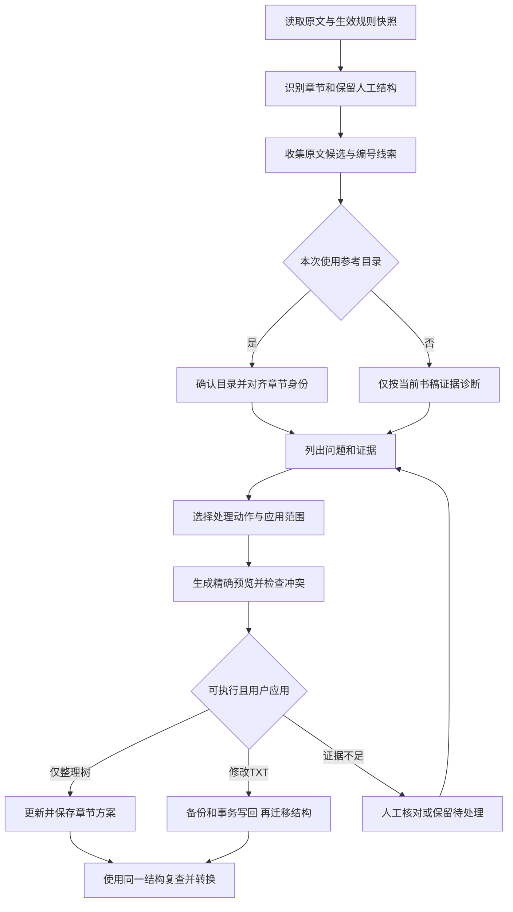

# EasyPub Modern：章节编辑与修复完整开发方案

> 日期：2026-09-19。代码基线：v1.61.2，提交 `d6b2a3e`。  
> 文档性质：基于用户本轮规划的开发设计与验收合同；不是已实现功能清单。  
> 本轮交付：设计文档、逐项回应、后续开发反馈规则。未修改程序、样书、个人设置或原始 TXT。  
> 后续界面实现必须提供真实程序截图，请用户确认；发布、推送依当次授权执行。本文不授予修改用户原稿或推送的权限。

> **2026-09-20 实施更新：**上述“本轮交付”描述的是最初设计阶段，之后已开展代码修改。整体执行清单及当前阶段以 **§13.5** 为准，逐批实际结果见[实施记录](2026-09-19_章节重构实施记录.md)。尚未交付重构版本。

## 阅读导航

- 想先看结论：§0。
- 想逐条核对自己的要求：§1。
- 想看六卷例子如何处理：§2、§6。
- 想弄懂四种模式与正则：§4、§7。
- 想知道进入软件后点什么：§5、§9、§10。
- 开始实现：§8、§11、§13。
- 看总体进度、当前任务和明确的下一步：§13.5；每轮结束按 §14.5 汇报。
- 判断版本是否真正能交付：§12。
- 以后每次开发怎样向用户反馈：§14。
- 当前代码依据与仍待验证事项：§15。

## 0. 核心结论与产品方向

### 0.1 要做成什么

EasyPub 应让用户把一本有缺陷的 TXT 整理成可阅读、目录正确、问题可追溯的电子书。用户进入章节工作台后，应能回答：

1. 软件认出了什么，还漏了什么？
2. 这条提醒有哪些依据，能确定到哪一步？
3. 我能怎么处理，点下去具体改变哪里？
4. 当前是在改电子书的章节结构，还是要写回这份 TXT？
5. 修复之后还有哪些未知，转换出来的东西是否与预览一致？

产品主线固定为：**导入 → 检查 → 预览处理方案 → 应用 → 复查 → 制作设置 → 转换与验收**。高级工具服务于这些任务，不与主流程争夺入口。

### 0.2 本方案的主要决定

| 决定 | 为什么 | 用户实际得到什么 |
|---|---|---|
| 保留 C# / WPF，集中重构章节工作台和修复编排 | 当前主要矛盾在状态、规则和执行链，换框架不能自动解决 | 可以沿用已有转换、事务和兼容性能力，逐步交付 |
| 两个独立选择组成四种修复组合 | “依据什么”决定能得出什么结论；“改到哪里”决定副作用 | 一个工作台内看清本次依据和写入范围 |
| 新建处理会话默认“仅整理章节树” | 先整理成品，避免把查看与诊断变成写原稿 | 修改 TXT 必须在本次应用前明确选择，并看见路径与差异 |
| 检测、方案、预览、执行、复查使用同一份结构与配置快照 | 现有多个入口可能丢失选择、重新推导或数出不同的章数 | 看见的改动就是实际执行的改动 |
| 正则识别与疑似标题搜寻分开 | 严格规则漏识别时，仍需要发现候选；候选不能直接成为事实 | 严格规则继续有效，额外线索须经过确认 |
| 有目录仍须核对原文证据 | 目录说明应该有哪些章，不保证该 TXT 有对应正文 | 不会为了凑齐目录制造空章、删错章或乱分正文 |
| 保留不确定性 | 没标题且没边界，无法可靠自动切开；没有文本，无法恢复 | “未定位”“待分割”“已确认缺失”分别报告 |

**重要现状差异：** v1.61.2 的 `DefaultRepairLandingMode` 是 `EditSource`。上表的默认值是本方案提出的改变，当前代码尚未改。用户本轮是在讨论两种落地方式，不等于授权现在写回任何原始 TXT。

### 0.3 本版本应交付的范围

必须完成：四组合共用的操作链、六类问题的诚实处理、正则可识别性验证、正文完整性检查、可撤销或可恢复、清楚的界面、可靠的转换出口。

可以交付为“人工确认后完成”：临时分卷、证据有歧义的移动、完全无标题的正文分割、无法唯一推断的错号。

不得承诺自动解决：原文里不存在的正文；仅凭段落长度精确切出缺失标题的每一章；仅凭重号推断跨卷归属。

本版本不以换技术栈、扩大书源数量或增加 AI 猜测为前置条件。真实缺失和无法确定的内容有清楚出口，也属于完整的软件行为。

本方案的章节修复对象是 TXT。已有 EPUB 输入转 MOBI、封面、插图、字体、元数据与版式功能继续保留；不能为了统一 TXT 识别而把已有 EPUB 拆回文本重做，也不能丢掉现有导入/输出能力。

## 1. 对用户原话逐项回应

### 1.1 目标与三个前提

| 用户观点 | 回应与补充 | 落地位置 |
|---|---|---|
| 目标是好用的电子书转换软件，目前章节编辑问题很多 | 同意。优先解决“整理后的书是否正确、用户是否知道发生了什么”，不能把进度等同于增加按钮 | §0、§5、§12 |
| 用户正则不同，会极大影响识别和修复 | 同意。规则必须作为显式输入进入整个处理链，同时显示当前生效值与来源 | §3、§7 |
| 修复使正则识别出更完整的树 | 需要区分：改 TXT 后可要求原正则重新识别成功；只改树时 TXT 不变，新增的章节依靠已保存的人工结构，不会使原正则凭空变强 | §4.3、§7.4 |
| 有无目录、改不改原文形成四种选择 | 同意。设计成两个维度，不拆四套独立界面；共享动作含义、预览和验证，依据与执行适配分别变化 | §4、§8 |
| 按钮含义、后果和引导必须清楚美观 | 同意。每个按钮必须绑定前置条件、目标、后果、失败解释、恢复方式，并在可见位置说明关键后果 | §9、§10 |

### 1.2 六类缺陷及对应思路

| 用户问题与思路 | 回应 | 必须补上的限制 |
|---|---|---|
| ① 卷标题全部丢失；无目录按循环分卷，有目录精准归类 | 无目录可提出“按编号重启临时分组”；有目录可按卷与章节身份恢复结构 | 编号重启也可能由错位造成。临时卷名必须标“推测”，目录匹配含歧义时不能称精准 |
| ② 章标题和正文完全重复；有无目录都可一键修复 | 成立。确定同一章节的完整重复副本后，可成组加入建议方案 | 章号相同不等于重复；仅标题相同也不够。目录里只有一条不能证明另一段正文可删 |
| ③ 第二卷章节移动到第三卷；有目录移回，无目录提示号异常 | 成立。检测必须与重复分开，移动标题和其正文范围作为整体 | 没目录可给当前位置与编号冲突线索；除非用户指定目标，否则不猜真实卷属、不自动重排 |
| ④ 连续重复标题、没有重复正文；按相邻行判断 | 成立。可先在识别阶段合并结构，再提供清理原文重复标题行的独立动作 | 允许标题之间仅有空白；同时看正文归属，不能按“只有一两行”删除短正文 |
| ⑤ 标题缺失与整章缺失；先看跳号和超长章，再找正文线索 | 整体方向成立。但长度只负责排序线索，不是缺章证明，也不应成为全文搜索的硬门槛 | 有目录也找不到标题时，先记“未定位”；完全无标题的正文由用户指定分割点。标题正文都不在时只报告 |
| ⑥ 缺“第”、数字标题、数字错字；有目录校正，无目录推断 | 成立。但必须同时校验章号语义、原文位置及改后对当前规则的可识别性 | 任意正则不能自动反向生成标题。无法生成匹配文本时，明确改本书规则或改用树内覆盖，不静默换规则 |

这些限制应成为界面行为与自动化测试，而不只是说明文字。§6 给出逐类算法、四组合差异和用户操作。

### 1.3 五个疑问

| 疑问 | 明确回答 |
|---|---|
| 如何清晰设计四种模式？ | 用“检查依据”和“应用范围”两个固定选择；保存目录是否存在、当前树的历史来源另行展示。更换依据不会撤销旧树，更换范围不会增强判断能力。见 §4 |
| 如何知道树有什么错、怎么改、现在是什么模式？ | 问题列表显示事实、影响、证据和下一步；选中问题同步定位章节与原文；顶部显示两项选择，应用窗再次显示实际影响。见 §9、§10 |
| 如何美观、高级、实用？ | 统一字体、留白、颜色和按钮层级；减少同权重控件；长标题可换行；不同尺寸下关键按钮始终可见。视觉质量必须以真实截图和操作检查确认。见 §9 |
| 如何成为完整实用的软件？ | 打通导入、整理、保存、重新打开、转换、验收、失败恢复；正常书能快速通过，坏书能分清“能修”和“缺材料”，大书不阻塞界面。见 §12、§13 |
| 是否重写前后端或章节编辑？ | 当前建议：不做全量技术栈重写；重构章节领域编排，逐步重做工作台视图。现有转换器、备份事务、工程持久化保留并加强契约。见 §8 |

### 1.4 三项交付要求

| 要求 | 本方案的落实方式 |
|---|---|
| 一份详尽开发文档 | 本文件覆盖产品行为、算法限制、四组合、数据、代码改造、UI、按钮、验收及里程碑 |
| 对原话一一回应 | 本章建立对应表，§6 展开每一种具体缺陷，不用总括意见替代逐项回答 |
| 开发持续说明为什么、按钮做什么、如何操作、什么逻辑 | §14 定义每个开发单元必交的反馈卡，设计、代码、截图和验收共用需求编号 |

## 2. 先把六卷样本定义准确

### 2.1 数量与区间约定

采用**包含首尾**的区间口径：30–40 是 11 章，20–40 是 21 章，100–105 是 6 章。用户原话中的“十章”“二十章”视为概述，测试以明确区间为准；如果以后改成恰好 10 / 20 章，应调整区间，不能让程序靠错误数量通过。

| 卷 | 完整版本应有章数 | 注入缺陷 |
|---|---:|---|
| 第一卷 | 100 | 30–40 各自后面紧跟一份该章完整副本，共 11 份 |
| 第二卷 | 100 | 20–40 整个连续区段被移走，共 21 章；原位置不留副本 |
| 第三卷 | 130 | 在本卷第 20 章之前插入上述第二卷 21 章；本卷原章节全部保留；本卷 70–80 标题行各多一份 |
| 第四卷 | 100 | 30–40 只删标题行，正文保留；50–60 标题和正文都删去 |
| 第五卷 | 130 | 100–105 缺“第”；110–115 使用数字标题；120–125 编号含可疑错字 |
| 第六卷 | 130 | 除卷标题缺失外，章节正文正常，作为对照 |
| 合计 | **690** | 六个卷标题均从 TXT 中移除 |

完整书的每章应有独立身份，例如“卷 2 / 章 20”，不能使用“第 20 章”作为全书唯一键。六卷都能重新从 1 编号。

测试用真实标题应彼此可区分；额外制作同名标题、同号异题、不同卷相似标题的反例，避免算法只适用于刻意容易匹配的数据。

第五卷数字样式的主样本应保留正确编号，如 `110：你好`；用户举的 `001：你好` 表示样式，但如果它出现在第 110 章位置，其本身还涉及编号错乱，应另设子样本，不能无依据把 001 当成 110。

### 2.2 应能核对的事实

- 参考目录：6 卷、690 个预期章节；卷节点不计入章节数。
- 实际独立正文：679 章的正文仍存在，11 章正文已删除。
- TXT 中正文实例：679 个原有实例加 11 个重复副本，共 690 个实例。这个巧合说明“总数等于目录”无法证明完整。
- 其中 11 章标题消失，算法在用户分割前不能假装知道其确切边界。
- 移动只改变位置：21 章正文既不新增也不删除。
- 重复标题行不增加独立正文：新增 11 行标题，不能算作新增 11 章正文。
- 三组标题写法问题各 6 个；是否一开始就被识别，取决于当前正则与辅助规则。

“实际独立正文 679”是测试生成器保存的真值，不是要求软件凭不完整文本猜出的数字。正确界面在证据不足时必须显示未知。

### 2.3 新旧样本不能混用

仓库现有 `samples/六卷缺陷样书/` 按其说明是 480 章，含“第二卷副本插入第三卷”以及第三卷原有章节缺失；它不是本轮 690 章、真正移动且保留第三卷正文的例子。

后续新增独立样本目录 `samples/六卷690章修复验收/`，保留旧样本用于回归，不能覆盖或把旧断言改成新数字。

拟新增材料：完整原稿、损坏原稿、参考目录、缺陷清单、正文范围真值、生成参数与哈希。以确定性生成器注入缺陷；用于断言的真值通过独立路径生成，不能拿待测识别器自身的输出当标准答案。

人工走查使用副本；参考目录、设置、事务存储重定向到临时目录，避免相同文件哈希命中个人已保存记录。

## 3. 共同语言与不可混淆的概念

### 3.1 四种不同的对象

| 对象 | 含义 | 不能替代什么 |
|---|---|---|
| 原文 | TXT 中真实存在的字节、编码、换行和行顺序 | 不能用目录推断不存在的正文 |
| 识别结果 | 在一份确定规则下，从原文识别出的标题与范围 | 不等于完整的书；也不等于人工整理后的结构 |
| 工作章节树 | 识别结果叠加已确认的分组、标题、范围、排序、排除 | 不能再偷偷被一次重新识别覆盖 |
| 参考目录 | 某个来源/版本对预期卷章的描述 | 不证明当前文件包含全部正文，也不必然适用于当前版本 |

输出章节结构应来自本次保存的工作章节树。原文坐标和输出顺序必须分离：第二卷第 20 章可以引用 TXT 后半段的正文，而在电子书里排回第二卷。

### 3.2 提醒状态与严重程度分开

“确定程度”回答证据有多强；“严重程度”回答不处理会怎样。两者不能压成一个红黄绿。

| 证据状态 | 示例 | 允许行为 |
|---|---|---|
| 已证实 | 相邻完整章的标题与正文逐字相同，身份和范围明确 | 可列入建议方案，仍在预览中说明保留哪份 |
| 有依据，待确认 | 疑似编号重启处，可能新卷也可能错位 | 提供候选或预览，不默认应用 |
| 未定位 | 参考目录有该章，当前源文件尚未找到可确认对应位置 | 展示已搜范围与证据，支持人工定位，不能直接说正文缺失 |
| 人工确认 | 用户指定了分割点或确认与另一版本不同 | 保存确认人行为、范围、源版本；新证据出现后可重新检查 |
| 不适用/无法检查 | 当前规则能找标题但无法提取编号 | 明确哪些检查未执行，不能显示“全部通过” |

问题处理状态另设：未处理、已加入方案、已解决、待用户判断、本次忽略。**提醒隐藏、用户忽略、问题解决**必须分别计数。

### 3.3 不变量

1. 不生成原文中不存在的正文；不把空占位章算作修复成功。
2. 每段正文的去向必须可说明：保留在哪章、移动到哪里、因何明确删除。
3. 没有删除决策时正文不能丢失；没有复制决策时正文不能被重复分配。
4. 重号不等于重复，标题相同不等于正文相同。
5. 用户手工确认的结构、范围和排除项有优先权；与新方案冲突时列出，不能悄悄覆盖或复活。
6. 同一操作在四种组合下含义一致；依据改变证据，落地方式改变写入对象。
7. 原文、规则、树、目录或选择改变后，旧预览失效；不能用过期方案执行。
8. 用户看到的范围和实际写入范围一致。没有生成源补丁时，不能显示“已修复 TXT”。
9. 不把“导出成功”“结构检查通过”“内容完整”“真机通过”合并成一个通过状态。
10. 网络失败不自动切换修复依据；目录保存不等于目录已经应用。

## 4. 四种修复组合如何设计

### 4.1 两个选择，不是四套程序

**选择 A：本次检查依据**

- `依据当前书稿线索`：读取当前 TXT 与当前工作树；本次不使用参考目录、不联网。当前树可能已被历史目录修复过，这段历史仍然显示。
- `依据参考目录`：明确选择并确认一份目录；显示书名、来源/版本、卷章数和匹配摘要。

这里“有目录/无目录”指**本次是否使用目录作为依据**。磁盘上存在目录仍允许用户选择当前书稿线索；无需删除目录记录。

**选择 B：应用范围**

- `仅整理章节树`：改变工程内结构及成品输出，不写当前 TXT。
- `同时修改当前 TXT`：将选定、可验证的文本动作写回界面显示的那份 TXT；应用前备份。其余纯结构动作必须单独列明，不能伪称全部已物理落实。

“另存整理后的 TXT”可作为后续导出动作，不加入第五种修复模式，不用于偷换“修改当前 TXT”的含义。

### 4.2 四组合总表

| 编号 | 依据 | 应用范围 | 能力与限制 | 最终应用按钮 |
|---|---|---|---|---|
| M1 | 当前书稿线索 | 仅整理章节树 | 处理确定重复、合并重复标题节点、采纳本地候选；分卷和不确定纠错须确认；不宣称按完整目录验完 | `应用到章节树` |
| M2 | 参考目录 | 仅整理章节树 | 按已确认的目录身份整理卷章、输出顺序和标题；无法定位的正文仍挂起 | `应用到章节树` |
| M3 | 当前书稿线索 | 同时修改当前 TXT | 对确定的标题写法、重复标题或重复正文生成文本差异；未知卷名和歧义移动不能自动写入 | `备份并修改 TXT` |
| M4 | 参考目录 | 同时修改当前 TXT | 在原文证据支持下同步标题、分卷、移动区段等；所有文本动作须明确位置和后果 | `备份并修改 TXT` |

M3/M4 若选中动作全是纯结构动作，则最终按钮改为 `仅应用章节树改动`，并说明“这次没有 TXT 改动”。用户要求的某项文本效果做不到时，该项标为不可执行，由用户取消该项或更换范围；不得自动降级后声称完成。

### 4.3 四组合对同一动作的不同落地

| 动作 | 仅整理章节树 | 同时修改当前 TXT |
|---|---|---|
| 加卷 | 新增结构节点，标明目录卷名或临时推测名 | 在确认的边界插入卷标题，并验证当前卷规则能识别；没规则时提示配置 |
| 完整章去重 | 从成品正文与目录同时排除选定副本，原 TXT 留存 | 删除选定副本的完整范围；保留副本可定位，清单记录全部被删行 |
| 移动章节 | 调整树与成品顺序，引用正文范围不变 | 搬动标题及对应原始正文块，保留字节与边界，再迁移行号 |
| 重复标题行 | 保留一个目录节点，额外标题不混进成品正文 | 删除多余标题行；空行处理按预览列出，不扩大删除到正文 |
| 采纳已有疑似标题 | 为真实源行建节点并分配后续正文 | 标题本已符合规则时只更新结构；否则修改该标题行并验证重识别 |
| 无标题处分割 | 用户指定起始位置，新建人工标题与正文范围 | 用户指定位置后插入标题行；不改变正文文字 |
| 改错标题 | 改成品标题，不谎称 TXT 已改变 | 只改已确认标题行中的相关文字，不做全文替换 |
| 真正缺失正文 | 缺失清单与虚线提示，不新增成品章 | 同左；绝不在 TXT 里插空章来凑数 |

### 4.4 切换规则和默认值

- 新会话推荐 M1；有已保存且确认过的匹配目录时可推荐 M2，但必须在开始检查前可见。
- 新会话不因上次选过写回而静默变成 M3/M4；可保存用户“优先使用目录”的偏好，写回仍需本次明确选择。
- 切换依据：保留当前树，重新生成诊断与方案；清除不再有效的自动勾选，保留人工决定作为待核对记录。
- 切换应用范围：保留语义上的选择，重新编译影响与可执行性；新增的删除/移动源文范围必须展开确认。
- 更换目录：先展示匹配差异；未确认的网络候选不持久化为本书已选目录。
- 清除目录记录：只删除目录记录，不复原章节树，不改变历史来源。
- 树历史与本次依据分别显示。例如“本次依据：当前书稿线索；当前树：曾按目录整理，之后手工调整 3 项”。

## 5. 用户从导入到成品怎样操作

### 5.1 正常书的最短路径

1. 添加 TXT，自动进行只读分析。
2. 主界面显示“当前规则识别出 X 章；所选检查未发现需处理项”，同时列出没有检查的部分。
3. 有修复历史时沿用已保存章节树；没有则把本次识别结果固定为本次转换结构。
4. 设置书名、作者、封面与版式，预览。
5. 转换，分别查看结构验收结果和未验证事项。

没有问题时不强迫用户打开工作台、获取目录或逐个点确认。

### 5.2 当前六卷损坏书的推荐路径

1. 打开工作台，先显示当前规则、树章数和“完整性尚未核对”。
2. 导入或获取目录；确认是同一本、同一版本、6 卷 690 章，再选“用这份目录检查”。
3. 选择“仅整理章节树”进行第一轮方案预览。希望修复 TXT 的用户可切换写回，但应先读差异。
4. 优先处理确定的重复与格式问题，再确认卷属和移动；冲突项不混在一键建议里。
5. 第四卷缺标题的区间进入人工分割；不存在的正文保留缺失报告。
6. 复查后显示“已解决哪些、还有哪些未定位、哪些由你确认、哪些检查未执行”。
7. 保存工程和章节方案。转换直接使用这份方案。
8. 对照成品目录、章节正文与完整性报告验收；有缺文时可以继续导出，但状态明确“保留已知缺失”。

没有目录时从第 2 步转为“依据当前书稿线索”，提供临时分卷、重复清理、候选修复和人工整理。软件解释不能自动完成的原因，用户可随时补充目录后重新检查。

### 5.3 一次处理的顺序



该顺序允许部分处理，但每次只应用同一快照编译出的非冲突动作。不能在应用途中重新猜标题、换目录或重新分配正文。

## 6. 六类问题的具体解决逻辑

### 6.1 卷标题全部丢失

**检测。** 在标题语义可解析的前提下，观察编号序列、局部单调性、重启位置及异常插入。不能简单遇到 1 就断卷，也不能先把所有同号章合并。先把很短的倒退段标成错序候选，再提出稳定的重启分组；两个解释同样合理时都保留，不自动选择。

**无目录。** 提出临时卷 1、临时卷 2 等结构，显示起止标题与“根据编号重启推测”。用户可以移动边界、合并分组、改名。数量可能不是六卷；因为软件并不知道用户在本轮描述里提供的真相。

**有目录。** 使用“卷身份 + 章节标题语义 + 相邻匹配 + 源位置”分配章节，允许先找到第三卷里属于第二卷的章节，再确认移动。目录卷标题可以作为真实目录名称写入；边界有多个可能位置时先请用户确认。

**用户操作。** 点问题卡 `预览分卷` → 查看每卷起止与依据 → 调整有歧义的边界 → 加入方案。纯树模式新增节点；写回模式插入卷标题行并验证卷规则。

**验收。** 无目录不声称恢复了真实卷名；有正确目录且身份唯一时得到 6 卷；未出现所有正文都归第一卷、把错位片段拆成新卷、卷节点数计入章节数等情况。

### 6.2 第一卷整章逐一重复

**检测。** 先区分标题、正文边界，再比较：章节身份/局部位置一致、标题一致、正文逐字一致。正文比较包括真实正文内容；可用哈希加速筛选，但最终确认需核对内容和范围。只忽略换行格式形成的“等价”另列为需确认，不允许把标点、空白和格式清理后的相似正文自动当作原样副本。

**无目录。** 相邻同一章节的两个完整副本、边界可靠、非手工保护项时，建议保留前一份；保留对象可切换。标题或正文不一致则进入对比，不自动删除。

**有目录。** 目录帮助确认同一卷章身份与应保留数量，但不降低正文比较要求。同一标题在不同卷合法出现，不能跨卷去重。无卷边界时只自动建议局部相邻、上下文一致的重复，其余先确认卷属。

**用户操作。** `对比重复正文` 展示两份位置与相同依据 → `保留这一份` → `加入方案`。对已证实的一组可 `选中确定重复项`，一次预览后应用。

**落地。** 纯树模式必须同时排除重复目录项与对应成品正文范围，不能只把目录藏掉。写回模式还必须明确勾选删除重复正文，并生成逐行删除清单；不允许模式切换替用户勾选。

**验收。** 删除的是 11 个副本；每章仍有且仅有一份完整正文；附近的不同标题、同号异题、相似但不相同正文全部保留或待核对。

### 6.3 第二卷 21 章移动到第三卷

**检测。** 两种线索分别建立：第二卷的 19→41 缺口；第三卷第 20 章之前出现标题语义属于另一卷的连续段。编号相同只触发顺序/归属核对，不进入完整重复组。正文指纹仅辅助判断是否还有副本，不把“在别处找到”误报为缺文。

**有目录。** 建立跨位置对齐：第二卷 20–40 在 TXT 另处可定位，目录相邻关系也支持其返回位置。若有两份同名不同正文或多个可插入位置，先让用户选择。整段可分组，但每章的正文归属必须可检查。

**无目录。** 显示“发现编号倒退/重复编号，但标题不同，疑似错序或分卷”。支持用户选择区段和目标卷/章节后的手动移动；没有足够证据时不能自动写“应移回第二卷”。

**用户操作。** `查看顺序异常` → 双位置预览 → 选择或确认目标 → `加入移动方案`。显示“从第三卷前段移到第二卷第 19 章后，共 21 章；正文不删改”。

**落地。** 纯树模式改变电子书顺序，不改变 TXT 顺序。写回模式把原标题、完整正文以及有明确归属的分隔空行整体移动；不是复制过去再忘记删旧位置，也不是只改章号。

**验收。** 第二卷恢复 100 章，第三卷保留原本 130 章；其余缺陷另计。21 份正文哈希和内部行序不变，每份只出现一次。真实移动必须用新样本验证，旧“插入副本”测试不能代替。

### 6.4 第三卷连续重复标题行

**检测。** 相邻相同标题之间只有允许的空白，没有属于独立章节的正文；后面有明确正文范围。把“重复的标题标记”与“完整正文副本”分别记录。

**有无目录。** 本地证据通常足够，目录不是必须条件。若两行标题之间有哪怕很短的非空内容，也不按空标题自动删；短诗、楔子等是必要反例。

**识别阶段。** 可以直接把这组行识别成一个工作节点，附注“原文重复标题 1 行”。结构已经合并不等于原文已清理；若要改 TXT，重复标题源行仍须保留为可执行清理动作。

**用户操作。** `查看重复标题行` → 高亮多余标题与将保留的标题 → `清理多余标题`。纯树模式不把额外标题漏进成品段落；写回只删额外标题及明确选择的空行。

**验收。** 第三卷 70–80 每章一个节点、正文逐字不变；重复标题不造成空章；未保存树直接转换的路径也必须使用同一识别结构。

### 6.5 第四卷：标题缺失与整章缺失

这两种缺陷必须分别报告。缺章号是一条观察，不是“正文不存在”的结论。

**共同搜寻顺序：**

1. 检查卷内编号缺口，记录两侧已确认标题；编号体系不清时不套连续编号假设。
2. 检查缺口附近是否有异常长章节。非空行数、字符数、段落数共同作为线索；与同卷附近可信章节比较，排除目录、插图、短章等离群类型。
3. 用当前规则、候选标题规则、编号变体和已知目录标题搜索局部区间。
4. 有目录时继续查全书索引，排查章节被移动；不能因为这一章“不够长”就停止查找。
5. 未找到独立标题行时，展示可能的段落分界。正文里一句话碰巧含有目录标题不构成可自动采纳的章边界。
6. 无边界证据则交给用户人工分割；查找无结果则记录“未定位”，由用户结合版本与原文确认是否缺失。

长度异常首轮可试用“相邻可信章字符数中位数的 3 倍”作为候选排序信号；它是待 44 本语料验证的初始参数，不是直接删除、补章或宣称缺文的阈值。邻章不足或篇幅差异过大时显示“长度线索不足”。

**30–40 标题完全消失但正文在。** 软件可提示第 29 章异常长、缺少中间编号，却无法从总长度精确分出 11 章。若目录标题在真实独立行上可定位，就采纳该行；完全没有标题行，则由用户在原文中逐个标记分割点。目录可提供标题名称，无目录由用户输入；默认临时名必须注明人工待命名。

**50–60 标题与正文都不在。** 不添加 11 个空章节。问题列表可以显示 11 个“预期章节未定位”的虚拟提示，明确它们不是工作节点，不进入成品目录。用户确认缺失后，转换可继续，但保留已知缺失报告。

**手动分割操作。** `查看缺口原文` → 选择真实段落起始行/位置 → `从这里新建章节…` → 输入或选用标题 → 同时预览前后两章正文 → 确认。纯树按范围拆分；写回在选定位置插入标题。首版支持行首边界；如果正文全在一行，应另用明确的段落切分操作，不能暗中重新换行。

**验收。** 用户确认全部缺标题边界后，第四卷可形成 89 个有正文章节，11 个真正缺失仍在报告中。分割前不得提前报告“已恢复 89 章”；人工切分前后的正文串联内容必须完全一致。

### 6.6 第五卷：标题存在但形式不被识别

**缺“第”（100–105）。** 默认现代规则可能已经认识，不应人为制造修复任务。若用户严格规则要求“第”，候选扫描识别周边 99/106 与这些标题的连续性；提出补“第”或仅本书放宽规则两种明确选择，不能两者一起静默执行。

**数字形式（110–115）。** 识别行首数字、分隔符、标题文本及相邻章节上下文；保留 `001` 的原始形式用于解释，语义编号可解析为 1，但不能自动推成 110。日期、列表序号、余额、编号对话等必须作为反例。数字标题解析和“最少正文行”都应展示当前参数，短章不能仅因篇幅短被判不是标题。

**编号错字（120–125）。** 只在候选标题的编号片段尝试有限纠正，例如“久→九”；用前后编号、目录身份及真实标题文字复核。绝不对全文做“久→九”，也不修改标题正文里的“天长地久”。未唯一确定时显示候选，用户选择。

**有目录。** 用标题文字、卷信息与邻接关系确定对应目录项，再生成符合当前规则的标题。原目录也可能用 `第110话`，而当前正则只接受“章”；不能假定照抄目录就能识别。必须预览实际改后标题及匹配结果。

**无目录。** 邻接连续、格式变化可解释时提出候选；涉及重新编号、多个同样合理标题或跨卷判断时需要用户确认。没有候选时提供手动建章，不自动替用户扩大全局规则。

**用户操作。** `查看漏识别标题` → 查看原始行、为何没识别、建议文本和“改后是否可识别” → `加入方案`。如果用户选择改规则，则进入本书规则预览，不混进改 TXT 的标题修复动作。

**验收。** 三种变体各 6 例，在严格规则与现代默认规则下结果可解释；已经正确识别的标题不报错；每个实际写回标题在本次规则下重新识别成功；没有把正文数字或普通错别字改成标题。

### 6.7 六类问题同时出现时，不能串成六次盲修

这些问题会互相影响：卷名缺失会让重号含义不清，错位区段会伪装成编号重启，漏识别标题会把几章正文并成一章。不能先无条件分成六卷，再按这份推测去删重。

1. 第一遍只读收集：当前正式标题、重复标题源行、候选行、正文指纹及相邻关系，保留人工保护范围。
2. 有目录时建立可靠锚点，并保留多候选；无目录时只建立有证据的局部编号段。还不写树或 TXT。
3. 在当前证据下区分完整副本、空标题重复与同号异题；依赖卷属的判断要等待卷属确认。
4. 把分卷、移动、采纳候选等组成有依赖的方案。用户可以先确认有歧义的卷边界，再让软件重新计算后续项。
5. 正文归属校验通过后一次编译选中动作；如果某项依赖未选中的前置动作，就解释并阻止该组合。
6. 应用后重新检查，不在应用中间自动启动下一轮猜测；新发现再进入下一次预览。

验收必须保留完整混合样本。单项都能修，不代表它们同时出现时不会互相制造误判。

## 7. 正则识别如何贯穿全链

### 7.1 把识别配置做成可核对的完整输入

拟引入完整的“本次生效识别配置”，包含：标题正则、卷章层级正则、数字标题开关与格式、编号纠正规则、编码、超时策略以及各字段的来源。它作为不可变快照传给识别、诊断、候选搜索、方案编译、预览和转换。

**建议的优先级，属于新设计：** 本书明确覆盖值 > 本书选择的预设快照 > 全局默认 > 程序内置默认。现有配置迁移时逐字段映射，不能仅按一个总的“来自预设”标签概括。

- 导入 `config.xml` 是一次显式的设置导入，展示差异后形成当前书/当前配置的值，不增加隐形第五层覆盖。
- 保存命名预设时保留版本快照；修改同名预设不偷偷改动已经打开的书。
- 旧默认升级显示“本书旧默认已升级哪些字段”，用户自定义字段保留；这是修正默认残留，不是把所有旧表达式重写。
- UI 显示摘要，例如“严格章节规则 · 本书设置，卷规则继承全局”，点开看具体字段。
- 缓存键至少包含源文件版本、完整识别配置指纹、工作树版本；不能只看路径。

### 7.2 三个职责分开，但共享标题语义

| 职责 | 负责什么 | 输出 |
|---|---|---|
| 正式识别 | 用户规则明确承认哪些行是标题 | 标题位置、原始文字、层级、匹配规则 |
| 标题解析 | 从已识别/候选标题里读出编号、编号体系、标题文字、编号片段 | 可空的编号与解释；不支持时返回原因 |
| 候选搜寻 | 在缺口、长章和全文索引中找可能漏掉的标题 | 带证据和位置的候选，不直接改树或 TXT |

当前 `HeadingSyntax` 的固定编号解析逐步收进这个共同模型。兼容旧正则时，如果没有编号捕获组，可尝试内置解析；仍不能读出时明确标“本规则不支持编号检查”。

新高级规则可约定命名捕获组 `number`、`title`，卷号可另有 `volume`。这是新配置能力，不强迫现存用户的所有正则一次性重写。只定义了识别规则而没有解析能力，也应能正常导出，只是不宣称检查过跳号和编号顺序。

### 7.3 规则测试窗必须展示后果

输入正则时，旁边展示：示例匹配行、疑似漏识别行、意外匹配正文、编号是否可解析、与当前树相比新增/减少的条目数，以及哪些手工调整将受影响。

按钮固定为 `预览本书识别变化`、`应用为本书规则`、`另存为预设`；不能让“应用本书”顺手覆盖全局。

对用户正则设有限执行时间并可取消；超时显示具体规则与输入位置，不将其当作“本书没有标题”。.NET 官方建议对可能过度回溯的正则使用超时限制；具体预算以本项目长篇语料测量，不在 UI 暴露复杂实现参数。[微软正则最佳实践](https://learn.microsoft.com/dotnet/standard/base-types/best-practices)

### 7.4 改标题后要验证什么

**只改树：**

- 允许人工标题不满足原始 TXT 正则，因为正文范围已经由人工或目录证据明确指定。
- 保存来源为“人工建章/目录确认”，转换读保存结构。
- 提示“按原规则重新识别可能找不到该章”，而不是声称修好了 TXT 识别。

**写回 TXT：**

1. 先生成改后的候选标题文本。
2. 用本次真实生效规则验证该行是正确层级的标题。
3. 需要跳号检查时再验证其语义编号能正确解析。
4. 对临时渲染结果重新识别，比较受影响标题位置、正文分配与预期结构；同时检查是否误吞相邻正文。
5. 不通过就不提交这条文本动作，展示失败原因和可选修正。

单纯 `Regex.IsMatch(标题)` 不足以证明修改正确，因为真实识别还有层级、数字过滤、上下文等条件。最后必须走同一套识别入口。

### 7.5 任意正则不能自动反向生成标题

程序不能普遍从任意表达式推导出用户想要的标题。例如规则要求 `[第001话]`，直接套 `第一章` 会失败。

拟提供有限的标题输出格式：保留现有形式、内置中文编号格式、阿拉伯数字格式、用户模板。模板必须包含所需的编号/标题字段，生成后逐条验证，不把模板本身视作正确性证明。

如果当前格式无法匹配规则，界面提供三个明确出口：编辑这条标题、调整本书规则并重新预览、改为只整理章节树。不能自动把全书规则改宽，也不能宣布“修复成功但识别不到”。

### 7.6 转换路径不能重新给出另一种答案

当前默认转换要消费本次已经接受的结构快照：即使用户没有手动打开工作台，也应由正式识别结果生成一个快照后传给转换器。

现有 `LegacyTextParser` 兼容路径保留给**显式的旧识别兼容选项**及回归用例；不能因 `ChapterTree == null` 偷偷选另一套章节规则。“原版兼容版式”仍只描述排版，与旧识别算法分开。

本项是有意的产品行为调整：不再只靠“保存树后章数才一致”的提醒让用户绕开分歧。迁移时必须锁住旧兼容出口，并让普通转换、预检、预览使用同一份结构。

## 8. 代码怎样改，哪些保留

### 8.1 不全量重写，分层收拢章节编辑

| 范围 | 决定 | 原因 |
|---|---|---|
| C# / WPF 技术栈 | 保留 | 当前已能承担本地文件、桌面交互和样式；未发现必须换框架才能实现这些需求的证据 |
| EPUB/MOBI 输出与兼容处理 | 保留，改为显式接收统一结构 | 输出兼容能力已有积累，主要缺口在输入结构契约 |
| 事务、备份、恢复、版本迁移 | 保留并补契约测试 | 新的移动/插入必须接入已有审计链，不能另建直接写文件路径 |
| 章节修复编排 | 集中重构 | 当前 UI 与 Core 有重复组织流程及选择丢失风险 |
| 标题识别与编号语义 | 逐步整合 | 每次提取一段、对照回归，不一次性替换所有规则 |
| 工作台视图 | 逐步重做 | 将状态与命令绑定到会话模型，保留必要的焦点/拖动等视图逻辑 |
| 问题策略表 | 继续使用 `IssueResolutionPolicy` | 不再建立第二份“问题到按钮”的硬编码表 |

WPF 已提供布局、数据绑定、样式和模板能力；因此“高级审美”本身不是换框架的依据。保留 WPF 是结合现有代码与交付目标的工程判断，不是对所有项目的通用结论。[微软 WPF 概览](https://learn.microsoft.com/en-us/dotnet/desktop/wpf/overview/)

若未来有明确跨平台要求，或经过性能/可访问性测量证明现有实现无法满足目标，再单独评估前端迁移；不可用尚未测量的假设作为重写理由。

### 8.2 目标模块与最小调用面

以下名称是**拟议设计**，不是仓库中都已经存在的类。

| 模块（Module） | 调用方需要知道的接口（Interface） | 隐藏的实现（Implementation） |
|---|---|---|
| `RecognitionContext` | 取得本次配置快照与字段来源 | 继承、旧默认迁移、缓存指纹、编号解析能力 |
| `BookStructureSnapshot` | 读取原文版本、章节身份、正文范围、人工决定与输出顺序 | 识别结果与工作树的合成、来源追踪 |
| `ChapterRepairSession` | `Analyze`、`Preview`、`Apply`，均返回明确结果 | 检测、方案、选择验证、版本变化、复查编排 |
| 方案规划器 | 从固定快照和依据生成带证据的动作 | 当前书稿规划与参考目录规划两个适配实现（Adapter） |
| `RepairPlanCompiler` | 从方案和完整用户决定生成同一份预览/执行产物 | 依赖关系、正文归属、树补丁与源补丁、冲突检测 |
| `ChapterRepairApplier` | 应用已验证的产物，返回实际提交结果 | 树落地或源事务、备份、清单、迁移、恢复记录 |
| 工作台会话视图模型 | 可读状态与用户命令 | 选中联动、按钮可用原因、显示映射；不自行实施正文修改 |

“接口接缝（Seam）”放在快照→方案、决定→编译、编译结果→提交三处。已有本地/目录规划、树/文件落地是真实差异，需要适配；不要为了未来想象的第三种后端建立大量空接口。

实现优先扩展或包住现有 `ChapterTreeDocument`、`ChapterTreePlan`、`RepairCompilation` 等真实载体；表中的新名称是职责说明，不要求另造一套平行状态。整个会话只保留一个权威工作结构，视图摘要由它计算，避免产生另一份会过期的“真相”。

网络目录来源也设可替换入口：实际联网适配与离线固定目录适配，用来验证“候选未确认不保存”和失败状态，不让窗口测试依赖真实网络。

### 8.3 数据与身份

| 数据 | 必须包含 |
|---|---|
| 章节身份 | 稳定工程 ID、卷作用域、原文锚点、标题原文、规范化标题、可空编号 |
| 标题候选 | 原始位置、匹配来源、候选编号、上下文证据、不确定原因 |
| 预期目录项 | 目录自身 ID、卷/章序位、原始标题、来源/版本、匹配状态 |
| 正文片段 | 原始坐标或字节范围、内容指纹、唯一归属、是否被显式排除 |
| 问题 | 稳定问题 ID、关联对象、证据、严重程度、确定程度、可执行动作 |
| 用户决定 | 动作 ID、是否选择、保留/移动目标、分割锚点、源文删除许可、手工修改文本 |
| 编译产物 | 基准版本、选择指纹、树变化、源变化、预期结构、冲突、删除/移动清单 |
| 提交结果 | 实际源文是否改变、工程是否保存、事务阶段、备份位置、未完成项、下一步 |

不能把章号、标题字符串或当前行号当成跨版本唯一身份。无源行的卷节点还可能重名，须有卷作用域与生成 ID。移动后以迁移映射维持身份，失配列出而不默默丢失人工调整。

已被用户明确排除的范围应形成随源版本绑定的记录。候选搜索不能重新把它当作漏章推荐；恢复排除必须是另一个明确动作。

### 8.4 动作应描述真实业务效果

现有 `ReferenceActionKind` 可以保留为旧方案适配入口，逐步映射为更明确的效果：

| 语义动作 | 必要参数 | 关键约束 |
|---|---|---|
| 建立卷/改变卷属 | 卷身份、起止/成员、名称来源 | 推测卷不可标成目录确认 |
| 保留一份、排除重复副本 | 保留章、被排除章、正文范围 | 不只有一个“删除节点”命令 |
| 合并重复标题标记 | 保留标题、重复标题源行 | 不能包含非空正文 |
| 移动章节区段 | 稳定章 ID、完整范围、目标锚点 | 无自包含目标、无范围重叠、内部顺序保持 |
| 采纳真实标题行 | 源锚点、标题、正文终点 | 不是凭目录制造源行 |
| 人工分割正文 | 人工锚点、前后归属、标题来源 | 无正文内容损失、不可越过受保护范围 |
| 更正标题文字 | 原文预期值、新值、编号片段 | 写回时重识别验证 |
| 标记未定位/确认缺失 | 目录项、已搜索证据、用户确认 | 不产生可导出的空章 |

动作依赖需显式表达，例如先确认卷属再执行跨卷移动；动作冲突需在应用前发现，例如“删除副本 A”与“把 A 移到第二卷”不能同时选中。相邻多个插入按确定顺序编译。

动作 ID 应覆盖可执行参数、正文范围、目标、用户编辑值与来源版本，不能只由显示标题决定。选项或目标变了，旧预览就不是同一动作。

### 8.5 预览和执行只吃一份完整决定

必须打通：`RepairReviewWindow` 的全部选项 → 完整 `RepairDecision` 集合 → 编译 → 可视预览 → 应用同一编译结果。

本轮静态阅读发现：窗口存在重复正文删除的单独勾选，但生产路径传入的决定工厂只收到 `chosen`；调用处取出 `SelectedDecisions()` 后，应用又传 `chosen` 让 Core 重新生成决定。这是**应优先用真实入口复现的传参风险**，不能再用“编译器单独测过”证明按钮正确。证据见 §15 E04。

两种落地也应走同一会话入口。当前树模式在 Desktop 直接重建，写回模式调用 Core 应用器，必须收拢为一处语义编译，消除两条路各自推导正文和来源的机会。

### 8.6 源文移动是明确缺口，不能只给它换个按钮名

当前 `SourcePatch` 已有删除、替换、插入行，未见独立的原始区段移动操作。新设计增加能引用原始内容的移动效果与坐标映射，或由一个明确保留来源的区段编译器展开；不能把正文当成普通新字符串复制后当作“标题插入”。

提交时基于不可变的旧文件一次渲染新版本：先分配所有保留、移动、替换范围，再写临时文件。所有范围在旧坐标中验证，避免按顺序修改字符串导致后续行号漂移。

移动清单至少包含旧卷章、旧行区间、新位置、内部内容指纹。它和删除清单是不同记录：移动不应被报告成正文丢失。

正文守恒比较必须考虑排列：允许移动时比较每个正文片段的内容与出现次数、片段内部顺序，不能要求全书正文串联顺序不变；同时要求新顺序恰好等于用户批准的顺序。

## 9. 章节工作台的界面设计

### 9.1 页面职责与布局

工作台只负责一本书的章节问题。主窗口继续承载书籍列表、制作设置、批量转换与验收。

```text
章节工作台  /  当前书名                       保存章节方案  返回

本次依据 [当前书稿线索 / 参考目录]   应用范围 [仅章节树 / 修改当前TXT]
目录：已确认·6卷690章  [更换]        识别：严格规则·本书配置 [查看]
当前树：曾按目录整理，手工调整3项     原文：版本一致

下一步：先核对确定重复项和错位区段          [预览建议处理]

┌───────────────────┬──────────────────────────────────┐
│ 章节树 / 搜索      │ 当前问题：第二卷20–40出现在第三卷  │
│ 第一卷…           │ 证据、影响、推荐操作与不能判断的事 │
│ 第二卷…           │                                  │
│   缺口提示        │ [原文] [参考目录] [变更预览]       │
│ 第三卷…           │ 对应行与前后上下文                 │
├───────────────────┤                                  │
│ 问题：全部/可处理/ │ [查看目标位置] [加入方案]          │
│ 需确认/未定位     │                                  │
└───────────────────┴──────────────────────────────────┘
已加入方案：X项，影响Y章  ·  仍有Z章未定位    [查看方案]
```

这是信息布局草图，不是已完成视觉稿。宽屏时问题列表可以独立成第三列；窄屏改用“章节 / 问题”切换与详情页，不把三个面板挤到文字不可读。

### 9.2 用户始终能看见什么

- 顶部两项选择是本次行为，不用颜色或缩写让用户猜模式。
- 目录是否存在、树历史、原文版本是事实；可收成一行摘要，展开详情。原文变化等关键状态不得隐藏。
- 当选择写回时，显示“将修改：完整路径”，应用窗再次显示；查看路径不会触发写入。
- 当前生效规则与来源可查，不能只显示“自动识别”。
- 检查范围说明，例如“未使用参考目录，完整性尚不能确认”。
- 操作数量分别显示“方案动作数、影响章节数、问题组数”，避免 1 组重复 11 章被说成 11 个互不相关问题。

树上的缺口提示是可点的辅助行，视觉上与章节节点不同；不能被拖动、导出或计入目录。选中它会定位两侧已知正文和问题详情。

### 9.3 问题卡的固定结构

每张卡只回答六件事：

1. **发现了什么：** “这里连续出现两次相同标题。”
2. **会有什么影响：** “可能在目录里多出一个空章。”
3. **为什么这么判断：** “第 420、422 行标题相同，中间只有空行。”
4. **建议怎样做：** “保留第 422 行作为标题。”
5. **本次会改哪里：** “仅修改章节树；TXT 不写入。”
6. **做不到什么：** 仅在需要时说明，例如“目录项未定位，无法恢复正文”。

一个主要动作，最多两个常用辅助动作；其他放“更多”。问题列表可以分组折叠，但不可用折叠掩盖高影响未解决项。

### 9.4 方案预览页

预览页显示所有将发生的实际效果，而不是重复问题描述。

| 区域 | 内容 |
|---|---|
| 顶部 | 书名、依据、目录来源、应用范围、当前 TXT 路径 |
| 摘要 | 修改标题数、建立/移动章数、排除副本数、新建卷数、源文删除/插入/移动范围 |
| 动作列表 | 每项原状→结果、依据、勾选、不可执行原因、相依动作 |
| 详情 | 树前后对照、原文差异、移动两端、保留正文与删去正文对照 |
| 底部 | 本次是否真的改 TXT、备份策略、仍未解决的项目、明确的最终按钮 |

取消某项后立即重编译摘要，不能只让勾选图标变了。源文删除勾选必须进入预览与实际执行。应用前再次核对版本；版本改变时保留用户选择用于重新审查，但不执行旧补丁。

### 9.5 审美与可用性标准

建议延续已有暖白底、深墨色文字与克制的强调色，统一使用 `Controls.xaml`。首次视觉稿提供给用户截图确认，颜色与字号不是在这份文档里宣布已获用户认可。

| 项目 | 设计目标 |
|---|---|
| 字体 | 主界面使用系统中文 UI 字体；原文可单独设置阅读字体；避免细到难读的正文 |
| 字号 | 正文与主要控件约 14–15 个逻辑像素；标题约 20–24；关键模式不小于正文 |
| 间距 | 使用 4/8 的间距刻度，相关项紧邻，不相关区域留更大空白 |
| 按钮 | 每个当前任务区域一个主按钮；其他用描边或文字样式，危险操作写清对象 |
| 色彩 | 色彩只辅助状态；成功、警告、错误必须同时有文字，不只靠颜色 |
| 长文字 | 书名、卷名、标题可以换行；布局先给操作留足空间，完整文本可直接展开 |
| 响应布局 | 根据实际可用逻辑宽度重排；固定底部操作区不盖住正文，内容区域独立滚动 |
| 小窗口 | 宽度不足时折叠辅助面板，不横向挤压“转换与验收”等入口；保留文字与点击区域 |
| 大字体/DPI | 100%、125%、150%、200% 实际窗口验收；尤其检查高缩放下的可用逻辑高度 |
| 键盘 | 清楚的焦点、可预测的 Tab 顺序；快捷键标注对应操作，Esc 不丢弃已应用修复 |
| 无障碍 | 控件名称与功能一致，禁用原因可读，关键动作不只存在于悬浮提示 |
| 等待 | 明确正在读原文/取目录/生成方案/提交；可取消阶段显示取消，不可中断的提交阶段如实说明 |

不把事务 ID、类名、正则指纹等实现细节放进主流程。它们进入“详细记录”，只有解释用户决策所需的路径、备份和改动位置留在主界面。

### 9.6 视觉验收方法

对导入、无目录、有目录、无问题、多问题、方案预览、改 TXT、原文变化、失败恢复至少九种状态截取真实 WPF 窗口。覆盖长书名、长卷名、长标题、最大化与紧凑窗口。

文字正确性读控件真实属性并断言；截图检查遮挡、层级、间距、焦点与可读性。不能把视觉模型转写文字当成文字验收。按照用户既有要求，视觉改完后交用户看截图，记录其反馈后才声称界面验收完成。

## 10. 按钮字典与操作后果

### 10.1 命名规则

按钮名字使用“动词 + 对象”，少用“智能处理”“高级修复”“一键修复全部”。省略号表示会打开设置/确认或预览，不代表立即写入。

“检查”只读；“加入方案”只改待应用选择；“应用到章节树”提交结构；“备份并修改 TXT”才会写当前 TXT。这四个阶段必须在界面和代码中一致。

人工改名、移动、分割先进入工作草稿，可即时预览并撤销；源文件不会因选择写回模式就边操作边保存。最终应用窗同时纳入这些草稿动作。项目可保存恢复草稿，但必须区分“草稿”和“已应用结构”，转换只使用已应用结构。

### 10.2 主流程按钮

| 按钮 | 用户意图与前置条件 | 按下后的结果 | 失败/不可用时的反馈 |
|---|---|---|---|
| `检查章节` | 看当前书有哪些问题；原文可读取 | 使用显示的规则和依据生成问题列表，不改树/TXT | 规则超时、原文变动、目录未确认分别说明 |
| `选择参考目录…` | 想用外部目录核对 | 打开获取、导入或粘贴面板；选中候选本身不修书 | 失败可重试、导入或继续本地检查，不自动改模式 |
| `用这份目录检查` | 已看过来源、卷章数与匹配摘要 | 确认本次依据并重新检查 | 版本明显不符时展示冲突，保留原选择 |
| `记住这份目录` | 希望下次继续使用 | 保存明确选定的目录记录，不改变当前树 | 保存失败显示位置与原因，当前会话仍可用 |
| `查看识别规则…` | 不清楚为什么漏标题 | 展示有效配置与逐字段来源，提供预览 | 无需原文写权限，不应因其他修复错误而隐藏 |
| `预览建议处理` | 想批量解决确定问题 | 打开方案页，默认勾选证据充分且无冲突的项 | 无建议时说明未检查什么，并给人工出口 |
| `查看方案` | 核对自己已选择的动作 | 展示完整影响，重新编译与校验 | 有冲突就定位具体项，不弹模糊“修复失败” |
| `应用到章节树` | 接受本次结构变化 | 提交结构，保存到工程，保留撤销历史；TXT 哈希不变 | 工程保存失败区分内存已更新与磁盘未保存 |
| `备份并修改 TXT` | 接受精确源差异且当前模式为写回 | 备份、执行一次事务、迁移树、复查 | 备份失败不写源；源已提交而后续失败时显示“已写入，需完成恢复” |
| `复查结果` | 想知道修后是否真的改善 | 对新结构重新检查，对比已解决/仍存在/新问题 | 不把隐藏提醒计入已解决 |
| `保存章节方案` | 保留已应用结构及必要恢复信息 | 写工程/章节方案，不写 TXT，不偷偷应用尚未确认的草稿 | 说明保存路径，失败保留草稿 |
| `返回制作流程` | 回主界面排版转换 | 有草稿时选择保留草稿或放弃，已应用变更不被撤销 | 不用关闭窗口代替源事务撤销 |
| `转换并验收` | 制作成品 | 使用已应用的同一结构输出并做结构验收 | 有草稿提示先应用或明确使用已应用版本；有缺文显示具体范围，可带报告继续 |

### 10.3 问题处理与恢复按钮

| 按钮 | 何时出现 | 实际行为与限制 |
|---|---|---|
| `定位原文` | 问题有真实锚点 | 跳到相关行并显示上下文，不改变任何内容 |
| `对比重复正文…` | 两个以上可能副本 | 并排展示差异，标位置；不会自动选定删除对象 |
| `保留这一份` | 正在比较副本 | 更新待应用决定和预览，可撤销选择 |
| `并从 TXT 删除该副本` | 写回模式且重复范围确定 | 单独明确许可；取消后正文只能在成品里排除，摘要必须反映这一区别 |
| `清理多余标题…` | 仅标题行重复 | 预览将移除的标题行或树内排除，不能处理未知正文 |
| `预览分卷…` | 编号重启或目录分卷可核对 | 展示边界、卷名来源与不确定处；用户可调整 |
| `加入移动方案` | 移动目标已确认 | 移动整章/区段的草稿，不立即重排 TXT |
| `选择移动位置…` | 无目录或目标有歧义 | 用户从树中指定前/后位置；解释移动正文会跟随 |
| `采纳此标题行` | 原文真实行已定位 | 把该行建为标题并预览前后正文归属 |
| `从这里新建章节…` | 用户选中明确边界 | 建立人工分割草稿并要求标题；不会凭空产生正文 |
| `更正标题…` | 候选文字可编辑 | 展示改前/改后以及当前规则匹配结果；修改范围是标题 |
| `调整本书规则…` | 形式正常但规则不识别 | 先预览识别变化；不影响其他书和全局预设 |
| `确认此章未在本稿中找到` | 已查看搜索范围与原文 | 记录用户确认，不把缺失标成修复完成，不建立空章 |
| `本次忽略` | 用户接受某项疑点 | 保留理由与版本绑定；统计为忽略而非已解决 |
| `撤销本次结构修改` | 树/草稿操作在同一源版本内 | 撤销对应结构命令，不还原磁盘 TXT |
| `恢复修改前版本…` | 存在源事务备份 | 预览将恢复的 TXT 与工程结构；当前版本已变时先处理冲突，避免覆盖后续编辑 |
| `重新识别章节…` | 用户决定重新按规则建树 | 先展示会替换的人工结构，允许对照采纳；不与刷新原文混成同一按钮 |
| `同步外部原文修改…` | 文件被其他编辑器修改 | 尝试迁移现有结构，列失配项目；不直接清空手工树 |

按钮禁用必须附有可见原因和可执行下一步。例如“原文已变化，请先同步原文”，而不是让整个问题卡消失。每个按钮都应有稳定命令标识，自动化验证其真实执行结果，不能只断言字符串存在。

## 11. 状态、失败、保存与恢复

### 11.1 会话状态

| 状态 | 用户可以做什么 | 禁止发生什么 |
|---|---|---|
| 待读取 | 选择文件、调整读取配置 | 显示旧书的检查结论 |
| 分析中 | 看进度、取消、查看原文 | 自动应用部分结果 |
| 可处理 | 查看问题、建草稿、选择依据与范围 | 修改选择后保留过期预览 |
| 预览有效 | 查看精确改动、应用 | 执行另一份重新猜出的方案 |
| 需要重算 | 原文/规则/目录/树/决定改变后重新预览 | 沿用旧定位或旧删除范围 |
| 应用中 | 查看实际阶段 | 第二次点击提交，或在原子替换中强制中断 |
| 已应用待复查 | 查看回执、复查、必要时恢复 | 未复查就宣称所有问题已解决 |
| 部分后续工作失败 | 完成迁移/保存，或按备份恢复 | 文件已写入却提示“什么也没改” |
| 外部原文已变 | 比较、同步结构、放弃旧草稿 | 使用旧版本源坐标执行补丁 |

动作在 UI 线程以外计算，回到界面时检查会话版本。用户已切书或改规则后，迟到的分析结果只能丢弃/存缓存，不能覆盖当前页面。

### 11.2 提交链

1. 固定源哈希、工作树版本、规则指纹、目录指纹和完整决定。
2. 编译所有选择，检查重复占用、正文归属、目标存在、规则可识别性与冲突。
3. 展示预览；点击应用时确认快照仍有效。
4. 树模式通过结构命令提交并保存；不写 TXT。
5. 写回模式先验证备份可用，再在源目录同卷生成临时文件，保存执行清单，原子替换。
6. 迁移行号与章节身份，保存新的工程状态、目录关联及事务结果。
7. 复查并提供实际变更回执。

源写入不能绕过 `SourceEditTransaction`。备份失败、编码无法表示新标题、位置冲突、文件被占用时停止并解释。原编码/BOM/换行风格应尽量保留；需要转编码时作为用户可见的独立差异，不静默替换成问号。

对外部并发编辑，除预览时校验外，还须在提交阶段重新验证或持有适当文件句柄保护；记录竞态下的拒绝/恢复策略。仅说“原子替换”并不意味着可以忽略别的编辑器刚写入的内容。

### 11.3 删除、移动、撤销各自的证据

- 删除：应用前备份；逐行列出删除内容、旧位置、所属章节、理由及保留副本位置。
- 移动：记录旧位置、新位置和内容指纹；不把搬走的正文算作永久删除。
- 插入：记录标题文本、来源（目录/用户/临时）、插入锚点与规则验证结果。
- 树撤销：同源版本内恢复树与人工决定，不能声称撤销了 TXT 写入。
- 源恢复：作为显式恢复事务，恢复前检测当前 TXT 与目标备份的关系；需要保留当前版本时先备份。提供“恢复原文及当时结构”与可用范围说明。
- 应用后崩溃：启动恢复从清单与文件哈希判断实际阶段；不得只看最后一条 UI 提示。

### 11.4 保存和重新打开的合同

工程应保存：已应用树、完整识别配置快照、目录与确认信息、树来源、人工决定、排除范围、未解决问题及源版本。草稿可自动恢复，但不能冒充已应用方案。

重新打开后必须能再次得到同一成品结构；原文改变时先报告，不能自动套用旧行号。旧工程缺少新字段时标明来源未知或需确认，使用显式迁移，不猜用户当年选了什么。

“清除提醒”和“重建工作树”不能删除源备份。删除备份属于独立管理功能，先列明将失去的恢复点；本次章节修复不新增隐蔽的备份清理行为。

### 11.5 统计口径统一

| 显示项 | 定义 |
|---|---|
| 当前章节数 | 已应用树中实际包含正文或明确有效特殊章的章节；不含卷节点、合成前言占位和未定位提示 |
| 参考目录章数 | 当前选用目录中的预期章条目；不是已找到正文数 |
| 已定位 | 对应的正文/标题身份已确认，可定位到源范围；人工无标题分割需确认后才进入 |
| 未定位 | 尚不能确认对应原文，包括可能缺失与可能边界不明 |
| 已确认缺失 | 经用户或确定的样本真值核对确认不在当前原稿；生产环境不以一次搜索无结果自动确认 |
| 问题组数 | 当前非重复问题组；一组可能涉及多章 |
| 已解决 | 复查证据证明问题消失；不包括被过滤、忽略或不再检查 |
| 动作数 | 本次选定的业务动作数量；与源行操作数量分别显示 |

解决旧“120 与 43”的问题时，要让缺失报告、工作台卡片和目录定位共同引用同一份对齐结果。不能让一边按标题规范键统计、一边按定位器匹配后直接比较，也不能为了数字好看强行合并两种口径。

## 12. 怎样验收它真的可用

### 12.1 验收层次

1. **规则合同：** 给定同一原文、完整配置和人工决定，结果可重复，原因可解释。
2. **业务端到端：** 从检测到选择、预览、应用、重开、输出，正文与结构符合预期。
3. **真实 UI 入口：** 通过按钮/命令产生的决定与 Core 收到的一致，所有勾选有效。
4. **界面可用性：** 真实窗口尺寸、缩放、长文字、键盘和异常状态走查。
5. **成品结构：** EPUB/MOBI 目录、正文顺序、重复/缺文报告和输入方案一致。
6. **设备效果：** 阅读器/Kindle 实际显示与跳转。无设备时明确待验收，不能由结构测试代替。

本轮只编写设计并静态核对代码；以下均是**后续必须完成的验收**，不代表现在已跑过。

### 12.2 九个子场景 × 四组合

六类问题拆为九个独立子场景，每个场景都需覆盖 M1–M4，共 **36 个基础行为格**；完整混合样本再覆盖四组合，验证相互影响。

| 子场景 | M1 当前线索/树 | M2 目录/树 | M3 当前线索/TXT | M4 目录/TXT |
|---|---|---|---|---|
| 卷名全失 | 临时分组，标推测 | 确認目录卷与归属 | 用户确认后插临时卷标题 | 确认边界后插目录卷标题 |
| 整章副本 | 排除成品副本 | 目录辅助身份，仍核对正文 | 明确许可后删源副本 | 同左，目录不能代替正文比较 |
| 跨卷移动 | 提醒，用户指定目标 | 匹配后预览输出排序 | 人工指定后移动源区段 | 匹配与确认后移动源区段 |
| 重复标题行 | 一节点，额外标题不进成品正文 | 同左 | 删多余标题行，正文不变 | 同左 |
| 无标题但正文在 | 搜候选，必要时人工分割 | 按目录搜，必要时人工分割 | 人工锚点插标题 | 人工锚点与目录标题插入 |
| 标题正文都失 | 报编号疑点，不猜缺失正文 | 报未定位，确认后记缺失 | 不插空章 | 不插空章 |
| 缺“第” | 已识别则无动作，否则候选 | 结合目录采纳 | 校正或本书规则调整二选一 | 校正后重识别通过 |
| 数字式标题 | 排除正文数字反例，待确认 | 结合目录与上下文确认 | 生成符合规则的源标题 | 同左，不能照抄不匹配目录形式 |
| 编号错字 | 有唯一证据才建议 | 目录与原文联合确认 | 只改编号片段 | 同左，正文“久”等字不变 |

“无目录”用例还需断言没有读取已保存目录或发起网络请求。当前树已有目录历史的用例单独存在，不能把该历史抹掉来让测试容易通过。

### 12.3 正则与反例矩阵

至少覆盖：现代默认、严格“第…章”、数字标题规则、“第…话”且有语义解析、能匹配但不能解析编号的自定义规则、旧设置迁移、非法/超时表达式。

必要反例：

- 跨卷同号、跨卷同名但不同正文；同标题不同正文；正文只差一句关键话。
- 两个连续短章；重复标题之间夹着短诗；大段正文恰巧包含目录标题。
- 日期、金额、列表序号、对话中的数字；“天长地久”不应被错字修正规则改变。
- 全局编号与每卷重启混用；卷内番外、无编号章节、上下篇、已知缺文。
- 错目录、节选目录、不同修订版目录、目录本身重复、同一标题多候选。
- 用户手工删过/移动过/改名过；新候选不得复活已排除章节。
- 用户只应用一部分方案，复查能区分未选择与未能执行。
- 本次只检查部分问题，不能给出全书“完整无误”结论。

### 12.4 字节、正文与重开验收

| 验收项 | 明确断言 |
|---|---|
| 树模式不改原稿 | 前后 TXT SHA-256 完全一致 |
| 正文删除受控 | 所有消失的正文范围均对应明确删除决定与逐行清单；其余内容保留 |
| 移动无丢失/复制 | 被移正文片段内容及出现次数一致，内部顺序一致；新位置符合决定 |
| 标题去重 | 只多删标题标记，不削掉紧邻正文 |
| 无标题分割 | 各分片按原顺序拼回与原正文相同，无重叠无遗漏 |
| 重识别 | 写回新增/修改的标题由本次真实规则识别成预期层级；不能只测字符串匹配 |
| 两模式成品等价 | 同一已确认语义方案下，树模式与写回模式输出的卷章顺序、标题、正文一致；若用户明确选择不同源效果，差异逐项列明 |
| 保存重开 | 应用后关闭重开、重新输出结构与原方案一致，人工决定未丢失 |
| 连续应用 | 同一已完成动作不再次删除/插入；过期方案拒绝执行 |
| 取消/异常 | 预览前取消不改文件；替换后异常如实报告真实提交状态，可继续恢复 |
| 输出验收 | EPUB/MOBI 实际目录与正文片段序列一致，不仅检查输出文件存在 |

完整混合样本的目标：在人工确认无标题分割后，有 6 卷、679 个有正文章节、11 个仍缺失的预期章节；副本与额外标题不再进入成品，第二卷 21 章回到正确位置。无目录且未人工确认边界时，不强制猜出这组真值。

### 12.5 真实语料与性能

新增识别/推断逻辑必须在既有 44 本语料上量一次；开始时重新确认文件数量与哈希，不把历史“37+7”当永远不变。

每本记录：生效规则、树章数、各类问题数、新增候选、默认建议数、目录匹配情况、耗时和源哈希。对前后差异抽查，并保留全部新增高影响自动建议的证据；未标注真值的语料不能把“发现更多问题”当提高了准确率。

性能策略：后台索引、取消、缓存完整配置、树虚拟化、按需展开原文；禁止每次鼠标选中都重扫全书。相似匹配先缩小候选，避免所有章两两全文比较。

现有长篇预检 400 ms 预算先在相同机器与配置下建立独立基线；冷启动、热缓存、目录网络时间分开记录。性能测试失败要调查，不以放宽阈值掩盖回归，也不把所有失败统称偶发。

### 12.6 UI 与发布门槛

- 真实窗口测试加载真实 `App` 资源，在受控 STA/调度器宿主中运行；需要无 `Application` 的测试单独隔离，不能只把每处 `new Application()` 替换掉就认为完成。
- 先记录现有 Desktop 未解释失败，再独立改宿主；定位 App 初始化、窗口事件和测试隔离的真实影响。
- 测试禁并发争用同一构建输出；改 Core 后按项目已知要求清理该项目产物并确认真的重新编译。
- 检查来源、写入范围、删除选择、移动目标等文案与实际控件属性、实际执行结果一致。
- 至少在 1366×768 与 1920×1080 屏幕条件、不同缩放下检查可用逻辑尺寸。高缩放下窗口可用高度不足时启用紧凑布局；关键操作不被底栏或边缘遮住。
- 给用户提供截图与一条完整操作路径，视觉反馈完成前不宣称界面最终验收通过。
- 打包后从独立输出目录启动 EXE，检查资源、KindleGen 和版本一致；便携 ZIP 与安装包均给明确路径。
- 版本说明列出已验证、未验证与已知缺失；README、版本字段与实际包一致。
- 未经当次授权不推送。没有 Kindle 时把真机验收列为待办，不能由打包成功替代。

## 13. 一个可交付版本中的开发顺序

### 13.1 分阶段实现，最终集成一个版本

不把下列阶段当成需要用户分别安装的多个版本。它们是同一目标版本的内部检查点；版本号在真正打包前按仓库状态确定。

| 阶段 | 先解决什么 | 主要落点 | 退出条件 |
|---|---|---|---|
| P0：基线与真样本 | 新旧样本不符、已知失败未解释、UI 选择可能丢失 | 新 690 章夹具；真实修复窗口调用测试；测试宿主 | 可复现基线；真实移动样本与四组合数据准备好；删除选择到执行链有证据 |
| P1：统一决定与状态 | 两种落地分叉、默认写回、来源失真 | `ChapterRepairSession`、`RepairDecision`、`ChapterAutoRepairPanel`、来源与设置迁移 | 全部按钮的预览/执行使用同一决定；本次依据/范围准确；纯树哈希不变 |
| P2：统一识别与输出 | 正则来源不明、解析能力不同、转换另数一套 | `RecognitionContext`、标题语义、配置预览、转换结构快照 | 各入口结构一致；错误/不支持显式报告；旧兼容路径明确 |
| P3：六类行为闭环 | 真实移动、重复分类、无标题/缺文分开 | 规划器、正文归属、移动效果、手动分割、缺失模型 | 36 格及混合样本通过；不靠假章补齐统计 |
| P4：工作台与引导 | 模式难懂、按钮挤压、问题没有下一步 | 视图模型、问题卡、方案页、共享样式 | 能按 §5 完成流程；截图可读无遮挡；用户完成视觉确认 |
| P5：集成与交付 | 工程重开、批量转换、失败恢复、安装包 | 全链验证、44 本语料、产物验收与发布文档 | 数据与结构合同通过；待验收项如实列出；完整可运行包 |

P4 可以在 P1 的状态接口稳定后并行进行设计，但不要在不稳定的底层上把每种问题的算法写进 XAML 事件。这里“并行”指工作安排建议，不授权创建其他 agent 或任务。

### 13.2 有价值的最小完整范围

优先把“能确定的自动建议 + 不确定的人工完成 + 真缺文报告”做完整。下列可以延期，不影响本版作为完整工具使用：

- 更多网络目录来源与大规模抓取优化。
- 任意自然语言标题的 AI 猜测。
- 全自动切开完全无标题、无边界的正文。
- 跨平台界面迁移与全应用风格重做。
- 不影响六类核心问题的低使用率高级排版能力扩展。

以下不能拿“尽快可用”作为理由跳过：预览/实际一致、正文不丢不重、四组合的明确行为、真实移动、保存重开、备份恢复、不会遮挡主按钮。

### 13.3 现有代码改造清单

| 文件/模块 | 下一步 | 保留什么 |
|---|---|---|
| `ChapterAutoRepairPanel.cs` | 去掉 UI 自行重建/推导决定的分叉；传完整选择；纠正依据来源记录 | 既有工作台入口、进度与取消体验 |
| `RepairReviewWindow.cs` | 预览和提交传同一决定；移动/删除选项真实生效；明确不可执行项 | 逐项勾选、详情与确认功能 |
| `ChapterWorkbench.cs` | 把会话状态绑定到一致的显示模型；清理绝对不变文案 | 已有选择联动、保存状态、原文变化提示 |
| `ChapterEditorWindow.xaml(.cs)` | 逐步把业务判断移入会话；布局分区；人工操作生成命令 | 原文预览、必要键盘/拖动交互 |
| `IssueResolutionPolicy.cs` | 扩展动作执行条件与证据支持，不另立按钮规则 | 现有问题语义单一来源 |
| `SelfRepairPlanner.cs` | 处理未入树候选的入口；区分完整副本与空标题；保护卷作用域 | 当前保守规划与手工编辑保护 |
| `ReferencePlan.cs` / `ReferenceLocator.cs` | 对齐结果统一供缺失统计使用；补真实错位、歧义处理 | 已有标题/卷匹配能力，逐场景锁回归 |
| `RepairPlanCompiler.cs` / `RepairEffectCompiler.cs` | 全决定编译、正文归属、移动效果、保留不可执行原因 | 纯编译、先验证后写入 |
| `SourcePatch*` / `SourceVersionTransition.cs` | 支持有来源的移动、插入与稳定身份迁移 | 字节/行坐标、源版本核对 |
| `SourceEditTransaction*` / 备份恢复 | 补新动作事务与中断测试 | 单一事务入口与恢复日志 |
| `HeadingSyntax.cs` / `ConversionRequest.cs` | 共享标题语义、完整配置快照、明确能力限制 | 现代默认与兼容正则的已有回归 |
| `LegacyEpubWriter` / `LegacyMobiWriter` | 普通转换显式接收工作结构，旧识别只在明确兼容入口 | 既有输出格式与KindleGen兼容行为 |
| `App.xaml` / `Controls.xaml` / UI 测试宿主 | 真实资源统一加载，逐页采用样式 | 已有主题资源和独立对话框兼容性 |

### 13.4 开发中明确不做的事

不改原仓库；不覆盖旧样本；不把设计文档的“应当”当作已经实现；不未经授权推送。最初“不写 Memorix”的限制已由用户于 2026-09-21 明确授权交接与接手记忆写入所取代：写入 `uiu8/EasyPub-Modern` 并检索核验，不混入其他项目。真正开始修改 Core 时遵守当前构建缓存注意事项，并记录实际构建与测试证据。

后续每个实现单元必须先更新本方案对应章节的状态为“实施中/已实现/已验证”，附提交与证据。新决定若推翻本方案，在原段落标出取代关系，避免再产生多份互相矛盾却都写“最终版”的设计。

### 13.5 整体执行计划与当前任务（2026-09-20 建立）

**目标：在同一个可交付版本中完成 §13.2 的最小完整范围。** 不把内部阶段分别包装成完成版本，不用测试数量替代用户流程验收。保留既有技术栈与可用能力。

状态定义：**待开始**＝尚无本轮完整验收；**实施中**＝已有代码或局部证据但退出条件未满足；**已验证**＝该任务的退出条件及证据齐全。历史代码存在不等于本轮已验证。不编造完成百分比或工期。

当前阶段：**P4-2 用户确认完成，进入 P5-1**（2026-09-24）。章节工作台保留三栏架构，其他页面布局未重排，全局配色已恢复原版；P0/P1 的基线、会话与执行安全证据仍保留为前置约束。

| 顺序/编号 | 实际交付物与范围 | 状态 | 完成标准 | 完成后的下一步 |
| --- | --- | --- | --- | --- |
| 1 / P0-1 | 690 章真样本、独立正文真值、36 格验收台账及混合样本基线 | **已验证：样本、真值与36格台账均可重建** | 核对真实移动21章；样本/真值可重建；36格均有预期、不适用行为与证据位置；运行基线并保留实际失败 | P0-2 |
| 2 / P0-2 | 当前代码的完整 Core 与 Desktop 隔离测试基线 | **已验证：基线与失败边界均留有证据** | 当前源代码同一快照全量跑完；发现数=执行数；失败说明和复现命令齐全；性能基准与功能回归分开记录 | P1-1 |
| 3 / P1-1 | 本次依据与落地范围的统一会话状态、默认值及旧设置迁移 | **已验证：统一会话、目录本地覆盖与默认TreeOnly已接通** | 有目录记录也可明确选择本地依据；该路径不读目录/不联网；新用户默认只改树，旧显式偏好按约定迁移；界面与执行读取同一状态 | P1-2 |
| 4 / P1-2 | 预览→完整决定→应用→撤销/备份恢复统一链 | **已验证：预览快照、一次提交、撤销/重做、备份恢复与外改拒绝均有证据** | 所有入口决定一致；空选、取消再选、部分选择、重复删除许可、失败/版本变化均覆盖；新增/改名/多插入结果与确认树一致 | P2-1 |
| 5 / P2-1 | 完整识别配置快照与规则能力说明 | **已验证：快照、重载、保存重开、批量隔离及非法/超时/不可解析边界均有证据** | 正则、数字规则、编号解析、层级设置在检测/预览/重识别间一致；非法/超时/不可解析明确报告；本书设置不污染其他书 | P2-2 |
| 6 / P2-2 | 工作台树→保存重开→EPUB/MOBI 输出结构一致 | **已验证：同一树合同覆盖TXT→EPUB/MOBI、预检和EPUB输入→MOBI双模式；转换验证统一Kindling** | 同一方案的章节数、顺序、标题、正文归属一致；兼容识别只能显式进入；成品不暗中重新识别另一棵树 | P3-1 |
| 7 / P3-1 | 卷边界与重复分类 | **已验证：36格全链中的S1/S2/S4及其反例已覆盖** | 卷名丢失按有/无目录分别处理；完整副本、空标题重复、同号不同正文分开；跨卷同号不误删；对应12格验收，见2026-09-24完成报告 | P3-2 |
| 8 / P3-2 | 真实章节移位：树排序与 TXT 区段移动 | **已验证：树排序、批量预览、撤销/重做、物理副本移动、恢复与导出UI四格功能链通过** | 21章移回卷2，原位置不留副本，卷3原章保留；内容指纹、移动清单、预览目标、撤销或备份恢复齐全；无目录要求明确人工目标 | P3-3 |
| 9 / P3-3 | 缺标题与真缺文、人工分割/插标题 | 功能完成：分类、人工边界、修订副本与保存重开通过；完整四模式矩阵归入 P5-1 | 正文在才允许人工指定边界；目录辅助定位不伪造正文；多处插标题/行号迁移正确；真缺文不建空章 | P3-4 |
| 10 / P3-4 | 缺“第”、数字标题、编号错字 | 功能完成：缺前缀、数字标题、单字符编号纠错分流；错字候选默认可见且不改正文；完整四模式矩阵归入 P5-1 | 修复后当前规则可识别；不全局替换正文；歧义候选需人工决定；数字正文/“天长地久”等反例不受影响 | P4-1 |
| 11 / P4-1 | 工作台原型、模式提示、问题卡、按钮字典与操作引导 | 已完成：顶部下一步摘要、三项后果说明、状态分流与既有策略统一 | 逐项说明用户意图、依据、改动范围、不可用原因、撤回方式；不把算法散进界面事件 | P4-2 |
| 12 / P4-2 | 真实窗口视觉及可用性验收 | 用户确认完成：章节工作台三栏与底部栏保留；其他页面架构未重排；全局颜色恢复原版 | 小屏/高缩放/长文本/空状态/错误状态可用，主按钮无遮挡；章节工作台截图已复核 | P5-1 |
| 13 / P5-1 | 36 格 + 4 组合混合样本、重开与失败恢复全链验收 | **已验证：36/36格，转换出口统一Kindling** | 全部必要格有端到端证据；字节/正文合同成立，取消与中断不虚报成功；批量转换不串书 | P5-2 |
| 14 / P5-2 | 实际 47 个物理 TXT（42 种唯一内容）正确性与性能验收 | **已验证：47/47只读成功，源字节47/47不变** | 新启发式先量全语料；冷/热/诊断/断点分开计时，记录章节数、提示、断点、耗时与内存；性能回退查明而非放宽阈值 | P5-3 |
| 15 / P5-3 | 集成版本、独立启动、便携 ZIP、安装包及使用说明 | **已验证：v1.63.0 Kindling 完整交付** | 版本字段与产物一致、打包目录可启动；列已验证/待验收；提供路径和一次完整操作示例；无 Kindle 时真机列待验收；推送另按授权 | 收集实际使用反馈 |

**最近已经验证的子项：**确认窗选择不消失、删除许可传递、来源撤销、四组合重复标题真实应用、写回后保留确认树、新增与改名同时应用、不同插入动作身份区分。详细证据在实施记录。P1-1 的默认值、依据覆盖与会话一致性，P1-2 的预览快照/单次提交/外改拒绝/备份恢复，P2-1 的规则快照与错误边界，P2-2 的树到成品结构合同，均已纳入后续36格和Kindling链路；不再把历史段落中的“待验收”当作当前状态。

**P5-3 集成发布已完成。** v1.63.0的版本字段、便携ZIP、Setup、随包Kindling和独立启动均已核对；P5-1的36格全链转换统一使用Kindling，P5-2的47个物理TXT/42种唯一内容只读正确性与性能基线已保留。后续只收集实际使用反馈；Kindle真机仍列为待验收，不把设备缺失写成通过。

> 以下按日期保留的是历史实施记录，可能出现“下一步”“实施中”等当时状态；当前状态以本表、实施记录顶部和P5-3发布证据为准。

**2026-09-21 WorkBuddy 接手核对：**已读取交接与历史基线，核实 main / `d6b2a3e` 及全部未提交现场；既有 TRX 为 Core910/910、桌面应用11/11，本轮未重跑。当前仍 P3-1，不进入打包发布。下一唯一主任务为移动/合并后非单调正文范围的桌面切分、撤销/重做与保存重开合同，路由事件与物理点击证据分开记录。之后补标题选择/输入及修订副本插入预览，再做六卷11处人工切分真值验收，返回 P3-1 的12格收尾后推进 P3-2；关联 P3-3 不提前标完成。

执行约束：

1. 开始一项时写明编号、目标、退出条件和本次边界；每个子步骤完成或遇阻时立即更新实施记录的实际结果、证据、剩余与下一步，同步此表及受影响验收格，不等整轮结束才补记。
2. 每项记录已验证范围和仍缺的验收；局部通过只关闭子项，不把整阶段标完成。
3. 中途遇到阻碍当前验收的缺陷，注明父任务和返回点；修完返回该任务，不自动转入无关工作。
4. P0/P1 未收尾之前不把 UI 重排作为主任务；必要文案/遮挡修复可作为对应父任务的子项。
5. 性能贯穿每一步：先正确，再测热点；记录缓存失效条件和复杂度。P5-2 是最终统一复测，不是到最后才考虑性能。

## 14. 后续开发如何向用户反馈

### 14.1 每个功能单元的反馈卡

每完成一个用户能感知的功能单元，都交付下列信息。它可以写入本项目开发记录；不写入 Memorix，除非用户另行要求。

| 字段 | 必须回答的内容 |
|---|---|
| 需求编号 | 对应本文件章节与验收场景，例如 C3-M4 表示跨卷移动/目录/写回 |
| 为什么做 | 之前用户哪里会困惑、误操作或拿到错误结果 |
| 现在如何工作 | 检测依据、哪些自动建议、哪些必须人工判断 |
| 按钮是什么 | 可见名称、何时出现、不可用原因 |
| 用户怎样操作 | 从当前页面开始的一条可复现点击路径 |
| 按下去的后果 | 树、TXT、工程、成品分别改变什么 |
| 如何撤回 | 草稿撤销、结构撤销还是备份恢复；它们不能混写 |
| 验证证据 | 测试/真实输出/截图，明确是否经过用户视觉确认 |
| 还没解决什么 | 剩余限制、需人工处理的条件、未验证的设备 |

开发前先用这张卡描述目标，开发后填实际结果；与目标不同的地方写出原因，不用一句“优化逻辑”代替。

### 14.2 反馈示例：跨卷移动

> 以下是未来完成后的反馈结构示例，**不是本轮完成声明**。

**需求：** C3-M4，将第二卷误放在第三卷的 21 章移回。

**为什么：** 用户原先只看到重号，无法区分重复正文和错位；按重复处理会删掉唯一正文。

**逻辑：** 目录匹配确认章节身份，原文确认每章范围，再确定第二卷第 19 章后的目标。任何匹配歧义留给用户选择。

**按钮与路径：** 章节工作台 → 顺序异常 → 查看两处原文 → 加入移动方案 → 查看方案 → 备份并修改 TXT。

**后果：** TXT 中这 21 章整体换位置，章节树行号同步更新；标题与正文内容不变。若选“仅整理章节树”，只改变成品顺序，TXT 顺序保持原样。

**恢复：** 树模式可撤销；写回模式从原文备份恢复，并检查是否会覆盖后续编辑。

**验证应提交：** 新 690 章样本的前后位置、21 份正文指纹、成品目录与正文顺序、真实窗口截图。

**限制应说明：** 无目录或同名多候选时，软件不自动猜真实卷属。

### 14.3 每次给用户版本时的说明

按以下顺序组织：

1. 本版解决了哪几个具体使用问题。
2. 用户从哪里进入，按哪个按钮，发生什么。
3. 哪些默认值或旧行为改变了，已有工程会怎样迁移。
4. 验证了什么，以及证据的范围。
5. 仍未完成或需要用户确认什么。
6. 可运行 EXE、ZIP、安装包的准确位置。

视觉相关反馈附修改后的真实截图与待确认的布局点。反馈是解释工作与验收依据，不把每个已经授权的可逆实现步骤变成重复申请许可。

### 14.4 三个禁止的沟通方式

- 不说“已经全部优化”，却不说明具体解决的用户问题。
- 不用测试总数量掩盖已知红项，也不把只测核心方法说成已验过真实按钮。
- 不把“还需要目录/正文/用户分割”当失败掩盖掉；这些正是软件需要清楚表达的正常状态。

### 14.5 每轮结束必写“下一步”

每次结束工作前，实施记录和回复都使用下面的信息顺序；不要求每次重复整张总表。

- **当前任务：** P 编号及名称。
- **本次完成：** 具体用户行为发生了什么变化，或完成了哪份验收产物。
- **验证：** 实际运行的测试、样本、截图和证据路径；没有运行的不写通过。
- **剩余：** 该任务尚未满足的退出条件；若已满足，标记已验证。
- **下一步：** 唯一下一主任务的编号、动作和预期产物；如果仍在原任务，说明下一子步骤。

本节是 §14.1 详细反馈卡的每轮摘要，不能替代必要的按钮、影响范围和恢复说明。到阶段边界再汇总总体计划，不用连续的“已修复一处，尚未发布”替代进度管理。

## 15. 现状证据、设计推论与实施路径

### 15.1 证据表

以下行号均针对本文件注明的基线；后续改动以符号名与提交为准。链接为仓库相对路径，方便在本地和 GitHub 阅读。

| 证据 | 当前代码/材料 | 本轮能确认的事实 |
|---|---|---|
| E01 | [交接入口](HANDOVER.md)、本地 Git | 基线 v1.61.2 / `d6b2a3e`，文档编写前工作区干净；交接明确列有未解释失败与未完成界面工作 |
| E02 | [设置](../src/EasyPub.Core/AppSettingsStore.cs)，`DefaultRepairLandingMode` 第 73 行 | 当前默认是写回原文；本方案提出更改默认，不伪称已经改过 |
| E03 | [修复请求](../src/EasyPub.Core/RepairRequest.cs)、[工作台修复入口](../src/EasyPub.Desktop/ChapterAutoRepairPanel.cs)，`RunRepairReviewAsync` | 已有显式当前树/参考目录请求；UI 当前主要按传入或已保存目录决定，未提供本方案要求的完整双维度会话选择 |
| E04 | [确认窗](../src/EasyPub.Desktop/RepairReviewWindow.cs)，第 173–187、1031 行；[入口](../src/EasyPub.Desktop/ChapterAutoRepairPanel.cs)，第 219–254 行；[应用器](../src/EasyPub.Core/ChapterRepairApplier.cs)，第 135、173 行 | 自定义决定工厂与预览委托只接收选中 action 集合；入口取出 `SelectedDecisions()` 后应用又传 `chosen`；逐行删除许可存在丢失路径，需真实入口复现 |
| E05 | [工作台修复入口](../src/EasyPub.Desktop/ChapterAutoRepairPanel.cs)，`ApplyRepairEntries` 第 20–32 行 | 方法无条件设为目录来源，而本地与目录方案都可调用它；来源记录应随实际依据传入。此处为静态路径发现，未运行复现 |
| E06 | [源补丁](../src/EasyPub.Core/SourcePatch.cs)、[渲染器](../src/EasyPub.Core/SourcePatchRenderer.cs) | 当前基本源操作是删行、替换行、锚点插行；不能据此直接声称真实区段移动已完成 |
| E07 | [标题语法](../src/EasyPub.Core/HeadingSyntax.cs)、[能力提醒](../src/EasyPub.Core/RecognitionConsistency.cs) | 标题匹配与固定编号解析仍不完全一致，当前已对“全部无法解析编号”做提示 |
| E08 | [现有样本说明](../samples/六卷缺陷样书/自测说明.md) | 既有样本的章数、错位方式、重复标题所在卷与用户本轮样本不同，不能沿用其数字作为新验收 |
| E09 | [修复编译](../src/EasyPub.Core/RepairPlanCompiler.cs)、[源事务](../src/EasyPub.Core/SourceEditTransaction.cs) | 已有纯编译及源版本、备份、清单、原子替换框架，可复用；不能由存在这些类推导所有 UI 路径都正确接入 |
| E10 | [测试宿主](../tests/EasyPub.Desktop.Tests/WorkbenchHarness.cs)，第 73 行；[应用资源](../src/EasyPub.Desktop/App.xaml)，第 12 行 | 部分测试用裸 `Application`，真实 App 合并 `Controls.xaml`；资源差异可由源码确认，其他失败原因仍待验证 |
| E11 | [修复入口](../src/EasyPub.Desktop/ChapterAutoRepairPanel.cs)，第 134 行 | 准备方案窗口仍含“原始 TXT 保持不变”文字；它是否在准备阶段造成误解需结合后续写回完整流程评审，不能只查已修底栏 |
| E12 | [现有交互设计](2026-09-18_交互设计与情境决策映射.md) §3 | 已认识到目录可用性、树历史和本次依据不能合并；本方案继承此点，并增加明确本次选择与落地范围 |

### 15.2 证据 → 发现 → 实施路径

| 发现 | 依据 | 实施与验收路径 |
|---|---|---|
| 四组合不能只靠换按钮文案完成 | E02、E03、E04、E05 | P1 引入一致会话选择与完整决定；从真实按钮验到源文件与来源标记 |
| 跨卷移动需独立实现并验证 | E06、E08 | 新建真正移动夹具，补来源保持的移动效果，再做树/TXT 两条端到端 |
| 用户规则必须进入整个处理链 | E07 | P2 完整配置快照与标题语义，P3 每个改后标题走真实重识别 |
| 不必以重写转换器作为起点 | E09、现有解决方案结构 | 保留核心可靠机制，先统一编排和输入契约；发现具体缺陷逐项修复 |
| UI 重做需先有可信窗口测试 | E10、E01 | 单独基线与宿主修复，再上共享样式和真实截图验收 |
| 原文承诺需要全路径审计 | E02、E11 | 从准备、预览、应用、结果到恢复逐步检查文案，按实际编译效果生成 |

### 15.3 明确尚未验证的事项

- 本轮没有运行程序、转换书籍或重跑测试；所有新增功能、样本和截图均是后续实施内容。
- E04、E05 是足以指导调查的静态代码路径发现，未在用户实际运行实例中复现，不写成已修复结论。
- 当前 Desktop 那条未解释失败的实际 issue code、不同测试宿主组合的影响仍需单独取证。
- 真实 44 本语料上的新增启发式准确率、耗时、误报数量未测。
- 本文视觉规格尚待实际 WPF 截图和用户确认。
- 真机 Kindle 兼容性沿用“待设备验收”状态，没有设备就不声称通过。

### 15.4 本轮文档验收与后续起点

本轮应核对：用户三个前提、六类缺陷及对应分析、五个疑问、三个交付要求均有明确回应；四组合能从 UI 选择追到实际效果；所有按钮有含义和后果；当前事实与目标设计分开；正文缺失没有被写成可自动恢复。

后续实施从 **P0：新 690 章基准样本 + 真实决定传递 + 测试宿主基线** 开始，再进入 P1。每一步附 §14 的反馈卡。完成这些工作之后，才能以本方案的验收合同声称“章节编辑已经真正可用”。

**2026-09-23 当前推进点：**人工切分另存副本路径已完成，Core916/916、桌面目标3/3；具体边界见实施记录顶部。下一步六卷11个缺标题切分点人工真值验收，真实缺正文保持报告；Kindling仍仅评估，未接入。

**2026-09-23 六卷推进：**有目录整理后的树/连续副本路径各11处切分通过，679份正文各一次、第四卷89章、归属与顺序错误0。Core917/917。下一步回到P3-1剩余分类反例及区间提示；完整36格、成品与设备未验收。见《2026-09-23_六卷人工切分验收》。

## 2026-09-23 v1.62.0 交付更新

人工切分副本路径与重复分类本批反例收尾已交付，新增Kindling可选引擎（兼容MOBI，默认仍KindleGen）。详见[使用说明](v1.62.0-使用说明.md)及实施记录顶部。Core定向25/25，桌面设置和主窗口配置往返各1/1；成品启动通过，便携ZIP与Setup位于outputs。用户要求简单测试，本次不主张全量回归或设备通过。截图work/test-results/2026-09-23/kindling-settings.png待用户确认。

下一步：先接收本版UI与实际书稿反馈；继续P3-1区间提示整合、目录选标题与剩余全模式验收。P3总体未完成。Kindling AZW3、专用元数据/完整设备兼容暂未开放。最新用户已授权打包，未授权本次push；保留全部未提交支线现场。

### 2026-09-23 后续：重复区段分析索引优化

用户确认v1.62.0的Kindling速度满意；已说明该包包括此前当前支线的已完成修改。继续P3-1：ChapterReviewAnalyzer对诊断行号、标题行及同父同级同名建立一次索引，编号提醒合并使用一次集合过滤，减少每组重复扫描。检测证据与处理入口不变，定向33/33通过（review-index.trx），没有新启发式和视觉变动，本批未打包。下一步是区段汇总→逐对比较的导航与去重展示，必须保留选择保留哪一份的操作，不能直接丢掉单对提醒。总体重构仍未完成。

### 2026-09-23 重复区段逐对核对入口

工作台区段提醒新增“逐对核对本区段…”：选择标题+两处行号对应的一对，直接打开既有正文对比/保留选择，不批量删除，不更改原稿。RepeatedSequenceWindow按区段交替A/B节点ID重验正文，仅呈现仍有效的实际配对，不依赖当前200组分页提醒。定位原文入口保留。桌面定向1/1通过，截图work/test-results/2026-09-23/重复区段逐对核对.png待视觉确认；未打包。下一步是折叠区段内单对提醒及过滤、加载更多、修改后刷新合同；本轮并未隐藏现有提醒，也未完成整个P3。

### 2026-09-23 区段提醒折叠完成

Desktop ChapterReviewPresentation在分页前将实际区段配对的同名正文重复提醒折入汇总，保留全部证据/节点/定位，逐对选择入口仍可用；不改检测及删除算法。例中5项变1组。定向4/4，包括真实工作台、成员搜索、200项分页及加载更多、处理后树刷新退回独立对。截图重复区段折叠工作台.png待确认。尚未打包，v1.62.0包不含本批后续改动。下一步人工切分时从参考目录选择标题及现行规则识别检查，整体P3仍未完成。

### 2026-09-23 人工切分参考目录标题入口完成

切分对话框接工作台SavedReference，显示来源和带卷名的章标题，支持筛选及明确“填入标题”；不默认选中、不自动覆盖手输、不推断正文身份与边界。无目录沿用手输；副本走既有ManualSplitCopy完整规则验证。定向1/1，split-catalog-final.trx；截图人工切分选择目录标题.png待用户确认。未打包，本批未宣称完整四模式验收。下一步汇总P3-1剩余验收格，串起目录选题→副本导出→项目重开证据。

### 2026-09-23 · P3-1 当前阶段与下一步

本步完成目录选标题→树切分/副本导出→保存重开联通合同，5/5通过（work/test-results/2026-09-23/p3-1-catalog-split-chain.trx）。新增两条有目录路线，与原三条本地路线共同覆盖取消、明确填入、非单调正文范围、撤销/重做、项目存储器重开；副本的正文逐行顺序不变。目录只是标题参考，未自动认定正文身份。未改产品代码/未打包，用户现有v1.62.0包不含包后新增UI。

用户要求每步明确P编号：后续进度和记录均以“P3-1（或实际阶段）· 本步动作/验证/下一步”表述。P3-1仍实施中，S5关联证据不等同S1/S2/S4的12格收尾。下一步P3-1回归这三类的完整处理→保存重开→成品正文证据；原P3-3人工切分相关底层证据保留，不提前标阶段完成。

### 2026-09-23 · P3-1 / E10 重复处理到EPUB成品

DuplicateOutputRoundtripTests四例4/4：完整副本保留前/后，空标题本地/目录依据，均经项目保存重开与真实EPUB逐章标题/p正文校验；原稿SHA256不变，两段正文各一次且顺序正确。证据work/test-results/2026-09-23/p3-1-duplicate-output.trx，原稿/项目/EPUB保留在p3-1-duplicate-output子目录。E10仅补S2本地树及S4本地/目录树局部证据，不把M3/M4写回、原始识别形状、设备等未测范围标完成。无产品改动/无新包。P3-1下一步：S1卷名丢失分卷后的保存重开与成品目录/正文合同。
