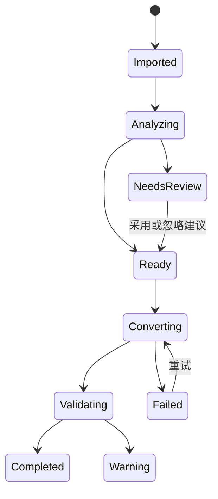

# EasyPub Modern 使用欲望与产品体验审视

- 审视日期：2026-09-06
- 对应版本：v1.17，提交 `7ad97d4`
- 产品边界：EasyPub 增强版／Windows 电子书格式转换器
- 调研范围：当前代码、界面截图、GitHub 首页与 Release；同类软件的官网、官方文档和官方 GitHub 仓库
- 本轮输出：产品、前端、后端、功能逻辑和网站建议；不修改功能代码

## 一、结论先行

EasyPub Modern 不需要变成写作软件、出版平台或缩小版 Calibre。它最有吸引力、也最符合现有积累的定位应当是：

> **面向 Windows 与 Kindle 用户，把中文长篇 TXT／EPUB 快速、可控地转换成可靠 EPUB／MOBI 的 EasyPub 增强版。**

进一步压缩成用户能记住的一句话：

> **拖入中文小说，自动判断章节和常见脏文本，少做设置，得到在 Kindle 上能正常阅读的电子书；原稿不动，结果可检查。**

真正影响“想不想用”的，不是再多十个开关，而是四件事：

1. 用户一眼知道这个工具正好解决自己的问题。
2. 第一次转换不需要先理解完整电子书制作流程。
3. 软件能说明它判断了什么、为什么这样处理，避免用户担心误删正文或做出坏书。
4. 转换完成后有可信、可见的结果，而不是只得到一个不知好坏的文件。

因此，下一阶段的重点不是扩充赛道，而是把已有的中文章节识别、文本清理、原版兼容、长篇优化、预检和成品验收重新组织为一条清楚的主路径：


## 二、哪些用户最值得服务

### 2.1 第一目标用户

| 用户 | 当下任务 | 选择 EasyPub Modern 的充分理由 |
| --- | --- | --- |
| 中文网文／长篇小说整理者 | 手里已有 TXT，希望放到 Kindle 阅读 | 自动识别中文卷章、清理常见网站残留、处理超长正文，并生成可用目录 |
| 原版 EasyPub 用户 | 希望保留熟悉的转换效果，又不想继续使用旧界面和旧工作流 | 可导入原版配置，输出受兼容样本保护，同时得到批量、预览和检查能力 |
| 批量转换用户 | 一次处理多本书，希望规则一致、失败可追踪 | 常用方案、逐书例外、批量进度、失败重试和验收报告在一个工作流中完成 |
| Kindle 老设备／USB 传书用户 | 仍然需要 MOBI，并在意目录、跳转与真机行为 | 针对 KindleGen 联合 MOBI 的兼容处理，以及明确标注的真机验证记录 |

### 2.2 次要用户

- 已有 EPUB，需要保留原版式或重排后转换 MOBI 的用户。
- 需要为少量书稿补封面、元数据、插图或定制 CSS 的进阶用户。
- 希望通过 CLI 重复执行同一转换方案的技术用户。

### 2.3 不应主动扩展的用户

- 从零写作、管理设定或协作审稿的作者。
- 管理大型电子书库、同步设备与阅读进度的读者。
- 制作印刷 PDF、互动教材、漫画或固定版式出版物的专业出版团队。
- 希望软件直接抓取付费或来源复杂的网页内容的用户。

这些群体的需求是真实的，但会把产品带进新的赛道，削弱“转换器”的清晰度。

## 三、同类产品为什么会被选择

下面比较的不是“谁的功能最多”，而是用户在真正下载或付费时，脑中最容易形成的选择理由。

| 产品 | 用户选择它的核心理由 | EasyPub Modern 应借鉴什么 | 不应追什么 |
| --- | --- | --- | --- |
| [Calibre](https://manual.calibre-ebook.com/conversion.html) | 书库、格式、设备和插件生态非常完整；普通转换可以“加书后点击转换”，同时保留大量精细参数 | 默认路径必须简单，高级参数按需出现；转换管线和命令行保持一致 | 不追书库管理、设备同步、全格式覆盖和插件数量 |
| [Sigil](https://sigil-ebook.com/sigil/) | 对 EPUB 2/3、XHTML、CSS、目录和元数据有精确控制 | 问题应能定位到章节／资源；进阶用户可查看必要细节 | 不做完整 EPUB 源码 IDE |
| [Kindle Create](https://kdp.amazon.com/en_US/help/topic/G93BCLJGZFGK39BT) | Amazon 官方身份带来 Kindle 信任；导入后自动识别章节、生成目录并提供设备预览 | 用用户语言组织“导入—自动判断—检查—生成”，把 Kindle 可信度放到结果页 | 不进入 KDP 项目写作和纸书排版 |
| [Vellum](https://vellum.pub/) | 用户看到的不是参数，而是 Build、Style、Preview、Generate、Update 和成品效果；样式作用于全书 | 始终展示成品预期、推荐方案和转换结果；少数高质量方案优于大量裸参数 | 不复制其印刷排版和作者工作台 |
| [Atticus](https://www.atticus.io/preview-your-formatted-book/)／[Reedsy Studio](https://reedsy.com/studio/format-a-book/) | 用设备预览、主题和“专业成品”降低对最终结果的不确定感 | 预览要服务于信心，并明确近似预览与真机之间的边界 | 不做云写作、协作、营销和印刷服务 |
| [CloudConvert](https://cloudconvert.com/ebook-converter) | 无需学习：选文件、选格式、转换 | 首页和空状态必须让用户立刻开始，主操作始终可见 | 不追在线上传和数十种格式 |
| [WebToEpub](https://github.com/dteviot/WebToEpub) | 在小说网页这个源头直接完成获取和转换，场景极其明确 | 围绕中文网文残留建立更强的清理与诊断规则 | 不内置站点抓取器；规则、合规和维护成本过高 |
| [txt-to-epub](https://github.com/bluicezhen/txt-to-epub) | 中文 TXT、自动编码与章节识别、浏览器本地处理，承诺非常直接 | “完全本地、不上传、原稿不动”应成为首屏信任信息 | 不因对方界面简单而砍掉 EasyPub 已有的进阶能力 |
| [Pandoc](https://pandoc.org/epub.html) | 一条命令、可脚本化、可复现 | 让 GUI 方案可保存、导出并由 CLI 重放 | 不把命令行参数原样搬进普通用户界面 |
| [cn-epub-maker](https://github.com/muyen/cn-epub-maker) | 直排、右翻、简繁和中文标点等窄而鲜明的中文能力 | 只有在真实用户验证后，才把特定中文排版做成独立方案 | 不把每一种小众排版都加入默认界面 |

共同规律是：被选择的产品都能用一句话说明“为什么是我”。EasyPub Modern 目前的优势已经存在，却分散在批量、章节树、清理、排版、预检、验收、项目和任务中心等页面中，用户先感受到复杂度，后感受到价值。

## 四、当前产品的使用欲望损耗点

### 4.1 发现阶段：项目看起来不像刚更新过

截至审视时，[v1.17 Release](https://github.com/uiu8/EasyPub-Modern/releases/tag/v1.17) 已发布，但仓库首页仍存在以下信息差：

- 版本徽章、三个下载入口、快速开始链接和页尾仍写 v1.16。
- README 主截图内部仍显示 v1.0.0，图片说明却写 v1.16。
- GitHub 仓库的 Website 地址仍指向旧的 v0.21.1 Release。
- 仓库根目录没有明确的 LICENSE 文件，GitHub 也无法显示许可证。

这不是小的文档瑕疵。新用户在运行未知 Windows EXE 前，会首先判断“项目是否仍维护、下载入口是否可信、代码能否合法使用”。版本冲突会直接损失下载欲望。

### 4.2 首次使用：转换器被呈现成五阶段制作系统

当前主窗口把“书库、封面信息、排版插图、转换输出、任务中心”并列成制作流程。这个结构适合已经理解产品的人，却会让首次用户误以为每页都必须完成。

代码层面的静态盘点也支持这一判断：`MainWindow.xaml` 约 86 KB，包含约 150 个按钮、选择框、列表等交互控件声明；`MainWindow.xaml.cs` 已达到 4,076 行。控件数量本身不是错误，但说明界面已经很难仅靠继续添加入口来维持清晰度。

### 4.3 评估阶段：功能说明很多，结果证明不足

README 很详细地列出了功能，但缺少能立即建立信心的三类证据：

1. 一段 15～30 秒的真实操作动图：拖入 TXT 到得到成品。
2. 固定样本的性能表：文件大小、章节数、输出格式、是否启用长篇优化、总耗时及 KindleGen 耗时。
3. 明确的兼容矩阵：哪些 Kindle 型号／固件由真机验证，哪些仅通过结构检查或近似预览。

“支持很多”不等于“我敢把自己的书交给它”。

### 4.4 操作阶段：工具入口比问题状态更突出

书稿详情把“编辑原始 TXT、编辑章节结构、编辑封面信息、文本清理”呈现为四张较高的操作卡。章节工作台和文本清理窗口则一次展示大量按钮或开关。用户面对的是“我能做什么”，而不是“这本书现在需不需要做什么”。

更好的顺序应是：

1. 软件先告诉用户“已识别 367 章；发现 1 条疑似广告；未发现阻止转换的问题”。
2. 用户只在需要时点击“查看并处理”。
3. 无问题的书不要求进入章节树或文本清理。

### 4.5 完成阶段：结果没有形成闭环

当前已有进度、历史、预检与可选成品验收，这是很好的基础。但主任务完成后，用户最关心的是：

- 文件在哪里；
- 是否真的成功；
- 花了多久；
- 章节和目录是否完整；
- 下一步是复制到 Kindle、用 Kindle Previewer 打开，还是继续处理下一本。

这些信息应收束成一张成品卡片，而不是要求用户再进入任务中心组合判断。

## 五、真正能成为选择理由的核心能力

### 5.1 核心能力 A：自动判断的“快速转换”

- **用户场景**：用户拖入一部长篇中文 TXT，只想尽快得到 Kindle 可读文件，不知道章节正则、压缩方式、正文分片和 EPUB 模式的含义。
- **用户价值**：把第一次转换从“配置工具”变成“确认软件的判断”。
- **产品形式**：导入后自动显示“识别到 1,393 章／GB18030／疑似网站残留 3 处／推荐：旧 Kindle MOBI”。主按钮直接显示“按推荐方案转换”。高级设置不消失，但不占据主路径。
- **实现方式**：使用确定性规则建立 `BookAnalysisSnapshot` 和 `ConversionPlanBuilder`，记录每个建议的原因与置信度；不需要 AI。
- **与现有能力结合**：复用编码检测、章节识别、文本清理预览、长篇合包、预检缓存和 `ConversionOptions`，不是另造转换器。
- **难度**：中等。主要工作在决策整合、状态模型和界面重排，不在转换内核。
- **验证方式**：准备 20～30 个不同编码、章节格式和脏文本的中文样本；首次用户不进入高级页即可成功生成的比例达到 90%，且不出现静默误删。
- **优先级**：P0。

### 5.2 核心能力 B：把格式选择翻译成用户目的

- **用户场景**：普通用户不确定该选 EPUB 还是 MOBI，也不知道“保留原版式”“EasyPub 兼容重排”的后果。
- **用户价值**：用户选择目标，不需要先学习格式历史。
- **产品形式**：默认提供少量目的卡片：
  - “传到旧 Kindle／USB 使用”——MOBI，显示需要 KindleGen；
  - “Send to Kindle／现代阅读器”——EPUB；
  - “延续原版 EasyPub 效果”——兼容方案；
  - “保留现有 EPUB 版式”——仅在 EPUB 输入时出现。
- **必要说明**：[Amazon 已停止接受 MOBI 作为新书或修订版的 KDP 上传格式](https://kdp.amazon.com/en_US/help/topic/GULSQMHU5MNH4EZM)，但 MOBI 对部分老 Kindle 和用户的 USB 侧载仍有现实价值。因此这里不是删除 MOBI，而是避免把“旧设备侧载”和“现代 Kindle 发布／发送”混成一个技术选项。
- **实现方式**：新增的是意图层 `ConversionIntent`，最终仍映射到已有输出格式与选项；格式名放在副标题，不隐藏真实输出。
- **与现有能力结合**：复用 EPUB/MOBI、EPUB 输入模式、原版兼容模式和 KindleGen 探测。
- **难度**：低到中等。
- **验证方式**：让不了解电子书格式的用户根据四个真实任务选择目标，正确率应达到 90% 以上；再检查映射出的请求与旧设置完全一致。
- **优先级**：P0。

### 5.3 核心能力 C：Kindle Ready 的可信结果

- **用户场景**：文件转换成功，但用户担心 Kindle 上没有目录、跳转错误、图片丢失或 MOBI 联合结构异常。
- **用户价值**：把“生成了文件”提升为“我有理由相信它能用”。这是 Calibre 的格式广度和在线转换器的便利都不能直接替代的价值。
- **产品形式**：转换完成后给出分层结果：
  - “生成成功”：文件存在且大小正常；
  - “结构通过”：目录、链接、资源和关键 Kindle 字段通过内部验收；
  - “真机覆盖”：显示该功能在什么设备／固件上实际验证过；未覆盖时明确写“待真机确认”。
- **实现方式**：把低成本的文件、目录与链接完整性检查作为推荐方案默认步骤；耗时更高的深度验收继续允许用户选择。增加“用 Kindle Previewer 打开”和兼容矩阵链接。不要把内部预览称为真机预览。
- **与现有能力结合**：复用 `ConversionPreflightInspector`、`ArtifactValidationService`、任务历史和已有真机回归记录。
- **难度**：中等。
- **验证方式**：故意破坏目录链接、封面、图片和导航目标，结果页必须区分错误并可定位；真实设备结果单独登记，不与结构测试混写。
- **优先级**：P0。

### 5.4 核心能力 D：解释得清楚、不会伤原稿的自动修复

- **用户场景**：下载的网文含广告、重复页眉、乱空格、硬换行和异常章节号，但用户害怕自动清理误删正文。
- **用户价值**：通用转换器通常给用户一堆启发式选项；EasyPub 可以直接指出中文小说里的具体问题，并保留人工否决权。
- **产品形式**：导入后显示“建议修复 8 项”，按类别列出影响行数与前后对比；每类可“全部采用／逐项查看／忽略”。默认只在内存中处理，并持续显示“原始 TXT 不会修改”。
- **实现方式**：检测与应用分离；每条命中带规则、位置、上下文、置信度和稳定 ID。低置信度广告只提示，不默认删除。
- **与现有能力结合**：现有文本清理已经具备修改预览、定位、排除、自定义规则和广告识别，重点是把入口从“开工具”改成“处理已发现的问题”。
- **难度**：中等。
- **验证方式**：建立包含真广告、正文网址、聊天记录、作者话和误导样例的黄金集，同时统计召回率与误删率；默认自动采用的规则应以极低误删为先。
- **优先级**：P0 到 P1。

### 5.5 核心能力 E：可复用的中文小说转换方案

- **用户场景**：用户每周处理一批相似来源的小说，希望同样的章节、清理、排版和输出规则反复生效，但个别书又需要例外。
- **用户价值**：这是批量用户留在 EasyPub 而不是每次重新设置 Calibre 的原因。
- **产品形式**：方案不再只叫抽象的“转换方案”，而是按任务命名，例如“中文网文 → 旧 Kindle”“原版 EasyPub 兼容”“EPUB 保真转 MOBI”“超长小说快速转换”。界面同时显示“本批通用设置”和“2 本书有例外”。
- **实现方式**：方案保存为可版本化、可导入导出的序列化 `ConversionIntent + ConversionProfile`；打开旧方案时显示兼容迁移结果和与当前默认值的差异。
- **与现有能力结合**：复用现有预设、项目、文件夹元数据映射、逐书覆盖和 CLI。
- **难度**：中等。
- **验证方式**：同一方案通过 GUI 与 CLI 转换同一批样本，请求快照及最终文件结构一致；升级后旧方案能明确迁移或给出提示。
- **优先级**：P1。

### 5.6 核心能力 F：经证明的长篇速度与稳定性

- **用户场景**：一千章以上、十几 MB 的小说打开章节树慢，文本清理慢，KindleGen 转换耗时明显。
- **用户价值**：用户愿意选择一个不会在大书上卡死、并且能说明时间花在哪里的工具。
- **产品形式**：长篇书自动进入渐进式分析；列表和窗口立即出现，章节与清理结果分批填充。转换结果显示“准备 3.2 秒／KindleGen 18.4 秒／验收 1.1 秒”。
- **实现方式**：对读取、编码检测、章节分析、清理扫描、打包、KindleGen、后处理和验收分别计时；按文件指纹和选项版本缓存共享分析结果；支持取消和过期失效。
- **与现有能力结合**：已有共享分析缓存、列表虚拟化、后台清理预览和长篇合包优化，可继续深化，而非重写。
- **难度**：中到高。
- **验证方式**：建立小／中／大三组固定基准，持续记录中位数与 95 分位数。用户实测 24 秒对 29 秒说明当前优化有效，但单一样本和 5 秒差值还不足以单独作为宣传口号；应先拆出 KindleGen 占比再定目标。
- **优先级**：P1。

### 5.7 核心能力 G：原版 EasyPub 的可靠迁移与兼容

- **用户场景**：老用户已有 `config.xml`、排版习惯和大量由 EasyPub 生成的书，不愿重新学习或承担输出变化风险。
- **用户价值**：这是大多数新工具无法复制的迁移理由，也是“EasyPub 增强版”名称最需要兑现的承诺。
- **产品形式**：首次启动可选择“导入原版 EasyPub 设置”；方案页明确显示“已兼容 12 项／暂不支持 2 项”，并可查看差异。
- **实现方式**：继续使用原版程序与黄金样本作为兼容基线；兼容模式的改变必须经过结构和视觉样本对比。
- **与现有能力结合**：现有 `config.xml` 导入、原版排版模式、兼容转换和回归测试已经构成基础。
- **难度**：低到中等，主要是入口、说明和回归纪律。
- **验证方式**：固定一组原版配置和输入书稿，比较章节、目录、CSS、元数据、图片及真机行为；无法等价的项目必须在界面说明。
- **优先级**：P0。

## 六、只能提升体验、不能单独形成差异化的辅助能力

这些功能值得做，但不应出现在产品定位的第一句话中。

| 能力 | 用户场景与价值 | 难度 | 验证方式 | 与现有能力结合 | 优先级 |
| --- | --- | --- | --- | --- | --- |
| 更紧凑的书稿详情 | 减少右栏四张高卡片占用，让状态和主操作首屏可见 | 低 | 1366×768 下无需滚动即可看到结果状态与转换按钮 | 调整现有书库详情布局 | P0 |
| 拖放、最近目录和空状态示例 | 降低首次开始成本 | 低 | 新用户 30 秒内完成导入 | 已有拖放、收藏文件夹和项目恢复 | P0 |
| 近似设备预览 | 用户在转换前看章节标题、缩进和图片大致效果 | 中 | 明确标注“近似”；与临时 EPUB 和 Previewer 抽样对照 | 复用现有 Kindle 设备预览 | P1 |
| 外部 TXT 编辑器 | 发现源文件确实需要人工改写时快速打开 | 已完成／低 | 编辑保存后缓存可靠失效、界面不中断 | v1.17 已实现 | 保持 |
| 章顶导航 | 特定阅读习惯下提升章节跳转便利 | 已完成／低 | 继续维护真机回归，不作为默认功能 | v1.17 已实现 | 保持 |
| 封面与元数据批量编辑 | 批量书稿统一信息 | 中 | 多选、逐书覆盖和撤销行为一致 | 已有逐书与批量能力 | 保持、优化入口 |
| 深色模式、密度、快捷键 | 提升长期使用舒适度与效率 | 低到中 | 可访问性、焦点顺序和回归测试 | 现有主题、密度、缩放和快捷键 | P2 |
| 动画、图标和细节美化 | 提升完成度，但不能弥补路径不清 | 低到中 | 不增加加载时间或遮挡状态 | 维持当前视觉语言 | P2 |

## 七、不值得投入或容易让产品臃肿的功能

| 不建议方向 | 为什么会稀释产品 | 更合适的替代 |
| --- | --- | --- |
| 完整电子书书库、阅读器、设备同步 | Calibre 和阅读器已有成熟生态，且会把转换器变成长期内容管理软件 | 只保留最近项目、输出历史和“打开文件位置” |
| 内置网页小说抓取器 | 站点规则变化快，存在登录、反爬、版权和维护成本 | 接受用户合法取得的 TXT／EPUB；加强来源残留诊断和可导入清理规则 |
| 写作、剧情规划、协作审稿 | 与“已有书稿转格式”完全不同 | 继续调用外部 TXT 编辑器，不内建写作工作台 |
| 生成式 AI 改写、扩写、自动润色 | 不可预测，会损害“确定、原稿安全”的信任 | 使用可解释、可撤销、可测试的确定性清理规则 |
| 印刷 PDF 和纸书排版 | 开本、出血、孤行、字体与 PDF/X 是独立产品面 | 明确说明不支持，必要时导向专业工具 |
| 完整 EPUB/XHTML/CSS 源码编辑器 | 学习成本高，会与 Sigil 正面竞争 | 问题定位后提供“用 Sigil 打开”或导出调试包 |
| 一次增加大量输入／输出格式 | 每种格式都带解析、版式和兼容测试成本 | 只在有明确用户量与黄金样本时增加格式 |
| 过早建立插件市场 | API、兼容和安全维护成本远高于当前收益 | 等至少出现两个必须由第三方扩展的真实场景再设计接口 |
| 云账号、同步和默认遥测 | 与“本地、不上传”信任承诺冲突 | 默认离线；用户主动导出匿名诊断包或 GitHub Issue 模板 |
| 为了“现代”而重做整套视觉 | 用户不会仅因渐变、动效或卡片更多而换转换器 | 保留当前黑／米色风格，优先修正层级、文案和主路径 |

## 八、前端与 UI 布局建议

### 8.1 主界面改成“转换驾驶舱”，不是五页必经向导

建议保留进阶能力，但默认主界面只回答五个问题：

1. 转哪些书；
2. 要给谁使用；
3. 软件发现了什么；
4. 输出到哪里；
5. 是否开始。

一个可执行的桌面布局如下：

```text
┌ EasyPub Modern ──────────────────────────────── 设置 ┐
│ 把 TXT / EPUB 拖到这里                         添加书稿 │
├──────────────────────┬───────────────────────────────┤
│ 书稿列表             │ 当前书稿                       │
│ ☑ 国民法医   TXT     │ 封面  书名 / 作者              │
│   1393章 · 已检查     │ 已识别 1393 章 · 2 条建议      │
│ ☑ 第二本书   EPUB    │ [查看问题] [内容] [封面] [排版] │
│                      │                               │
│                      │ 用途：旧 Kindle / USB          │
│                      │ 输出：MOBI · 原版兼容           │
├──────────────────────┴───────────────────────────────┤
│ 2 本 · 可转换 1 · 建议处理 1   输出位置…  [开始转换] │
└──────────────────────────────────────────────────────┘
```

“任务中心”可以保留为转换记录，但不必与封面、排版并列为制作阶段；“章节正文”也不应成为固定主导航，它是当前书稿出现章节问题后的处理工具。

### 8.2 书稿详情：先显示状态，再显示工具

当前右侧详情建议改为三层：

1. **身份层**：小封面、书名、作者、格式、路径；哈希式文件名可截断，完整值放到提示或复制菜单。
2. **状态层**：章节识别、文本清理建议、封面／元数据缺失、转换就绪状态。
3. **工具层**：内容、封面、排版、高级四个紧凑入口；“编辑原始 TXT”放在内容菜单中，并提示会修改源文件。

这能解决原始 TXT 信息与高卡片挤占空间的问题，也让用户先看到“是否需要处理”。

### 8.3 章节工作台：降低工具栏密度

当前章节工作台的目录、原文与层级信息完整，但首屏同时出现上移、下移、提升、降低、合并、规范化、全选、全不选等大量按钮。建议：

- 顶部只保留“撤销／重做、上移／下移、设为上级／设为子级”四组高频操作。
- “合并、数字规范化、目录全选／全不选”放入“更多”或列表表头菜单。
- 将“识别与层级规则”保持默认折叠，并在规则摘要中直接显示当前命中数。
- 当系统发现章节编号异常时，以问题卡展示“12 个标题可规范化”，而不是始终显示“一键规范化数字标题”。
- 大书正文继续按选中章节局部加载，不把全文绑定到 UI 控件。

### 8.4 文本清理：从“规则开关面板”改成“检测结果面板”

当前顶部一次列出十多个清理开关，专业但有压力。建议默认页先显示：

```text
发现 9 项建议
网站广告 1 条       [查看]
异常硬换行 6 处     [查看]
不可见字符 2 处     [查看]

[采用高置信度建议]       [高级规则]
```

进入类别后再显示命中、前后文、采用／排除。原有的普通规则、正则、跨行、范围和顺序放到“高级规则”，不删功能。

### 8.5 输出选择：用目的文案，保留技术细节

建议改写主要文案：

| 当前概念 | 建议主文案 | 副文案 |
| --- | --- | --- |
| EPUB | Send to Kindle／现代阅读器 | 输出 EPUB |
| MOBI | 旧 Kindle／USB 传书 | 输出联合 MOBI，需要 KindleGen |
| 原版兼容 | 延续原版 EasyPub 效果 | 使用兼容排版和后处理 |
| 现代排版 | 高分辨率 Kindle 舒适排版 | 更大行距和留白 |
| 检查问题 | 已自动检查／查看问题 | 显示错误、提醒及定位 |
| 转换方案 | 常用方案 | 可复用本批设置 |
| 任务中心 | 转换记录 | 进度、失败重试和历史 |

### 8.6 转换完成后用一张结果卡收尾

```text
转换完成 · 结构通过
国民法医.mobi   18.6 MB   1393 章   24.1 秒
目录 ✓  章间链接 ✓  封面 ✓  图片 ✓

[打开文件位置] [用 Kindle Previewer 打开] [复制路径]
真机覆盖：本次结构与 PW5 已验证样本一致；当前文件仍建议抽查
```

批量任务完成时先显示“成功 18／提醒 2／失败 1”，再允许展开逐书结果。

### 8.7 视觉方向

- 保留当前黑、白、米色与圆角风格，它已经有辨识度。
- 减少大面积卡片嵌套和每个操作都带一段说明；说明可以放到状态、提示和空状态中。
- 主按钮每个页面只保留一个视觉最高权重。
- 错误、提醒、成功不仅靠颜色，还要带图标与文字。
- 为 1366×768、150% 缩放和键盘操作建立固定截图／自动化回归。

## 九、功能逻辑与后端设计建议

### 9.1 当前基础

核心层已经存在较好的职责边界：

- `ConversionRequest`／`ConversionOptions` 描述转换请求；
- `BatchConverter` 负责并发、进度、取消和逐书结果；
- `ConversionPreflightInspector` 产生结构化错误与提醒；
- `ConversionPreflightCache` 复用检查结果；
- `ArtifactValidationService` 验收 EPUB／MOBI 成品；
- 章节、清理、原版兼容和 Kindle 后处理已有独立实现。

真正需要收紧的是桌面层。`MainWindow.xaml.cs` 同时承担导航、选择、状态、预设、章节、预检、转换、任务窗口和大量控件同步，导致任何新功能都倾向于再加字段、事件和分支。

### 9.2 建议增加四个“深模块”，不要堆浅 Service

#### `BookAnalysisCoordinator`

输入一本书和分析选项，输出不可变的 `BookAnalysisSnapshot`：

- 文件身份与缓存键；
- 编码、大小和行数；
- 章节候选、层级与置信度；
- 清理命中及风险；
- 封面、元数据、图片与格式特征；
- 各阶段耗时。

这个模块统一章节页、清理页、预检和快速转换使用的数据，避免每个窗口重新读取与重新分析。

#### `ConversionPlanBuilder`

输入书稿快照、用户用途和常用方案，输出最终 `ConversionRequest` 列表，同时返回每个关键决定的解释，例如：

- “选择 MOBI，因为用途是旧 Kindle／USB”；
- “启用长篇合包，因为章节数超过阈值”；
- “广告清理未自动采用，因为存在低置信度命中”。

UI 只展示和覆盖计划，不直接拼装几十个选项。

#### `ReadinessEvaluator`

把预检问题映射成三种用户状态：

- 可直接转换；
- 建议处理但可以继续；
- 必须处理。

每个问题附带结构化 `FixAction`，例如打开章节、打开封面、切换输出方案或重新选择 KindleGen。这样可替代桌面层针对 `PreflightTargetKind` 不断扩大的跳转分支。

#### `ConversionOutcomePresenter`

把 `BatchJobOutcome`、验收报告、耗时和历史整合成稳定的结果模型，供主界面、任务记录和 CLI 报告共同使用。

### 9.3 推荐状态流



主窗口只渲染状态和用户可执行动作，转换内核不感知具体 WPF 控件。

### 9.4 性能优化的正确顺序

1. 先给各阶段加统一计时，确认瓶颈是在读取、分析、打包还是 KindleGen。
2. 文件未变化时复用文本读取、章节分析和清理扫描；选项变化只失效受影响的派生结果。
3. 窗口先打开，再分批提供可见区域需要的数据；取消旧分析，避免用户切换书稿后后台继续占用资源。
4. 大列表统一使用虚拟化和稳定 ID，不因排序或过滤重新创建全部行。
5. KindleGen 是外部黑盒时，优化重点是减少传给它的文档分片、资源与重复调用；不要承诺无法控制的固定秒数。
6. 每次性能改动都用固定大书基准，分别记录冷启动和热缓存，防止“某个样本快了、另一个场景变慢”。

### 9.5 CLI 与 GUI 同源

GUI 不应拥有只存在于控件事件中的隐含默认值。最终方案由核心层生成并可序列化；CLI 能加载同一方案，GUI 也可以提供“复制等价命令”作为进阶入口。这样既借鉴 Pandoc 的可复现性，也不会把命令行复杂度暴露给普通用户。

### 9.6 暂不需要的架构

- 不需要微服务或在线后端；本地桌面应用的离线优势应保留。
- 不需要通用插件框架；当前先把输入、分析、计划、转换和验收边界稳定下来。
- 不要为了“MVVM 化”创建大量只转发一个方法的 Manager／Service；模块应真正隐藏复杂决策并减少主窗口接口。

## 十、GitHub 与网站建议

### 10.1 当天就应完成的信任修复

1. README 所有 v1.16 链接统一更新为 v1.17 或 `/releases/latest`。
2. 替换带 v1.0.0 的旧截图，使用当前真实主界面。
3. GitHub Website 改为 `/releases/latest`，或以后建立的 GitHub Pages 地址。
4. 增加明确的 LICENSE；若暂不开放许可，也必须写清楚代码与二进制的使用边界。
5. README 首屏只保留一个主要下载按钮，再用表格解释安装版与便携版。

### 10.2 README 首屏建议顺序

1. 一句话定位；
2. 当前版本下载；
3. 20 秒真实动图；
4. 三个选择理由：中文长篇、Kindle 可靠、本地不改原稿；
5. “三步完成”：拖入、确认建议、转换；
6. 支持范围与限制；
7. 详细功能和历史版本。

现在的首页过早进入完整功能表和版本历史。对首次访问者而言，“我能否马上完成任务”比“产品拥有多少面板”更重要。

### 10.3 建议做一个轻量 GitHub Pages，而不是复杂官网

页面不需要登录、数据库或在线转换后端，只需静态内容：

- 首屏定位与下载；
- 真实操作动图；
- “为什么不用 Calibre／为什么不用原版 EasyPub”的诚实对比；
- 支持的输入、输出和 Kindle 使用方式；
- 性能基准与真机兼容矩阵；
- 隐私说明：本地处理、不上传、哪些操作会修改原始 TXT；
- 常见问题和 GitHub Issue 入口。

### 10.4 证明比宣传更重要

建议公开维护两个小表。

**性能基准的固定方法**

- 小书统一使用约 1 MB／100 章样本，中书使用约 5 MB／500 章样本，超长书使用现有 11.66 MB／1,393 章真实样本。
- 每种样本分别输出 EPUB 和 MOBI，MOBI 再区分长篇合包关闭／开启。
- 在同一机器上各执行五次冷缓存、五次热缓存，公布中位数而不是最好成绩。
- 除总耗时外，必须列出文本准备、打包、KindleGen、后处理和验收耗时。当前用户样本已有“开启优化约 24 秒、关闭约 29 秒”的初始结果，但还需要按上述统一方法复测后才能作为公开性能结论。

**兼容层级的当前事实与记录方法**

| 能力 | 当前可确认的证据 | 公开记录应补充什么 |
| --- | --- | --- |
| 分级目录 | 已有目录结构与转换回归；本轮用户观察未见目录格式受长篇优化影响 | Kindle Previewer 结果、真机型号、固件和样本校验值 |
| 无正文目录页 | v1.16 起已有专门输出回归和真实长篇样本 | 各输出模式的 Previewer／真机结果 |
| 章顶导航直跳 | v1.17 Release 记录结构回归与真机直接跳转通过 | 真机型号、固件、输出选项和样本校验值 |

表里宁可明确写“这一层未验证”，也不要把结构通过包装成所有 Kindle 都已确认。

## 十一、近期、中期、长期优先级

### 近期：0～2 周，先让已有价值被看见

| 顺序 | 工作 | 预期影响 | 难度 |
| --- | --- | --- | --- |
| 1 | 修正 README、下载链接、截图、Website 和许可证 | 立即恢复下载信任 | 低 |
| 2 | 把主界面收束为书稿、用途、状态、输出、转换五要素 | 明显降低第一次使用成本 | 中 |
| 3 | 用用户目的包装 EPUB／MOBI／兼容模式 | 减少格式选择错误 | 低到中 |
| 4 | 导入后自动运行轻量分析与预检，显示三态就绪结果 | 用户不必主动寻找“检查问题” | 中 |
| 5 | 增加转换完成成品卡 | 建立任务闭环和可靠感 | 低到中 |

### 中期：3～8 周，形成可复用的转换优势

| 顺序 | 工作 | 预期影响 | 难度 |
| --- | --- | --- | --- |
| 1 | 建立 `BookAnalysisSnapshot` 与统一分析协调器 | 解决重复分析、慢窗口和状态不一致 | 中到高 |
| 2 | 建立 `ConversionIntent` 与 `ConversionPlanBuilder` | 让快速模式、高级设置、CLI 和预设同源 | 中 |
| 3 | 将文本清理改为检测结果优先，并建立误删黄金集 | 把中文脏文本处理变成选择理由 | 中 |
| 4 | 常用方案卡片、逐书例外和方案差异 | 增强批量用户留存 | 中 |
| 5 | 自动计时和固定性能基准 | 把“快”变成可证明的优势 | 中 |

### 长期：2～6 个月，只做经验证的深化

| 工作 | 启动条件 |
| --- | --- |
| Kindle Previewer 一键联动与更完整兼容矩阵 | 已稳定区分内部预览、结构验收和真机证据 |
| 少量高质量输出方案与近似设备预览 | 用户确实因无法判断成品外观而流失 |
| 新输入／输出格式 | Issue、下载反馈和样本证明存在持续需求，并能建立黄金回归 |
| 特定中文排版，如繁体直排 | 有一批真实用户、设备样本和明确维护者 |
| 可扩展适配器接口 | 至少两个真实外部集成无法通过现有边界解决 |

## 十二、如何验证这些建议确实让人更想用

小项目不适合一开始做复杂 A/B 测试。建议先进行两轮任务测试。

### 12.1 五人首次使用测试

选择五位没用过 EasyPub Modern、但确实有 TXT 转 Kindle 需求的用户，只给安装包和一个脏文本样本，观察：

- 多少人能在三分钟内开始第一次转换；
- 是否有人误以为五个流程页都必须设置；
- 是否能正确选择 EPUB／MOBI；
- 是否理解原稿是否会被修改；
- 转换后能否找到文件并说清结果是否可信。

目标：不进入高级页面也能完成任务；关键决定不超过三个。

### 12.2 固定样本回归

建立至少 20 个样本，覆盖：

- UTF-8、GBK／GB18030、Big5；
- 普通章、卷章、无标准标题、数字错乱；
- 网站广告、正文网址、重复页眉、OCR 空格、硬换行；
- 100、500、1,000、1,500+ 章节；
- 有无封面、插图、自定义字体和 CSS；
- EPUB 保真转 MOBI 与兼容重排。

持续记录：识别准确率、清理误删率、首次打开耗时、转换分阶段耗时、成品结构结果和已验证真机结果。

### 12.3 建议关注的产品指标

- **首次成品时间**：从启动到生成第一本书的时间。
- **零高级设置成功率**：不进入章节、清理和排版高级页即可成功转换的比例。
- **建议采纳率与撤销率**：自动建议是否有用、是否经常误判。
- **批量完成率**：一批任务中成功、提醒和失败的比例。
- **重复方案使用率**：用户是否因为可复用工作流而回来。
- **真机问题率**：结构检查通过但真机出现目录、跳转或排版问题的比例。

不建议默认上传使用数据。可以在用户主动提交 Issue 时生成一个可预览、可删减的诊断包。

## 十三、最值得做的下一个版本

如果只允许做一个聚焦版本，建议目标不是“再增加一组高级功能”，而是：

> **让第一次使用者拖入书稿后，不离开主界面就能理解推荐输出、看到风险、开始转换，并在完成后得到可信的成品卡。**

这个版本的最小范围是：

1. 修复 GitHub／README 的版本与信任信息；
2. 主界面增加用途选择和“按推荐方案转换”；
3. 轻量分析与预检自动运行，显示“可转换／建议处理／必须处理”；
4. 章节树、文本清理、封面和排版改为由问题状态进入；
5. 转换后展示文件、耗时、章节、验收和下一步操作。

这五项不会改变 EasyPub Modern 的定位，也不依赖再堆功能。它们只是把现有能力重新排列成用户愿意开始、敢于转换、愿意再次使用的产品。

## 十四、主要一手来源

- EasyPub Modern：[GitHub 仓库](https://github.com/uiu8/EasyPub-Modern)、[v1.17 Release](https://github.com/uiu8/EasyPub-Modern/releases/tag/v1.17)
- Calibre：[转换文档](https://manual.calibre-ebook.com/conversion.html)、[官方仓库](https://github.com/kovidgoyal/calibre)
- Sigil：[官网功能说明](https://sigil-ebook.com/sigil/)、[官方仓库](https://github.com/Sigil-Ebook/Sigil)
- Amazon：[Kindle Create](https://kdp.amazon.com/en_US/help/topic/G93BCLJGZFGK39BT)、[当前支持的电子书格式](https://kdp.amazon.com/en_US/help/topic/G200634390/)、[MOBI 支持政策](https://kdp.amazon.com/en_US/help/topic/GULSQMHU5MNH4EZM)
- Vellum：[官网](https://vellum.pub/)、[实时预览](https://help.vellum.pub/preview/)、[技术规格](https://vellum.pub/specs/)
- Atticus：[设备预览说明](https://www.atticus.io/preview-your-formatted-book/)
- Reedsy Studio：[排版与 EPUB 输出](https://reedsy.com/studio/format-a-book/)
- CloudConvert：[Ebook Converter](https://cloudconvert.com/ebook-converter)
- WebToEpub：[官方仓库](https://github.com/dteviot/WebToEpub)
- Pandoc：[EPUB 制作说明](https://pandoc.org/epub.html)
- 中文工具：[txt-to-epub](https://github.com/bluicezhen/txt-to-epub)、[cn-epub-maker](https://github.com/muyen/cn-epub-maker)
